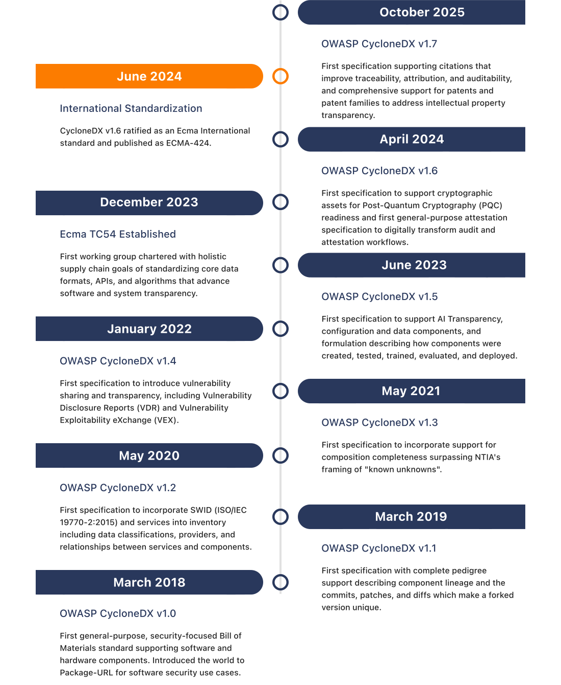

# The Innovative History of OWASP CycloneDX

OWASP CycloneDX has carved a legacy steeped in innovation, collaboration, and a commitment to openness. OWASP 
continues to advance software and system transparency standards, prioritizing remediation efforts that reduce risk.

  
_Source: [https://tc54.org/history](https://tc54.org/history)_
