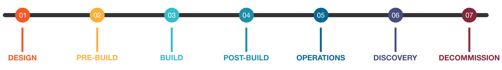

# Anatomy of a CBOM
The Cryptography Bill of Materials (CBOM) presents a structured approach to inventory management of cryptographic assets,
leveraging the CycloneDX component model to comprehensively represent a diverse array of cryptographic assets.
CBOM is implemented within the CycloneDX object model, facilitating the standardized representation of
cryptographic assets, including algorithms, keys, protocols, and certificates. The CycloneDX object model provides a
flexible and extensible framework that accommodates the complexity and diversity of cryptographic infrastructure.

## Structure and Cryptographic Asset Types


<div style="page-break-after: always; visibility: hidden">
\emptyparagraph
</div>

CycloneDX can represent the following types of cryptographic assets:


| Type | Description                                                                                                                                                             |
| ---- |-------------------------------------------------------------------------------------------------------------------------------------------------------------------------|
| algorithm | Cryptographic function commonly used for data encryption, authentication, and digital signatures or other primitives.                                                   |
| certificate | An electronic document that provides the identity or validates a public key.                                                                                            |
| protocol | A set of rules and guidelines that govern the behavior and communication with each other.                                                                               |
| private-key | The confidential key of a key pair used in asymmetric cryptography.                                                                                                     |
| public-key | The non-confidential key of a key pair used in asymmetric cryptography.                                                                                                 |
| secret-key | A key used to encrypt and decrypt messages in symmetric cryptography.                                                                                                   |
| key | A piece of information, usually an octet string, which, when processed through a cryptographic algorithm, processes cryptographic data.                                 |
| ciphertext | The result of encryption performed on plaintext using an algorithm (or cipher).                                                                                         |
| signature | A cryptographic value that is calculated from the data and a key known only by the signer.                                                                              |
| digest | The output of the hash function.                                                                                                                                        |
| initialization-vector | A fixed-size random or pseudo-random value used as an input parameter for cryptographic algorithms.                                                                     |
| nonce | A random or pseudo-random number that can only be used once in a cryptographic communication.                                                                           |
| seed | The input to a pseudo-random number generator. Different seeds generate different pseudo-random sequences.                                                              |
| salt | A value used in a cryptographic process, usually to ensure that the results of computations for one instance cannot be reused by an attacker.                 |
| shared-secret | A piece of data known only to the parties involved, in a secure communication.                                                                                          |
| tag | A message authentication code (MAC), sometimes known as an authentication tag, is a short piece of information used for authenticating and integrity-checking a message. |
| additional-data | An unspecified collection of data with relevance to cryptographic activity.                                                                                             |
| password | A secret word, phrase, or sequence of characters used during authentication or authorization.                                                                           |
| credential | Establishes the identity of a party to communication, usually in the form of cryptographic keys or passwords.                                                           |
| token | An object encapsulating a security identity.                                                                                                                            |
| other | Another type of cryptographic asset.                                                                                                                                    |
| unknown | The type of cryptographic asset is not known.                                                                                                                           |

<div style="page-break-after: always; visibility: hidden">
\newpage
</div>

## Key Management
[NIST Special Publication 800-57]((https://csrc.nist.gov/pubs/sp/800/57/pt1/r5/final)) outlines key management guidelines,
including various key states and their purposes. The key states defined in SP 800-57 include:

1. **Pre-activation**: Keys in this state are generated but not yet placed into active use. They are securely stored until needed, awaiting activation for cryptographic operations.
2. **Active**: Keys in the active state are currently in use for cryptographic operations such as encryption, decryption, or digital signatures. They play a fundamental role in securing data and communications within the system.
3. **Suspended**: Keys in the suspended state are temporarily inactive, typically due to security concerns or operational issues. While suspended, they are not utilized for cryptographic operations but can be reinstated if deemed appropriate.
4. **Deactivated**: Keys in the deactivated state are intentionally rendered inactive, often as part of routine maintenance or security protocols. Once deactivated, they are no longer used for cryptographic operations but may be retained for archival or auditing purposes.
5. **Compromised**: Keys in the compromised state are deemed untrustworthy due to known or suspected security breaches. Immediate action is required to revoke and replace compromised keys to prevent unauthorized access and safeguard the integrity of cryptographic operations.
6. **Destroyed**: Keys in the destroyed state are permanently eradicated from the system, typically to prevent any potential misuse or unauthorized access. Destruction ensures that the keys are irrecoverable and cannot be compromised, thus enhancing overall security.

These key states play a critical role in the lifecycle management of cryptographic keys, ensuring that keys are properly managed, secured, and monitored throughout their operational lifespan, thereby maintaining the integrity and confidentiality of sensitive data and systems.

CycloneDX fully supports key states as detailed in the example below:

```json
"cryptoProperties": {
  "assetType": "related-crypto-material",
  "relatedCryptoMaterialProperties": {
    "type": "private-key",
    "state": "compromised",
    ...
  }
}
```

<div style="page-break-after: always; visibility: hidden">
\newpage
</div>

## Intersection of Key Management States and Lifecycle Phases
As outlined in the [CycloneDX Authoritative Guide to SBOM](https://cyclonedx.org/guides/), CycloneDX supports lifecycles
that encompass those in the Software Development Life Cycle (SDLC) and those commonly used in Software Asset Management
(SAM). CycloneDX lifecycle phases can be used together with the key management states defined by NIST to help identify 
and prevent risks associated with compromised keys and operational anomalies.

CycloneDX defines the following phases:

| **Phase**    | **Description**                                                                                                                                                                                                                                                                                                                                                                                                                          |
|--------------|------------------------------------------------------------------------------------------------------------------------------------------------------------------------------------------------------------------------------------------------------------------------------------------------------------------------------------------------------------------------------------------------------------------------------------------|
| Design       | BOM produced early in the development lifecycle containing an inventory of components and services that are proposed or planned to be used. The inventory may need to be procured, retrieved, or resourced prior to use.                                                                                                                                                                                                                 |
| Pre-build    | BOM consisting of information obtained prior to a build process and may contain source files, development artifacts, and manifests. The inventory may need to be resolved and retrieved prior to use.                                                                                                                                                                                                                                    |
| Build        | BOM consisting of information obtained during a build process where component inventory is available for use. The precise versions of resolved components are usually available at this time as well as the provenance of where the components were retrieved from.                                                                                                                                                                      |
| Post-build   | BOM consisting of information obtained after a build process has completed and the resulting components(s) are available for further analysis. Built components may exist as the result of a CI/CD process, may have been installed or deployed to a system or device, and may need to be retrieved or extracted from the system or device.                                                                                              |
| Operations   | BOM produced that represents inventory that is running and operational. This may include staging or production environments and will generally encompass multiple SBOMs describing the applications and operating system, along with HBOMs describing the hardware that makes up the system. Operations Bill of Materials (OBOM) can provide a full-stack inventory of runtime environments, configurations, and additional dependencies. |
| Discovery    | BOM consisting of information observed through network discovery providing point-in-time enumeration of embedded, on-premise, and cloud-native services such as server applications, connected devices, microservices, and serverless functions.                                                                                                                                                                                         |
| Decommission | BOM containing inventory that will be or has been retired from operations.                                                                                                                                                                                                                                                                                                                                                               |

<div style="page-break-after: always; visibility: hidden">
\emptyparagraph
</div>

Key management states, as defined in NIST SP 800-57, offer a structured framework for managing cryptographic keys 
throughout their lifecycle. These states—such as pre-activation, active, suspended, deactivated, compromised, and 
destroyed—align closely with the lifecycle phases defined in CycloneDX. By integrating key management states with 
CycloneDX lifecycle phases, organizations gain a comprehensive understanding of the security posture of their 
cryptographic assets and can identify potential risks more effectively.

<div style="page-break-after: always; visibility: hidden">
\newpage
</div>

### Manage Keys From Inception
In the CycloneDX lifecycle, the "Design" and "Pre-build" phases correspond to the pre-activation state in key 
management. During development, cryptographic keys are generated but not yet put into active use. By linking 
pre-activation with these phases, organizations can ensure that cryptographic keys are securely managed from their 
inception, minimizing the risk of unauthorized access or compromise before deployment.

### Anomaly Detection
As software progresses to the "Build" and "Post-build" phases in CycloneDX, cryptographic keys transition into the 
active state, where they are utilized for encryption, decryption, or digital signatures. Integration with key 
management states allows organizations to monitor the active keys' security status and detect anomalies that may 
indicate compromise or unauthorized usage, thereby mitigating potential risks during the software development lifecycle.

During the "Operations" phase in CycloneDX, cryptographic keys may undergo transitions such as suspension or deactivation
if security concerns arise. For example, if a vulnerability is discovered in a cryptographic algorithm, keys associated
with that algorithm may be suspended or deactivated to prevent exploitation. By correlating these transitions with the 
CycloneDX lifecycle, organizations can promptly respond to security incidents and mitigate associated risks, ensuring 
the integrity and confidentiality of cryptographic operations across deployment environments.

Furthermore, the compromised and destroyed states in key management align with the "Decommission" phase in CycloneDX. 
When cryptographic keys reach the end of their operational lifespan, they are revoked, destroyed, or securely 
decommissioned to prevent unauthorized access. CycloneDX facilitates the documentation of these actions, providing a 
comprehensive audit trail of key management activities and ensuring regulatory compliance.

Any deviances from expected lifecycle mappings to key management states should be investigated.

<div style="page-break-after: always; visibility: hidden">
\emptyparagraph
</div>



### Prevention of Compromised Keys During Build or Deployment
The compromised key management state is crucial in preventing software supply chain attacks when integrated 
into the "Build" lifecycle phase in CycloneDX. During the build phase, cryptographic keys are utilized to sign software 
artifacts, ensuring their authenticity and integrity. By leveraging the "compromised" state within CycloneDX, 
organizations can detect compromised keys promptly and prevent unauthorized usage during the build process. 
For instance, if a key used for code signing is compromised, CycloneDX metadata can flag the key as compromised, 
triggering automated processes to revoke its access privileges and prevent its use in signing software artifacts. 
This proactive approach mitigates the risk of adversaries leveraging compromised keys to inject malicious code into the 
software supply chain, enhancing the security and trustworthiness of software builds distributed to software consumers.

By leveraging key management states within the CycloneDX lifecycle phases, organizations can enhance their risk 
management practices, proactively identify security vulnerabilities, and maintain the integrity of cryptographic 
operations throughout the software development lifecycle. This integrated approach enables organizations to safeguard 
sensitive data and mitigate potential risks associated with cryptographic assets.


<div style="page-break-after: always; visibility: hidden">
\newpage
</div>
