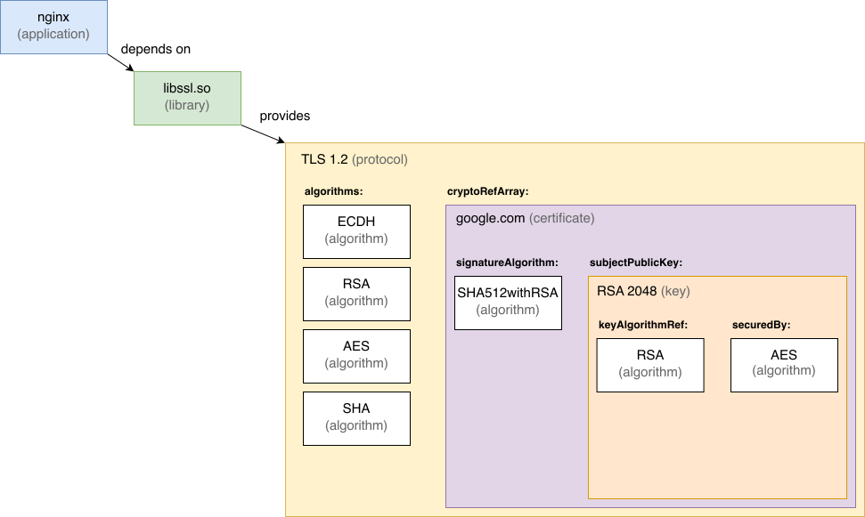

# Dependencies
CycloneDX provides the ability to describe components and their dependency on other components. This relies on a
component's `bom-ref` to associate the component with the dependency element in the graph. The only requirement for bom-ref
is that it is unique within the BOM. Package URL (PURL) is an ideal choice for bom-ref as it will be both unique and
readable. If PURL is not an option or not all components represented in the BOM contain a PURL, then UUID is recommended.
A dependency graph is typically one node deep and capable of representing both direct and transitive relationships.

Refer to the [CycloneDX Authoritative Guide to SBOM](https://cyclonedx.org/guides/) for additional details. In the 
context cryptographic dependencies, CycloneDX provides some additional capabilities.

As of CycloneDX v1.6, there are two types of dependencies, dependsOn and provides. 

| Dependency Type | Description                                                                                                                                                                                                                                                                                                                                         |
| --------------- |-----------------------------------------------------------------------------------------------------------------------------------------------------------------------------------------------------------------------------------------------------------------------------------------------------------------------------------------------------|
| dependsOn | The bom-ref identifiers of the components or services that are dependencies of this dependency object.                                                                                                                                                                                                                                                                                                                                                   |
| provides | The bom-ref identifiers of the components or services that define a given specification or standard, which are provided or implemented by this dependency object. For example, a cryptographic library which implements a cryptographic algorithm. A component which implements another component does not imply that the implementation is in use. |


The dependency type, dependsOn, is leveraged by classic SBOMs to define a complete graph of direct and transitive 
dependencies. However, for cryptographic and similar assets, "provides" allows for many additional use cases.



The example shows an application (nginx) that uses the libssl cryptographic library. This library implements the TLSv1.2 protocol. The relationship between the application, the library and the protocol can be expressed by using the depenedencies properties of the SBOM standard.

Since a TLS protocol supports different cipher suites that include multiple algorithms, there should be a way to represent these relationships as part of the CBOM. Compared to adding the algorithms as "classic" dependencies to the protocol, we defined special property fields that allow referencing the deployment with additional meaning. The protocolProperties allow adding an array of algorithms to a cipher suite as part of the cipher suite array. By modeling and then referencing these algorithms, we can still have only one classical component at the SBOM level, but a subtree of crypto dependencies within the crypto asset components.

The following example illustrates a simple application with a dependency on a cryptographic library, which in turn, 
implements AES-128-GCM. The cryptographic library also has a dependency on another library.

```json
"dependencies": [
  {
    "ref": "acme-application",
    "dependsOn": ["crypto-library"]
  },
  {
    "ref": "crypto-library",
    "provides": ["aes128gcm"],
    "dependsOn": ["some-library"]
  }
]
```

<div style="page-break-after: always; visibility: hidden">
\newpage
</div>