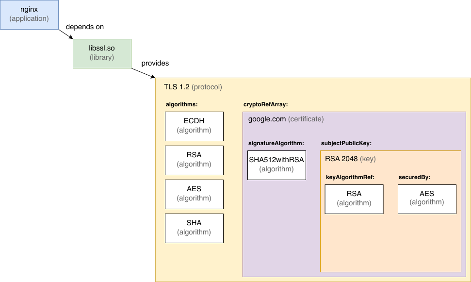

# Dependencies

CycloneDX provides the ability to describe components and their dependency on other components. This relies on a
component's `bom-ref` to associate the component with the dependency element in the graph. The only requirement for `bom-ref`
is that it is unique within the BOM. Package URL (PURL) is an ideal choice for `bom-ref` as it will be both unique and
readable. If PURL is not an option or not all components represented in the BOM contain a PURL, then UUID is recommended.
A dependency graph is capable of representing both direct and transitive relationships. In CycloneDX representation
`dependencies`, a dependency graph SHOULD be codified to be one node deep, meaning no nested child graphs. All
relations are on the same level.

Refer to the [CycloneDX Authoritative Guide to SBOM](https://cyclonedx.org/guides/) for additional details.

In the context of cryptographic dependencies, CycloneDX provides some additional capabilities. As of CycloneDX v1.6, 
there are two types of dependencies: `dependsOn` and `provides`.

| Dependency Type | Description |
| --------------- | ------------|
| `dependsOn` | The `bom-ref` identifiers of the components or services that are dependencies of this dependency object. |
| `provides` | The `bom-ref` identifiers of the components or services that define a given specification or standard, which are provided or implemented by this dependency object. For example, a cryptographic library that implements a cryptographic algorithm. A component that implements another component does not imply that the implementation is in use. |


The dependency type, dependsOn, is leveraged by classic SBOMs to define a complete graph of direct and transitive 
dependencies. However, for cryptographic and similar assets, "provides" allows for many additional use cases.



The example shows an application (nginx) that uses the libssl cryptographic library. This library implements the TLSv1.2
protocol. The relationship between the application, the library and the protocol can be expressed by using the 
dependencies properties of the SBOM standard.

Since a TLS protocol supports different cipher suites that include multiple algorithms, there should be a way to 
represent these relationships as part of the CBOM. Compared to adding the algorithms as "classic" dependencies to the 
protocol, we defined special property fields that allow referencing the deployment with additional meaning.
The protocolProperties allows adding an array of algorithms to a cipher suite as part of the cipher suite array. 
By modeling and then referencing these algorithms, we can still have only one classical component at the SBOM level but 
a subtree of crypto dependencies within the crypto asset components.

The following example illustrates a simple application with a dependency on a cryptographic library, which, in turn,
implements AES-128-GCM. The cryptographic library also depends on another library.

```json
"dependencies": [
  {
    "ref": "acme-application",
    "dependsOn": ["crypto-library"]
  },
  {
    "ref": "crypto-library",
    "provides": ["aes128gcm"],
    "dependsOn": ["some-library"]
  }
]
```

<div style="page-break-after: always; visibility: hidden">
\newpage
</div>