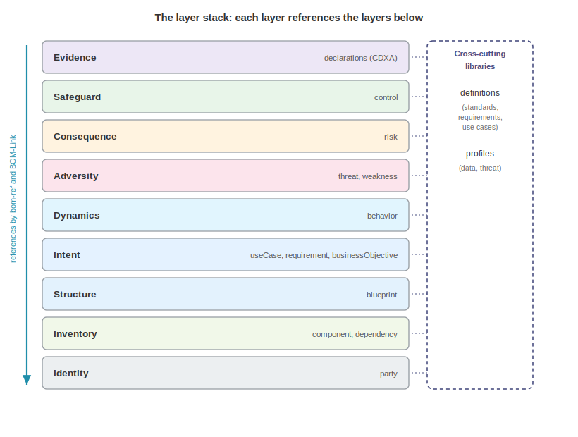

# Concepts and the Object Model

The design and assurance models form a deliberate stack: nine layers, each independently exchangeable, each referencing the layers below it. Three structural rules repeat across every layer, and a small set of mechanics is shared by all documents.

## The Layer Stack

| Layer | Model | Role |
|---|---|---|
| Identity | `party` | Who or what acts: an organization, a person, a system, or a persona |
| Inventory | `component`, `dependency` | What the system is made of (the classic bill of materials) |
| Structure | `blueprint` | How it is arranged: assets, zones, boundaries, flows, relationships |
| Intent | `useCase`, `requirement`, `businessObjective` | What it is for and what it must satisfy |
| Dynamics | `behavior` | What it is intended to do and observed doing |
| Adversity | `threat`, `weakness` | What can go wrong |
| Consequence | `risk` | What that costs, and how it is judged |
| Safeguard | `control` | What is recommended or in place about it |
| Evidence | `declarations` (CDXA) | Why anyone should believe any of the above |

Two cross-cutting models serve the stack: the declarative library (`definitions`) holds reusable declared objects such as standards, requirements, use cases, business objectives, and patents, so that instances elsewhere can reference a catalog instead of restating it. The profile registry (`profiles`) holds reusable characterizations, such as data profiles and threat profiles, separating what something is (identity) from how it behaves or is governed (characterization).

At the document root, these appear as sibling containers alongside the familiar inventory: `blueprints`, `threats`, `risks`, `controls`, `profiles`, and `definitions`, next to `components`, `dependencies`, `vulnerabilities`, `declarations`, and the rest. A document populates only what it needs, and a control inventory with nothing but `controls` and `definitions` is a complete, valid, useful document.

## Three Structural Rules

Three rules repeat across every model in the stack, and internalizing them makes the schemas predictable.

### Documentation Is Separated from Realization

A `threat` documents what can go wrong, catalog-style, independent of any particular adversary or occurrence. A `threatScenario` references one or more threats and adds the circumstances: the actor, motivation, intent, access level, and the likelihood and impact in context. The same separation appears everywhere: a requirement in the catalog versus a control instance with an implementation status, a durable `threatProfile` (sophistication, resources, skill set) versus the scenario-specific motivation, and a data profile versus the flows that carry it. Durable things are written once and reused, and circumstantial things carry references to them.

This rule is why the artifacts stay alive: a threat catalog survives reorganizations of the risk register, an actor profile survives individual campaigns, and a control catalog survives the system it was first written for.

### Annotation, Not Duplication

Analysis annotates structure rather than restating it: a `trustBoundary` in the threat model references a blueprint `boundary` and adds only the trust differential and the threats and controls at that boundary. A blueprint `asset` references a component rather than re-declaring its identity, and a risk references the threats it prices rather than embedding them. An author copying data between layers is fighting the model, which expects a reference instead.

### Edges Live in the Asserting Document

Every cross-object edge belongs to the party asserting it, following the precedent VEX set. A claim points at its target, a threat lists the controls that mitigate it, a control declares what it applies to, and a risk response lists the controls that implement it. There are no inverse properties to keep synchronized: the control does not list the threats it mitigates, because that is the threat modeler's assertion, not the control owner's.

This rule makes multi-party composition workable: an assessor can publish a document asserting edges into another party's control inventory without a byte of that inventory changing.

## Shared Mechanics

Objects carry a `bom-ref`, unique within the document, and references use either a bare `bom-ref` (same document) or a BOM-Link URN (`urn:cdx:<serialNumber>/<version>#<bom-ref>`) to reach into another document. The two forms are interchangeable wherever a reference is accepted, and cross-document references are how separately owned artifacts compose: Acme's documents use them heavily.

Capabilities with sibling collections group them in a container object at the root. The `threats` container holds `threats`, `scenarios`, `attackPatterns`, `attackTrees`, `attackPaths`, `abuseCases`, `trustBoundaries`, and `methodologies`, and the `risks` container holds `risks`, `assessments`, and `riskAppetites`. Collections that belong together travel together.

Wherever a property takes a taxonomy value, the schema offers a curated enumeration or a custom object with a `name` and optional `description`. No `other` value exists: the custom branch is the escape hatch, which keeps common values machine-comparable while never blocking an organization's own vocabulary. The pattern appears in threat methodologies, control categories, risk domains, data classifications, asset types, and a dozen other places.

Every "who" in the stack is a `party` with exactly one of four identities: an organization, a person, a system (including agent, service account, and machine identity kinds), or a persona, an archetype such as a customer or an attacker. Refer to Identifying Parties for the identity vocabulary in full. Parties carry roles from a shared taxonomy, and relations such as `delegatedBy`, which records that an autonomous agent acts on a principal's authority. Adversaries are not a special mechanism: an abstract attacker is a persona, a named group is an organization with aliases, and both plug into the same fields as authors and suppliers.

Substantial objects carry `properties` (namespaced name and value pairs), and most carry `externalReferences` (typed links, with types including `threat-model`, `risk-assessment`, and `pentest-report`), the sanctioned places for data the schema does not model.

Documents and many objects carry `signatures`, and document metadata carries distribution constraints (TLP). A control inventory signed by the GRC team, a threat model signed by the security architect, and an assessment signed by an external assessor can circulate independently with their provenance intact.

## The Acme Storefront

One system anchors the worked examples: the Acme Storefront, a commerce platform with a web storefront, a checkout API, an external Globex payment gateway, an orders database, and an AI support agent that answers order questions through a scoped order lookup tool. It is deliberately ordinary and deliberately modern, and the agent exercises the agentic and behavioral capabilities many organizations adopt CycloneDX to govern.

Acme's documents validate against the CycloneDX v2.0 schema and compose by BOM-Link into one picture: an architecture, an intent declaration, a behavior document, a threat model, a risk register, and a control inventory, separately owned and separately signed. A composite document carries the same material in single-document form. Refer to Appendix C for the document list and to the CycloneDX bom-examples repository for the complete files.

## The Threat Modeling Manifesto Questions

Threat modelers will recognize that the stack answers the Threat Modeling Manifesto's four questions:

1. "What are we working on?" (structure, intent, dynamics). 
2. "What can go wrong?" (adversity). 
3. "What are we going to do about it?" (safeguards). 
4. "Did we do a good job?" (consequence and evidence).

For the full mapping, refer to the Threat Modeling chapter. The stack itself is deliberately broader than any one discipline's frame, which is exactly why a compliance team, a privacy engineer, and a detection engineer can each use a slice of it without adopting the rest.

\newpage

