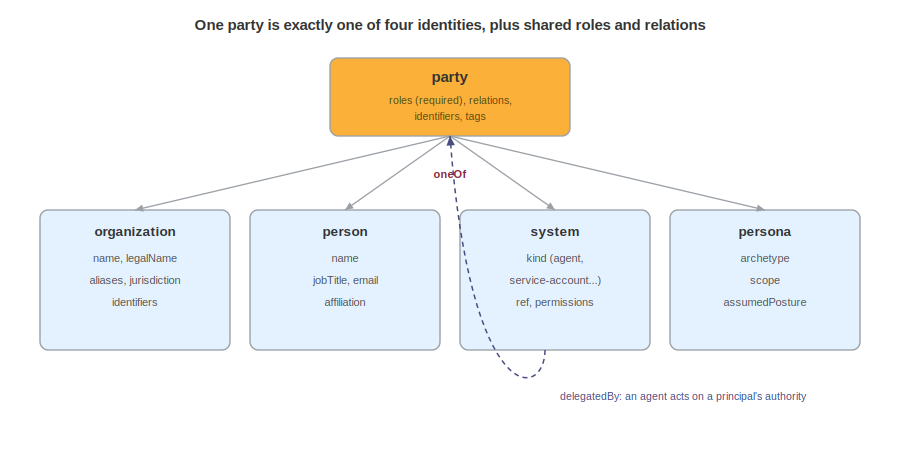

# Identifying Parties

Every model in the design and assurance stack names actors: an architecture has owners and external entities, intent has stakeholders, a threat model has adversaries, a risk register has an appetite owner, controls have implementers, an assessment has assessors. If each model invents its own way to write down "Acme," "Jordan Kim," or "the deployment service account," the same identity fractures across a dozen representations and nothing correlates. The party model is the one shared identity layer they all draw on, which makes it upstream of almost everything else here.

A single `party` object carries every identity in the stack: an organization, a person, a machine identity, or an abstract archetype, plus roles, identifiers, relations, and addresses. One identity vocabulary, reused everywhere, lets a supplier in a hardware BOM, an author in a blueprint, and an adversary in a threat model be the same kind of object.

Parties are not a document of their own, appearing wherever a model needs to name something: `component.parties`, a blueprint `actor.party`, and the party fields on services, vulnerabilities, declarations, and model cards. Acme's party document, `acme-parties.cdx.json`, gathers one of each identity: a `parties` array on a component, and three `actor` bindings on a blueprint.

## The Party and Its Four Identities



A `party` is a single actor. It carries a `bom-ref` so other documents can point at it, a required `roles` array, exactly one identity, and optional `relations`, `tags`, and `properties`. The identity is a `oneOf`: a party is an organization, a person, a system, or a persona, and never two at once, each described in its own section below. That exclusivity forces the author to decide what kind of thing is acting before describing it, and it lets a consumer switch on identity type without ambiguity. `parties` is the array of `party` used at a call site:

```json
"parties": [
  {
    "bom-ref": "party-acme",
    "roles": [ { "role": "supplier", "order": 1 }, { "role": "manufacturer" } ],
    "organization": { "name": "Acme", "legalName": "Acme Corporation" }
  }
]
```

Roles are required, and every party has at least one. A role says what the party does in this context, not who it is, so the same organization can be a `supplier` in one binding and an `issuer` in another. Each entry is a `preDefinedRole`: a `role` value plus an optional `order` integer that ranks parties sharing a role, lower being higher preference. Acme above is the order-1 supplier, and a second party with `role` `supplier` and `order` 2 would read as the alternate. The role vocabulary is a predefined enum, with a custom branch of `{ name, description }` for anything not listed:

| Value | Description |
|---|---|
| `author` | Created the component, document, or model |
| `supplier` | Provides the component or service to consumers |
| `manufacturer` | Makes the component or product |
| `operator` | Runs the system in production |
| `issuer` | Assigned an identifier or credential |
| `security-contact` | Receives security reports and inquiries |
| `end-user` | Uses the system or component |
| `attacker` | Acts against the system |
| `agent` | Acts autonomously on another party's authority |
| `owner` | Answers for the component or control |
| `verifier` | Checks controls or claims against their stated intent |

Where a field names a single party rather than an array, it uses a `partyChoice`: either an inline `party` or a bom-link reference to one declared elsewhere, such as `urn:cdx:8888...#party-acme`. The blueprint actors in the example each inline their party through a `partyChoice`. A document that had already declared the party could instead reference it and avoid repeating the identity. That reference form is the annotation rule at work, one identity named once and pointed at from everywhere.

## Organization

An `organization` is a named legal or informal body, ranging from a one-line stub to a full record:

```json
"organization": {
  "name": "Acme",
  "legalName": "Acme Corporation",
  "description": "Retailer operating the storefront.",
  "jurisdiction": "US",
  "foundingDate": "1998-03-01",
  "formerNames": [ "Acme Retail LLC" ],
  "aliases": [ "Acme Store" ]
}
```

`name` is the common name, `legalName` the registered one, and `jurisdiction` an ISO 3166 code. `formerNames` and `aliases` look alike and mean different things: former names are historical, from renames or acquisitions, while aliases are concurrent alternate designations, a distinction that earns its keep on adversaries, addressed below. An organization can also carry `identifiers` and `addresses`, both covered in their own sections.

## Person

A `person` is an individual whose `name`, following W3C internationalization guidance on personal names, is a single freeform full-name string, not a split of given and family parts that many cultures do not honor:

```json
"person": {
  "name": "Jordan Kim",
  "sortName": "Kim, Jordan",
  "honorificPrefix": "Dr",
  "jobTitle": "Security Architect",
  "email": [ { "name": "work", "address": "jordan.kim@acme.example" } ],
  "phone": [ { "name": "office", "number": "+1-555-0142" } ],
  "url": [ { "name": "profile", "url": "https://acme.example/people/jkim" } ],
  "affiliation": "party-acme"
}
```

`email`, `phone`, and `url` are labeled arrays, so one person can list work and personal contacts without collision. `affiliation` references the organization the person belongs to, wiring the person to the org without nesting one identity inside another.

## System

A `system` is a non-human actor: a service account, an autonomous agent, a machine identity, a bot, a device, a robot, and more. `kind` uses the predefined-or-custom pattern, a plain string for a known kind or an object for a custom one:

```json
"system": {
  "kind": "service-account",
  "ref": "comp-web",
  "identifiers": [
    { "scheme": "spiffe", "value": "spiffe://acme.example/ci/deployer" }
  ],
  "permissions": [ "deploy:storefront", "read:artifacts" ]
}
```

`ref` ties the identity to a concrete object elsewhere in the inventory, here the storefront component the account deploys. `permissions` records what the identity is allowed to do, and `identifiers` carries workload credentials such as the SPIFFE ID above. Software agents are `agent`, `bot`, or `automation`. The `robot` kind is reserved for physical robots.

## Persona

A `persona` is an abstract archetype, a role a class of actor plays rather than a named instance:

```json
"persona": {
  "archetype": "customer",
  "description": "A retail customer of the storefront.",
  "scope": "external",
  "assumedPosture": "authenticated",
  "permissions": [ "place-orders", "view-own-orders" ]
}
```

`archetype` is predefined-or-custom, an enumerated value or a custom object for an archetype not listed:

| Value | Description |
|---|---|
| `end-user` | A person using the system |
| `customer` | A buyer of the product or service |
| `administrator` | An operator holding privileged access |
| `attacker` | An adversary acting against the system |
| `insider-threat` | A malicious or compromised insider |
| `auditor` | An external reviewer of controls and claims |

`scope` places the archetype inside or outside the organization, and `assumedPosture` records the access it is modeled as holding, such as `authenticated` or `unauthenticated`. A persona describes a kind of actor, so it takes no legal name or contact details.

Adversaries need no special mechanism, and an abstract attacker is a persona:

```json
"persona": {
  "archetype": "attacker",
  "scope": "external",
  "assumedPosture": "unauthenticated"
}
```

A named threat group, by contrast, is an `organization`, and its tracked designations go in `aliases`, the same field Acme used for a trade name. Choose `persona` when the actor is a type, "a customer" or "an attacker," and `organization` when it is a specific named body, whether a supplier or a real adversary group. The circumstantial attributes of an attack, its motivation, intent, and access at a given moment, do not belong on the party. They live on the threat scenario, keeping durable identity separate from any single realization: refer to the Threat Modeling chapter.

## Relations

`relations` records how one party stands to another: `parent` expresses hierarchy or group membership, while `delegatedBy` records that an autonomous actor operates under another party's authority and lives on the delegated party, not the principal. The support agent's system identity uses both, bound into the blueprint as an actor whose `party` is again a `partyChoice`:

```json
"party": {
  "bom-ref": "party-agent-sys",
  "roles": [ { "role": "agent" } ],
  "system": { "kind": "agent", "ref": "comp-web" },
  "relations": { "parent": "party-acme", "delegatedBy": "party-acme" }
}
```

That single object is the difference between an agent that acts and a principal that answers for it, which every downstream model reasoning about accountability needs.

## Identifiers and Addresses

An `identifier` is a scheme-scoped external key, where `scheme` is predefined-or-custom and `value` holds the key itself. The optional `schemeVersion`, `issuedDate`, `expirationDate`, and `issuer` fields capture validity and provenance:

```json
"identifiers": [
  {
    "scheme": "lei",
    "value": "5493001KJTIIGC8Y1R12",
    "issuedDate": "2019-01-01",
    "expirationDate": "2027-01-01",
    "issuer": "party-giin"
  },
  {
    "scheme": { "name": "acme-vendor-id", "description": "Internal vendor registry identifier." },
    "schemeVersion": "2",
    "value": "V-10293"
  }
]
```

`lei` is one of the predefined schemes. A private key uses the custom object form, as the internal vendor id does with its own `schemeVersion`. `issuer` references the party that assigned the identifier, which is why the registry appears as its own minimal party in the document, `{ "bom-ref": "party-giin", "roles": [ { "role": "issuer" } ], "organization": { "name": "Global Identifier Registry" } }`.

A `postalAddress` records a location, with `isoCode` (an ISO 3166-2 subdivision code) beside the human-readable fields and optional `coordinates`:

```json
{
  "bom-ref": "addr-hq",
  "country": "US",
  "region": "California",
  "isoCode": "US-CA",
  "locality": "Springfield",
  "postalCode": "90210",
  "streetAddress": "1 Commerce Way",
  "coordinates": { "latitude": 34.05, "longitude": -118.24 }
}
```

## Consuming Parties

A consumer resolves a `partyChoice` to one identity and reads its roles to learn what the party does in that place. Correlation across documents keys on `bom-ref` and `identifiers`: two documents that both name `party-acme`, or both carry the same LEI, describe one organization. A tool building an access review walks system identities, their `permissions`, and their `delegatedBy` relations. A supply chain analysis ranks suppliers by `role` `order`, and because identity is uniform, none of these consumers needs a per-model parser.

The party model says who or what acts, not what they did, which is behavior, what they intend in a given attack, which is a threat scenario, or whether a claim about them is substantiated, which is CDXA. It gives every other model one honest way to name its cast, and stops there.

<div style="page-break-after: always; visibility: hidden">
\newpage
</div>
