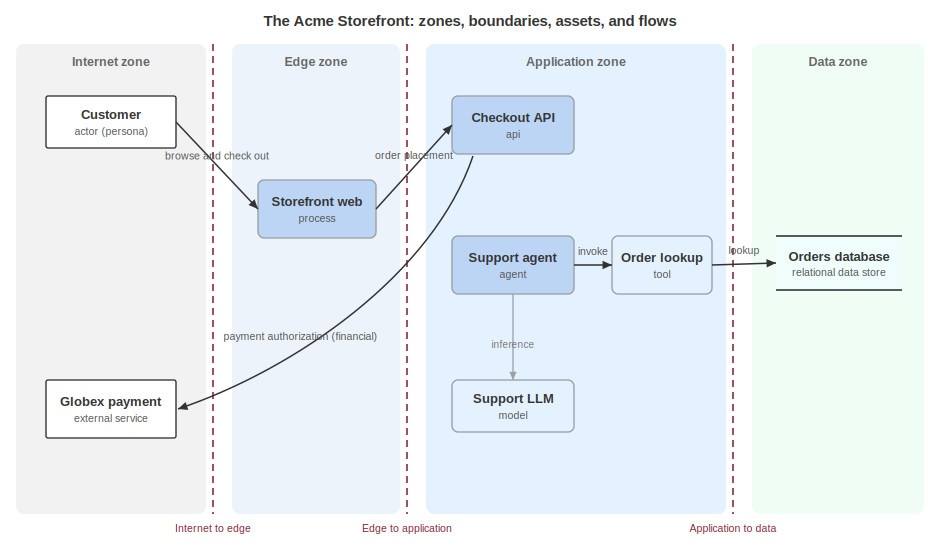

# Documenting Architecture

Someone needs to understand how a system is put together without access to its architect. That someone might be a review board, a security engineer mapping attack surface, an incident responder bounding the blast radius of a live issue, an auditor, or a threat modeling tool that needs elements to attach findings to. Today they receive a diagram export or a wiki page: unversioned, unlinkable, and out of date soon after it is drawn.

The blueprint model turns architecture into a first-class object. The practitioners who raised issue #463 came from six activity areas and shared one demand: an artifact precise enough to determine attack surface, assess the impact of a failure, detect when the running system stops matching the drawing, and show what changed architecturally between one release and the next. Those four jobs need the same thing, a structural model that lives as data and that other documents can reference by identifier.

Architecture lives in the `blueprints` array at the root of a CycloneDX document. The components it describes sit in the ordinary `components` array, and the blueprint references them rather than restating them, which is the annotation rule at work. Acme's `acme-architecture.cdx.json` carries one blueprint, and the intent, threat, risk, and control documents each point into it by BOM-Link.

A `blueprint` requires a `name` and `modelTypes`, the declared kinds of view it represents.

```json
{
  "bom-ref": "bp-storefront",
  "name": "Acme Storefront data flow model",
  "description": "Data flow view of the storefront, checkout, and AI support agent, with trust zones and boundary requirements.",
  "modelTypes": [ "data-flow" ]
}
```

`modelTypes` draws from ten values, and the model type tells a consumer what analysis the view supports:

| Value | Description |
|---|---|
| `architecture` | An overall architectural view |
| `behavioral` | Behavior over time, the model type for behavior instances and graphs |
| `conceptual` | A high-level conceptual view |
| `data-flow` | The substrate for boundary and flow analysis |
| `deployment` | The view that answers blast radius questions |
| `logical` | A logical structure view |
| `network` | A network topology view |
| `operational` | An operational view |
| `physical` | A physical infrastructure view |
| `process` | A process view |

One blueprint declares one coherent view, and a document may carry several views of the same system.

## Metadata and Validity

Blueprint `metadata` is distinct from document metadata: it records who authored the view, an `ordinalVersion` for ordered comparison across revisions, and a `validityPeriod` with a review cadence.

```json
"metadata": {
  "timestamp": "2026-07-10T09:00:00Z",
  "authors": [
    {
      "bom-ref": "party-jordan",
      "roles": [ { "role": "author" } ],
      "person": { "name": "Jordan Kim", "jobTitle": "Security Architect" }
    }
  ],
  "ordinalVersion": "1.3",
  "validityPeriod": {
    "start": "2026-07-10T00:00:00Z",
    "end": "2027-07-10T00:00:00Z",
    "reviewFrequency": "P3M"
  }
}
```

Architecture rots. The `validityPeriod` makes the rot visible: `start` and `end` bound the window the view claims to describe, and `reviewFrequency` (an ISO 8601 duration, `P3M` for every three months) states how often it gets checked, and `ordinalVersion` is what a reviewer diffs to see architectural drift between releases.

## Scope

`scope` states what the model covers and what it deliberately leaves out of the view.

```json
"scope": {
  "bom-ref": "scope-storefront",
  "name": "Storefront and support",
  "description": "Includes the storefront, checkout, and support agent. Excludes the warehouse management system, which has its own model.",
  "includedComponents": [ "comp-web", "comp-checkout", "comp-agent", "comp-llm" ]
}
```

Alongside `includedComponents`, an `excludedComponents` array and the description name what sits outside the frame. Stating the edge of the model is what lets a reader treat the absence of a thing as a decision rather than an oversight.



## Assets

Assets are the nodes of the model, and an asset takes one of four forms: a reference to a component (`componentRef`), a reference to a service (`serviceRef`), a reference to a party (`partyRef`), or an inline declaration with an explicit `type` and `name`. The reference forms bind the view to the same objects the rest of the document already describes.

```json
{
  "bom-ref": "asset-web",
  "componentRef": "comp-web",
  "type": "process",
  "zone": "zone-dmz",
  "authentication": [ "form", "session-cookie" ]
}
```

A reference asset carries a `type` but not a `name`, because it takes its display identity from the object it points at, and a party reference behaves the same way.

```json
{ "bom-ref": "asset-customer", "partyRef": "party-customer", "type": "actor" }
```

Only the inline form declares both a `type` and a `name`, for things outside the inventory such as an agent tool.

```json
{
  "bom-ref": "asset-order-tool",
  "type": "tool",
  "name": "Order lookup tool",
  "description": "Read-only tool the agent invokes to fetch order status.",
  "zone": "zone-internal"
}
```

The `type` vocabulary spans classic data flow elements and modern ones, among them:

| Value | Description |
|---|---|
| `process` | A running process, the classic data flow element |
| `api` | An exposed API |
| `agent` | An AI agent |
| `tool` | A tool an agent invokes |
| `model` | An AI model |
| `data-store` | A store of data at rest |
| `actor` | A person or external system interacting with the model |

A type outside the predefined set uses the same name-and-description object form as the other extensible fields, which keeps the model open without losing the shared vocabulary.

An asset can carry an `assetClassification` that grades its criticality and sensitivity, which is how impact analysis knows which nodes matter most.

```json
"classification": {
  "criticality": "high",
  "classification": "confidential",
  "categories": [ "payment" ],
  "tags": [ "pci-scope" ]
}
```

It also records the `authentication` and `authorization` it enforces, each a typed vocabulary with a custom escape: `authentication` draws from mechanisms such as the following, and `authorization` from access-control models.

| Field | Value | Description |
|---|---|---|
| `authentication` | `form` | Form-based login |
| `authentication` | `session-cookie` | A session cookie |
| `authentication` | `mtls` | Mutual TLS |
| `authentication` | `jwt` | A JSON Web Token |
| `authentication` | `certificate` | A client certificate |
| `authentication` | `fido2` | A FIDO2 authenticator |
| `authorization` | `rbac` | Role-based access control |
| `authorization` | `abac` | Attribute-based access control |
| `authorization` | `rebac` | Relationship-based access control |

```json
"authentication": [ "mtls", "jwt" ],
"authorization": [ "rbac", { "name": "purpose-based", "description": "Access gated by declared processing purpose." } ]
```

A predefined value is a plain string, and values outside the vocabulary are objects with a `name` and a `description`, as `purpose-based` shows. `ownership` binds a party as the owner of an asset, which matters most for parts outside the producing organization.

```json
"ownership": [
  {
    "bom-ref": "party-globex",
    "roles": [ { "role": "supplier" } ],
    "organization": { "name": "Globex Payments" }
  }
]
```

Finally, an asset lists its `interfaces`, the exposed surface a caller can reach.

```json
"interfaces": [
  {
    "name": "Orders API",
    "type": "rest",
    "protocol": "https",
    "dataFormat": "application/json",
    "authentication": [ "jwt" ],
    "operations": [ "createOrder", "getOrder" ]
  }
]
```

An interface names its `type` (`rest`, `graphql`, `grpc`, and others), its `protocol`, and the `operations` it exposes. Interfaces and operations are exactly what a threat modeler enumerates to build attack surface.

## Zones and Boundaries

Zones are containers for network segments, data domains, tenants, or geographies, and each zone carries a `type`:

| Value | Description |
|---|---|
| `network` | A network segment |
| `data` | A data domain |
| `trust` | A trust domain |

```json
"zones": [
  { "bom-ref": "zone-dmz", "name": "Edge", "type": "network" },
  { "bom-ref": "zone-data", "name": "Data", "type": "data" }
]
```

Boundaries are the edges between the zones they separate, and they carry the substance a diagram usually reduces to a dashed line.

```json
{
  "bom-ref": "bnd-edge",
  "name": "Internet to edge",
  "zones": [ "zone-internet", "zone-dmz" ],
  "crossingRequirements": {
    "authentication": [ "form", "session-cookie" ],
    "protocols": [ "https" ],
    "rateLimit": "600 requests per minute per client"
  },
  "sessionManagement": {
    "idleTimeout": 1800,
    "absoluteTimeout": 43200,
    "userLogout": true
  }
}
```

`crossingRequirements` state what a request satisfies at the moment of crossing (authentication, authorization, permitted protocols, rate limits), and `sessionManagement` states what governs the session that a successful crossing produces: token lifetimes, idle and absolute timeouts, logout semantics. The two are separated on purpose, because the gate and the lease are enforced by different mechanisms and fail in different ways. A boundary also carries a `type` from the same set, and Acme marks an internal edge as `"type": "trust"`. The threat model annotates these boundaries rather than restating them: a `trustBoundary` object references `bnd-edge` and adds the trust differential and the threats present there.

## Relationships and Flows

`relationships` are the static structure, a keyed adjacency form that mirrors the dependency graph, with typed edges such as `serves`, `contains`, and `dependsOn` among others, plus a `custom` escape.

```json
"relationships": [
  { "ref": "asset-web", "serves": [ "asset-customer" ] },
  { "ref": "asset-checkout", "dependsOn": [ "asset-payment" ] },
  { "ref": "asset-agent", "dependsOn": [ "asset-llm", "asset-order-tool" ] }
]
```

A named edge that no keyword covers uses `custom`: `feature-tour.cdx.json` records `{ "type": "processes", "targets": [ "z-data" ] }`. Where relationships are structural, `flows` are the runtime edges: a `source`, a `destination`, a `type`, whether the payload is `encrypted`, and, critically, what it carries.

```json
{
  "bom-ref": "flow-order",
  "name": "Order placement",
  "source": "asset-web",
  "destination": "asset-checkout",
  "type": "message",
  "encrypted": true,
  "dataProfiles": [ "dp-customer-pii" ]
}
```

Flow `type` classifies what the edge moves, and the values include the following:

| Value | Description |
|---|---|
| `data` | A data transfer |
| `message` | A message exchange |
| `financial` | A financial transaction |
| `control` | A control instruction, one asset directing another |

Acme's blueprint also records a `financial` payment flow and a `control` flow for the agent invoking its tool. A flow whose payload references a `dataProfile` is what turns a picture into a privacy and security substrate: refer to the Analyzing Privacy chapter.

## Actors

`actors` bind parties into the model with the context the party model does not carry: the `permissions` they hold and the `zone` they operate from.

```json
{
  "bom-ref": "actor-agent",
  "party": {
    "bom-ref": "party-agent-sys",
    "roles": [ { "role": "agent" } ],
    "system": { "kind": "agent", "ref": "comp-agent" },
    "relations": { "delegatedBy": "party-acme" }
  },
  "permissions": [ "read-orders" ],
  "zone": "zone-internal"
}
```

For an autonomous agent, `delegatedBy` records whose authority it acts on, which is the difference between the agent and the party that answers for it.

## Assumptions

An `assumption` records a load-bearing belief the model depends on, and what happens if it turns out to be false. It is where a producer states what the view does not prove.

```json
{
  "bom-ref": "asm-tokenized",
  "description": "Cardholder data is tokenized by the payment gateway and never stored by Acme.",
  "topic": "compliance",
  "relatedAssets": [ "as-checkout" ],
  "validity": "verified",
  "impact": "If false, the checkout API enters PCI cardholder-data scope.",
  "owner": "party-sec",
  "validationMethod": "Reviewed gateway integration and data retention configuration.",
  "validationDate": "2026-06-01T00:00:00Z"
}
```

The `owner`, `validationMethod`, and `validationDate` turn a belief into an auditable claim: someone is accountable, it was checked a particular way, and the check has a date a reviewer can judge as fresh or stale.

## Visualizations

A `visualization` attaches or links a rendering, and the structured model stays authoritative: the picture is a projection of it.

```json
{
  "bom-ref": "viz-seq",
  "name": "Checkout sequence",
  "type": { "type": "sequence" },
  "level": "detailed",
  "elements": [ "as-checkout" ],
  "attachment": {
    "mediaType": "text/plain",
    "content": "sequenceDiagram\n  Customer->>Checkout: place order\n  Checkout->>Gateway: authorize"
  }
}
```

`type` is a `visualizationType` from a predefined set, and the diagram travels inline as an `attachment` with a `mediaType` and `content`, or by `url` for a rendering hosted elsewhere, as the architecture document's context diagram does. When the drawing and the model disagree, the model is the record that wins.

## Consuming an Architecture Document

A recipient resolves the blueprint by `bom-ref` and reads only what the task needs. A threat modeler walks assets, interfaces, and boundary crossings to build attack surface, then references those identifiers from a threat model. An incident responder follows the flows out of a compromised asset to bound blast radius. A monitoring system compares the observed topology against the declared zones, boundaries, and flows and raises the delta, which is how the model turns "detect the unexpected" into a computation rather than a hunch. A reviewer diffs `ordinalVersion` N against N+1 to see what changed architecturally, and an auditor reads assumptions and their `validationDate`. Each of these consumers attaches by BOM-Link, `urn:cdx:<serialNumber>/<version>#<bom-ref>`, without editing the blueprint.

A blueprint states structure and enforced expectation. It does not model what an asset does over time, which belongs to the behavior model: refer to the Describing Behavior chapter. It does not model data at rest, since the blueprint only references data stores and data sets: refer to the Modeling Data Stores and Data Sets chapter. And it does not claim the structure is safe: what can go wrong, what it costs, and whether anyone checked are the jobs of the threat, risk, and control models, which reference these same assets and boundaries. Publishing structure alone is a legitimate stopping point, because the threat, risk, control, and privacy models all attach to this substrate by the same identifiers.

<div style="page-break-after: always; visibility: hidden">
\newpage
</div>
