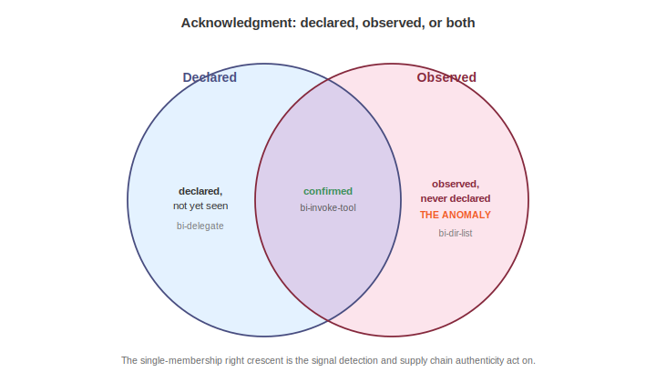
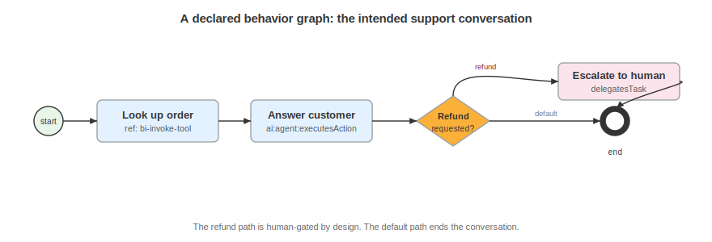

# Describing Behavior

Every component has a behavioral fingerprint. A checkout API opens connections to a payment gateway and writes to an order store. A support agent calls a lookup tool and, when a customer asks for a refund, escalates to a human. When a component starts doing something outside that fingerprint, the deviation is the signal. A new network beacon, an installer enumerating directories it never touched before, a model reaching for a tool it was never wired to call: each is a behavior that was observed but never declared.

In 2026, Microsoft and Karambit.AI described applying this exact comparison to software authenticity at roughly fourteen billion files per month (How Karambit.AI and Microsoft bring software authenticity to 14 billion files per month, Microsoft Security Blog, 2026). The shift they describe is away from static signature matching, where every file is analyzed as an island, and toward behavioral analysis, where tampering and supply chain compromise surface as a departure from expected behavior. What a program like that computes internally, the CycloneDX behavior model lets any producer and consumer exchange in the open: a declared baseline on one side, an observed record on the other, and a structured way to see where the two diverge.

Four audiences consume this, matching community needs U1 through U5 on issue #463. Detection engineering wants the declared baseline so an alert can fire on anything outside it. Supply chain authenticity wants to compare a build's declared behavior against what runs in production. Agent governance wants to know which tools an AI agent is permitted to invoke and which it invoked. QA validation wants to confirm that observed behavior matches the specification before a release ships.

Behavior is carried inside a blueprint, the container defined in the Documenting Architecture chapter. A blueprint that models behavior lists `behavioral` in its `modelTypes`, then attaches a `behaviors` container. That container has two parts: `instances`, a flat list of individual behaviors, and `graphs`, ordered flows built from those behaviors.

```json
"behaviors": {
  "instances": [ ... ],
  "graphs": [ ... ]
}
```

This is annotation, not duplication: the behaviors describe an asset that already exists elsewhere in the blueprint, and the graph's `subject` and each instance's `actors` and `targets` reference those elements by bom-ref or bom-link rather than restating them.

## The Behavior Taxonomy

Individual behaviors are not free text: each is coded against an external, versioned taxonomy of several hundred colon-delimited values organized into families.

| Value | Description |
|---|---|
| `network` | Network activity |
| `file` | File and directory activity |
| `system` | System-level activity |
| `data` | Data handling |
| `security` | Security-relevant activity |
| `privacy` | Privacy-relevant activity |
| `ai` | AI and agent behavior |

A value names a family, a subject, and an action, as in `ai:agent:invokesTool` or `file:directory:listsDirectory`. The taxonomy is versioned independently of the schema, the same way the cryptography reference registry evolves on its own cadence, so new behaviors can be added without a schema release. Coding behavior against a shared vocabulary is what lets one organization's declared baseline be compared against another's observed record.

## Behavior Instances

A `behaviorInstance` records one behavior, and it requires a `bom-ref` and a `behavior` value from the taxonomy. Its `acknowledgment` array states how the behavior is known, `trigger` states what set it off, and `actors` and `targets` reference the party performing the behavior and the thing it acts on.

```json
{
  "bom-ref": "bi-invoke-tool",
  "behavior": "ai:agent:invokesTool",
  "acknowledgment": [ "declared", "observed" ],
  "trigger": "user-initiated",
  "actors": [ "urn:cdx:11111111-1111-4111-8111-111111111111/1#party-agent-sys" ],
  "targets": [ "urn:cdx:11111111-1111-4111-8111-111111111111/1#asset-order-tool" ]
}
```

Here the support agent's tool call is both declared and observed. That combination is the important one: the two members of `acknowledgment` carry the whole comparison.

### Acknowledgment



`acknowledgment` is an array holding `declared`, `observed`, or both. The three meaningful states are the point of the model:

- `["declared", "observed"]` is confirmed. The behavior was expected, and it was seen.
- `["declared"]` is expected but not yet witnessed. The producer says the component does this, and no observation has confirmed it.
- `["observed"]` is the anomaly. The behavior was seen but never declared.

The Acme support agent declares that it delegates a task but has not yet been seen doing it, so its `bi-delegate` instance carries `["declared"]`. It was also seen listing a directory, a behavior nobody declared:

```json
{
  "bom-ref": "bi-dir-list",
  "behavior": "file:directory:listsDirectory",
  "acknowledgment": [ "observed" ],
  "trigger": "unknown"
}
```

`bi-dir-list` is the signal. A support agent has no declared reason to enumerate a filesystem, and the observed-only acknowledgment is exactly what detection engineering and supply chain authenticity act on. It becomes a referenceable fact with a bom-ref: a detection rule can key on it, a threat can point at it, and the producer can be asked to explain or retract it.

### Triggers

`trigger` names what causes a behavior, and it draws from a fixed set:

| Value | Description |
|---|---|
| `startup` | Runs at component startup |
| `shutdown` | Runs at shutdown |
| `scheduled` | Fires on a schedule |
| `event-driven` | Fires in response to an event |
| `user-initiated` | Set off by a user action |
| `api-call` | Set off by an API call |
| `signal` | Set off by a signal |
| `condition-based` | Fires when a condition holds |
| `continuous` | Runs continuously |
| `on-demand` | Runs when requested |
| `unknown` | The cause is not known |

A declared behavior usually carries a concrete trigger. The anomaly above carries `unknown`, because a behavior nobody declared has no known cause.

## Behavior Graphs



Instances say what a component does, and a `behaviorGraph` says in what order. It requires a `bom-ref` and `nodes`, and it typically sets `kind`, `subject`, `acknowledgment`, and `transitions`. `kind` is `activity` for a flow of actions, `state-machine` for lifecycle states, or `mixed`, and `subject` references the asset the graph describes.

```json
{
  "bom-ref": "bg-support-conversation",
  "name": "Support conversation",
  "kind": "activity",
  "subject": "asset-agent",
  "acknowledgment": [ "declared" ],
  "nodes": [ ... ],
  "transitions": [ ... ]
}
```

This graph is declared: it is the intended flow for an order-status conversation, the baseline a runtime record is later compared against.

### Ordering

A graph can set `ordering` to state how its nodes relate in time: `sequential`, `unordered`, or `parallel`, and Acme's session lifecycle graph sets `"ordering": "unordered"`, because its states are entered by event, not in a fixed line.

## Behavior Nodes

A `behaviorNode` requires a `bom-ref` and a `kind`, and different kinds carry different fields:

| Value | Description |
|---|---|
| `initial` | The entry point of the graph |
| `final` | The end point |
| `activity` | An action node that names a behavior |
| `state` | A lifecycle state |
| `event` | An occurrence that moves the graph |
| `gateway` | A decision point |

An `activity` node names a behavior in one of three ways (a taxonomy value in `behavior`, a `ref` to an existing instance, or a nested `graph`), and a `gateway` node sets `gatewayKind` for its branching logic. The Acme activity graph uses all of these:

```json
"nodes": [
  { "bom-ref": "bn-start", "kind": "initial", "name": "Conversation starts" },
  { "bom-ref": "bn-lookup", "kind": "activity", "name": "Look up order", "ref": "bi-invoke-tool" },
  { "bom-ref": "bn-answer", "kind": "activity", "name": "Answer customer", "behavior": "ai:agent:executesAction" },
  { "bom-ref": "bn-gate", "kind": "gateway", "name": "Refund requested?", "gatewayKind": "exclusive" },
  { "bom-ref": "bn-escalate", "kind": "activity", "name": "Escalate to human", "behavior": "ai:agent:delegatesTask" },
  { "bom-ref": "bn-end", "kind": "final", "name": "Conversation ends" }
]
```

`bn-lookup` reuses the declared instance `bi-invoke-tool` by reference, so the same tool call appears once in `instances` and is pointed to from the graph, while `bn-answer` and `bn-escalate` name their behaviors inline.

`state` and `event` nodes appear in a state machine, where a `state` node can attach behavior instances that run as the state is entered, while it holds, and as it exits, through `onEntry`, `doActivity`, and `onExit`. It can also carry an `ordinal` for position, and an `event` node sets `eventType`. The session lifecycle in `feature-tour.cdx.json` uses both:

```json
"nodes": [
  { "bom-ref": "n-init", "kind": "initial" },
  { "bom-ref": "n-active", "kind": "state", "name": "Active", "ordinal": 1, "onEntry": "bi-log", "doActivity": "bi-log", "onExit": "bi-log" },
  { "bom-ref": "n-timeout", "kind": "event", "name": "Idle timeout", "eventType": "scheduled" },
  { "bom-ref": "n-gate", "kind": "gateway", "name": "Re-auth?", "gatewayKind": "exclusive" },
  { "bom-ref": "n-closed", "kind": "final", "name": "Closed" }
]
```

The `Active` state logs an event on entry, throughout, and on exit, each pointing at the `bi-log` instance, and the `Idle timeout` event is `scheduled`.

## Transitions

A `transition` connects nodes: it requires `source` and `target`, and it can add a `trigger`, a `guard` condition, a `default` flag for the fall-through branch out of a gateway, and an `effect` naming a behavior instance the transition itself runs.

```json
"transitions": [
  { "source": "n-init", "target": "n-active", "trigger": "user-initiated" },
  { "source": "n-active", "target": "n-timeout", "trigger": "scheduled" },
  { "source": "n-gate", "target": "n-active", "guard": "re-auth succeeds", "effect": "bi-log" },
  { "source": "n-gate", "target": "n-closed", "default": true }
]
```

The gateway has two ways out: a guarded edge back to `Active` when re-authentication succeeds, which logs an event as its `effect`, and a `default` edge to `Closed` for everything else. In the Acme activity graph the same pattern routes a refund request to a human with `"guard": "request involves a refund"` and sends everything else to the end with `"default": true`.

## Consuming a Behavior Document

A recipient reads the declared baseline first: the instances and graphs a producer says represent normal operation. Detection engineering turns that baseline into alerting rules, a monitor then emits observed instances against the same taxonomy, and a consumer joins the two by behavior value. Anything that carries `["observed"]` with no matching `declared` is a deviation worth investigating. Anything with `["declared"]` and no `observed` is an expected behavior not yet confirmed, which QA can treat as a checklist item. Because both sides code against the shared, versioned taxonomy, the comparison holds across organizations, which is what makes it useful for supply chain authenticity rather than only for one vendor's internal tooling.

The behavior model describes what a system does and in what order: it does not rate how bad a deviation is, model an attacker, or prescribe a fix. An observed-only behavior is a signal, not a verdict. Turning that signal into a threat, a likelihood, and a response is the work of the threat and risk models. How behavior wires into those models is still converging, so a behavior instance stays deliberately light on threat-side linkage. It records the observation cleanly and lets the asserting threat or risk document draw the edge to it.

<div style="page-break-after: always; visibility: hidden">
\newpage
</div>
