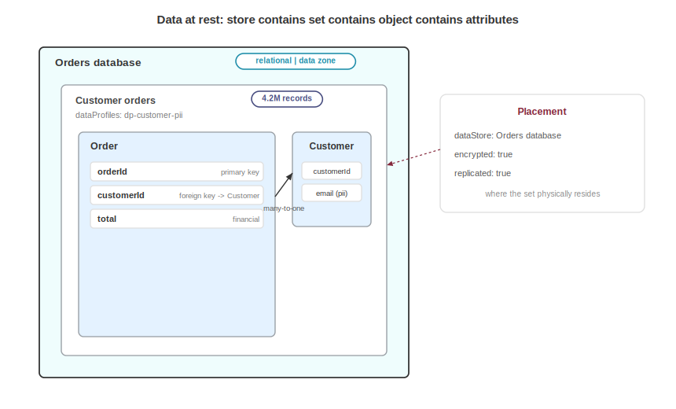

# Modeling Data Stores and Data Sets

Every system runs on data, and the sharpest questions in a security review are about that data. Where does it live, what is in it, and who can reach it? A threat model that lists components and flows but never names the orders database, or the customer records inside it, is missing the thing an attacker is after. The data model gives data first-class structure: the physical or logical store, the logical collection of records that store holds, the structure of each record, and a pointer to the classification and privacy semantics that govern it.

The audience is threat modelers who need affected assets to point at real data, data governance teams who need an inventory of collections and their sensitivity, and architects who want an entity relationship view that travels with the design.

Data modeling lives inside a blueprint: the `blueprints[].dataStores` array holds the stores, and the `blueprints[].dataSets` array holds the collections. Data objects, attributes, and relationships come from the data model and nest inside a data set. Classification and privacy come from a data profile, which sits in `profiles.dataProfiles` and is referenced by bom-ref.

Acme's data document is `acme-data.cdx.json`, serial `urn:uuid:9999...`, and it models one relational store, one data set of customer orders, two data objects, and one privacy-aware profile.

The layering is a stack: a data store holds data sets, a data set contains data objects, and a data object has attributes and relationships. That is an entity relationship diagram, or ERD, with storage and governance wrapped around it.



## Data Stores

A `dataStore` is the physical or logical place data resides, and it requires `bom-ref`, `name`, and `type`. The type names the storage model, with values that include the following:

| Value | Description |
|---|---|
| `relational` | A relational database |
| `document` | A document database |
| `key-value` | A key-value store |
| `object` | An object store |
| `data-lake` | A data lake |
| `vector` | A vector database |

Optional fields describe the product and its deployment: `vendor`, `product`, and `version` identify the software itself. `environment`, `zone`, `location`, `technologies`, and `authorization` describe where and how it runs, and the `dataSets` array lists which collections the store holds, by bom-ref.

```json
{
  "bom-ref": "ds-orders",
  "name": "Orders database",
  "type": "relational",
  "vendor": "Globex",
  "product": "GlobexSQL",
  "version": "16",
  "environment": "production",
  "zone": "zone-data",
  "location": "us-west",
  "technologies": [ "sql", "row-level-encryption" ],
  "dataSets": [ "dset-orders" ],
  "authorization": [ "rbac" ]
}
```

This is the asset an attacker wants to reach: the `zone` field ties the store to a network or trust zone in the blueprint, `location` records where it physically sits for data residency questions, and `authorization` records the access model at the store.

## Data Sets

A `dataSet` is the logical collection of records, independent of where it is stored, and it requires `bom-ref`, `name`, and `description`. `recordCount` sizes the collection, `dataProfiles` references the classification profiles that apply, `dataObjects` holds the record definitions, `owners` names the accountable parties by ref, and `authorization` records the access model for the set.

```json
{
  "bom-ref": "dset-orders",
  "name": "Customer orders",
  "description": "Order records including customer, line items, and delivery address.",
  "recordCount": 4200000,
  "dataProfiles": [ "dp-customer-pii" ],
  "owners": [ "party-data-team" ],
  "authorization": [ "rbac" ]
}
```

Separating the set from the store matters: the same collection can be replicated across stores, and one store can hold many collections. Keeping them as distinct objects lets each edge carry its own metadata.

## Placements

The `placements` array records where a data set resides, and each placement references a `dataStore` by bom-ref and carries operational facts about that copy: `encrypted`, `replicated`, and `retention`. This is the edge that says "this collection lives in that store, encrypted and replicated."

```json
"placements": [
  { "dataStore": "ds-orders", "encrypted": true, "replicated": true }
]
```

The placement complements `dataStore.dataSets`: that array lists what the store holds, and the placement adds the encryption and replication posture for one residence. A reviewer reads placements to find unencrypted copies of sensitive collections.

## Data Objects

A `dataObject` defines one record, the entity in the ERD, and it requires only `name`: `profile` classifies it through a data profile choice, `attributes` lists its fields, and `relationships` lists its edges to other objects.

```json
{
  "bom-ref": "do-order",
  "name": "Order",
  "profile": "dp-customer-pii",
  "attributes": [
    { "name": "orderId", "key": "primary", "required": true },
    { "name": "customerId", "key": "foreign", "references": "do-customer", "required": true },
    { "name": "total", "informationType": "financial" }
  ],
  "relationships": [
    {
      "name": "placed by",
      "target": "do-customer",
      "cardinality": "many-to-one",
      "sourceAttributes": [ "customerId" ]
    }
  ]
}
```

## Data Attributes

A `dataAttribute` is one field on a data object requiring only `name`, where `informationType` tags what kind of data the field carries, such as `financial` or `pii`, and `sensitive` and `required` are booleans. The `key` field takes one of three values, and `references` names the target object for a foreign key.

| Value | Description |
|---|---|
| `primary` | The primary key |
| `foreign` | A foreign key into another object |
| `unique` | A unique key |

```json
{ "name": "email", "informationType": "pii", "sensitive": true }
```

The `sensitive` flag and `informationType` are what let a reviewer find personal and financial fields without reading every schema. The customer object's `email` above is flagged sensitive PII, the order's `total` is financial, and `customerId` is a foreign key that references the customer object, `do-customer`.

## Data Relationships

A `dataRelationship` is an edge between two data objects, the line in an ERD, and it requires `target` and `cardinality`. The `cardinality` field states how many records sit on each side of the edge:

| Value | Description |
|---|---|
| `one-to-one` | One record on each side |
| `one-to-many` | One record here, many on the target side |
| `many-to-one` | Many records here, one on the target side |
| `many-to-many` | Many records on both sides |

`sourceAttributes` names the fields on this object that form the link.

```json
{
  "name": "placed by",
  "target": "do-customer",
  "cardinality": "many-to-one",
  "sourceAttributes": [ "customerId" ]
}
```

This relationship on the order object targets `do-customer` with `many-to-one` cardinality through the `customerId` attribute. Read together, the attributes and relationships reconstruct the full ERD from the document.

## Data Profile Choice

A data profile choice classifies a data object or set, either by referencing a shared profile by bom-ref, as `"profile": "dp-customer-pii"` does above, or by inlining a full profile object where the classification is local to one object. Referencing a shared profile is the common case: one profile describes the customer data once, and every object and set that carries that data points to it.

```json
"dataProfiles": [ "dp-customer-pii" ]
```

The profile carries classification, information types, subjects, purposes, jurisdictions, and regulations: those privacy fields are the subject of the Analyzing Privacy chapter. Here the point is the link: a data set and its objects reference the profile so that classification lives in one place and is never restated.

## Consuming a Data Model

A recipient reconstructs three views from this document: the storage view, from stores and placements, shows what exists, where it sits, and which copies are encrypted. The entity view comes from the objects, attributes, and relationships: a full ERD. The governance view comes from the profiles: classification and regulatory scope.

For threat modeling this is the impact axis: a threat in `acme-threat-model.cdx.json` names its `affectedAssets` by BOM-Link back into this document, for example `urn:cdx:9999.../1#ds-orders`. Now the threat says not just "the API is exposed" but "the API is exposed, and it reaches four million customer order records classified as confidential PII." The edge lives in the threat model, not here: the data store does not list the threats against it. Flows in the blueprint carry the same data profiles, so a reviewer can trace which paths move sensitive data into and out of each store.

The data model stops at structure and storage and does not define privacy semantics. Classification, data subjects, legal bases, retention rules, and regulatory scope live on the data profile: refer to the Analyzing Privacy chapter. The flows that move data between stores and components belong to the blueprint, alongside its zones and boundaries: refer to the Documenting Architecture chapter. The data model owns the data at rest: the stores, the collections, and the records inside them.

<div style="page-break-after: always; visibility: hidden">
\newpage
</div>
