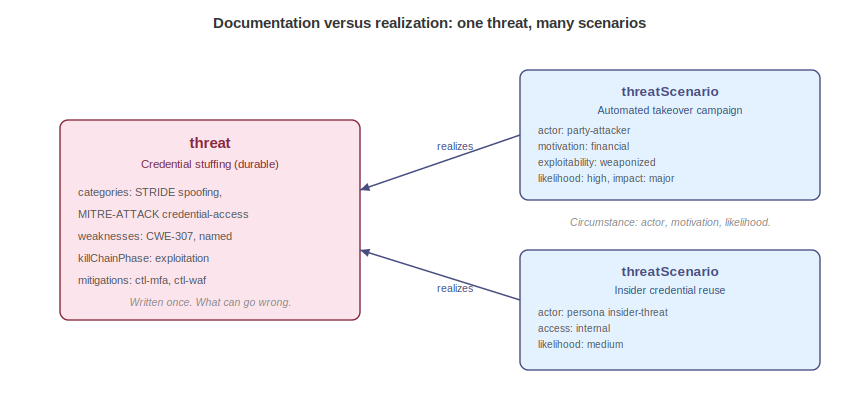
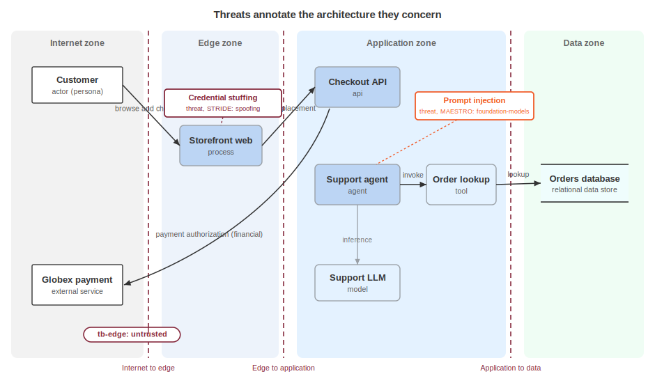

# Threat Modeling

A threat model starts decaying the day it is finished. The reasoning lives in a diagram locked to one vendor, the findings remain in a spreadsheet, and the decisions end up in a document no downstream system can parse. When the tool is retired or the modeler moves on, the analysis is lost. The aim is to record a threat model as structured, referenceable data: threats, the scenarios that realize them, and the actors behind them, all cross-linked to the architecture they concern and the controls that answer them.

The producers are security architects and threat modelers, and the consumers are the risk, controls, and engineering teams who act on the model, plus auditors and automation that need the reasoning itself rather than a static report.

Portability here is a tested property, not an aspiration. Five models from the OWASP Threat Model Library were converted to this representation, and an independent fidelity audit found no substantive loss across roughly 1,800 data points. A model that round-trips at that fidelity can be handed to another team, another tool, or a future maintainer without leaving meaning behind.

> Sidebar for threat modelers: the Threat Modeling Manifesto frames the practice as four questions, and they map cleanly onto the v2.0 models:
>
> - *What are we working on?* The blueprint, intent, and behavior models: the system, its objectives, and how it acts.
> - *What can go wrong?* The threat model: threats and the scenarios that realize them.
> - *What are we going to do about it?* Controls and risk responses.
> - *Did we do a good job?* Risk ratings, assessments, and the evidence bound to them.
>
> Only the second question is answered inside the threat model. The other three are reached by reference, which keeps the model focused and lets each answer evolve on its own schedule.

A threat model is carried in the `threats` container at the document root. Durable actor descriptions sit in a sibling `profiles` registry so scenarios can share them. Everything else the model depends on lives elsewhere and is reached by BOM-Link: assets and boundaries in the architecture document, business objectives in the intent document, behaviors in the behavior document, controls in the control document, and risks in the risk register. The threat model is the connective tissue, not a copy of its neighbors, and Acme's is `acme-threat-model.cdx.json`.

The `threats` container holds eight collections:

- `threats`: the durable catalog of what can go wrong.
- `scenarios`: realizations that bind a threat to an actor and a circumstance.
- `methodologies`: the approaches the model was built with.
- `attackPatterns`, `attackTrees`, `attackPaths`, and `abuseCases`: the structural detail of how an attack unfolds.
- `trustBoundaries`: annotations that mark blueprint boundaries as trust transitions.

## Documentation versus Realization



The spine of this model is a separation between what can go wrong and a specific instance of it going wrong. A `threat` is a durable, reusable catalog entry: credential stuffing is credential stuffing regardless of who runs it or how likely it is this quarter. A `threatScenario` is a realization, adding a named actor, a capability profile, a motivation, an access level, and an estimated likelihood and impact. One scenario can realize several threats, and vice versa. Keeping the two apart lets the catalog stay stable while the circumstances around it, which change far more often, live in the scenario.

## Methodologies

`methodologies` records the approaches used, drawn from a fixed list. It is provenance, coarse by intent: it says how the analysis was done, not what was found, and declaring it also tells a consumer how to read the rest of the model, since a STRIDE model reads differently from a LINDDUN or MAESTRO one.

| Value | Description |
|---|---|
| `STRIDE` | Organizes the analysis around violated security properties, spoofing and tampering among them. |
| `LINDDUN` | Organizes the analysis around privacy harms. |
| `PASTA` | A seven-stage, risk-centric, business-aligned methodology. |
| `MAESTRO` | Organizes the analysis around agentic and AI risks. |
| `OWASP` | The OWASP threat modeling approach. |
| `TRIKE` | The Trike risk-based methodology. |
| `VAST` | Visual, Agile, and Simple Threat modeling. |
| `ATFAA` | A threat framework for agentic AI systems. |
| `attack-tree` | Analysis built on attack tree decomposition. |
| `custom` | A locally defined methodology. |

```json
"threats": {
  "methodologies": [ "STRIDE", "MAESTRO" ]
}
```

## Threat

The `threat` is the catalog entry: its required fields are a `bom-ref` and a `name`, and the rest describe and classify it. `origin` places the threat in the NIST SP 800-30 source taxonomy, which lets the model carry threats that have no attacker at all.

| Value | Description |
|---|---|
| `adversarial` | A deliberate act by an attacker. |
| `accidental` | An unintended action by a legitimate user. |
| `structural` | A failure of equipment, software, or resources. |
| `environmental` | A disaster or infrastructure failure outside the system. |

`categories` is multi-taxonomy: each entry pairs a `taxonomy` with a `category`, and the schema gates the pair so a `STRIDE` entry accepts only STRIDE categories, a `MITRE-ATTACK` entry only ATT&CK tactics, and likewise for `LINDDUN` and `MAESTRO`. One threat can carry several taxonomies at once without flattening them into a single vocabulary.

`weaknesses` records the flaws the threat exploits, by CWE identifier or free text, and `killChainPhase` places it on the kill chain, from `reconnaissance` through `actions-on-objectives`. `affectedAssets` and `relatedBusinessObjectives` point, by BOM-Link, at the assets under threat and the objectives at stake, so a reader sees both the technical and the business surface, and `behaviors` links to declared or observed behaviors that the threat abuses. `mitigations` points at the controls that answer it, and `indicators` carries the observable signs of attempted or successful attack.

Two structural rules show up in a single threat. The threat references its assets, objectives, behaviors, and controls, and none of those are redefined here: each reference is an annotation. And the edge runs one way: the threat names its mitigating controls, the control document does not enumerate the threats it covers. The asserting document owns the edge.

```json
{
  "bom-ref": "th-credential-stuffing",
  "name": "Credential stuffing against customer accounts",
  "origin": "adversarial",
  "categories": [
    { "taxonomy": "STRIDE", "category": "spoofing" },
    { "taxonomy": "MITRE-ATTACK", "category": "credential-access" }
  ],
  "weaknesses": [ { "cweId": 307 } ],
  "killChainPhase": "exploitation",
  "affectedAssets": [
    "urn:cdx:11111111-1111-4111-8111-111111111111/1#asset-web"
  ],
  "relatedBusinessObjectives": [
    "urn:cdx:22222222-2222-4222-8222-222222222222/1#obj-protect-data"
  ],
  "mitigations": [
    "urn:cdx:66666666-6666-4666-8666-666666666666/1#ctl-mfa"
  ]
}
```

The fragment is abbreviated: the source threat also carries a named weakness and a second control reference. The AI threat in the same model, prompt injection driving agent tool misuse, shows the pattern for agentic risk: a `MAESTRO` / `foundation-models` category paired with a `behaviors` link to the tool-invocation behavior it abuses.

## Threat Scenario

The `threatScenario` is the realization, and it requires a `bom-ref`, a `name`, and the `threats` it realizes. `actor` references a party, the durable identity from the party model, and `threatProfile` references a capability profile in the registry. The circumstance fields describe this particular instance: `motivation`, `intent`, and `accessLevel` say why and from where. `attackVector` and `exploitability` say how: the vector's `type`, `complexity`, `privileges`, and `userInteraction` describe how reachable the attack is, while exploitability records its `level`, `complexity`, `skillRequired`, and whether it is `automatable`. `likelihood`, `impact`, and `riskScore` say how much it matters, and `relatedRisks` links the scenario to the risk it feeds in the register.

The circumstance fields are deliberately not on the actor. An organized criminal group has a fixed sophistication and skill set, but its motivation and access level depend on the engagement, so they belong to the scenario, not the profile.

```json
{
  "bom-ref": "ts-ato-campaign",
  "name": "Automated account takeover campaign",
  "threats": [ "th-credential-stuffing" ],
  "actor": "party-attacker",
  "threatProfile": "tp-organized-crime",
  "motivation": [ "financial" ],
  "intent": "opportunistic",
  "accessLevel": "external",
  "attackVector": { "type": "network", "complexity": "low", "privileges": "none", "userInteraction": "none" },
  "exploitability": { "level": "weaponized", "complexity": "trivial", "skillRequired": "basic", "automatable": true },
  "likelihood": { "level": "high" },
  "impact": { "level": "major", "categories": [ "financial", "reputation" ] },
  "riskScore": { "level": "high", "score": 7.2, "methodology": "owasp-risk-rating" },
  "relatedRisks": [ "urn:cdx:55555555-5555-4555-8555-555555555555/1#risk-ato" ]
}
```

`riskScore`, `likelihood`, and `impact` are the risk model's own objects, reused here so a scenario carries a first-pass rating without waiting for a full risk assessment, and so a scenario's rating and a risk's rating speak one language. Their complete structure, and how a scenario's estimate becomes a rated risk, is covered in Managing Risk.

## Threat Profiles

A `threatProfile` is a durable statement of an actor's capability: `sophistication`, `resources`, and `skillSet`. Profiles live in the `profiles` registry, under `threatProfiles`, so several scenarios, and several models, can reference one adversary profile by `bom-ref` instead of restating it. A profile carries capability only: motivation and intent stay on the scenario, because the same group can be opportunistic one week and targeted the next.

```json
{
  "bom-ref": "tp-organized-crime",
  "name": "Organized criminal group",
  "description": "Financially motivated groups running commodity account-takeover operations.",
  "sophistication": "intermediate",
  "resources": "moderate",
  "skillSet": [ "credential-stuffing", "phishing", "carding" ]
}
```

## Indicators and Signatures

A threat can carry `indicators`: observable signs that it is being attempted or has succeeded. The object has three arrays. `compromise` lists indicators of compromise, `attack` lists indicators of attack, and `signatures` holds machine-readable detections. Each `signature` pairs a `value` with an optional `confidence` and a `type` drawn from five detection formats.

| Value | Description |
|---|---|
| `yara` | A YARA rule. |
| `snort` | A Snort rule. |
| `regex` | A regular expression pattern. |
| `hash` | A hash-based match. |
| `behavior` | A behavioral detection description. |

Indicators are what turn a threat model from a planning document into something a detection pipeline can consume.

```json
"indicators": {
  "compromise": [ "Service-account token used from an unrecognized network" ],
  "attack": [ "Spike in bulk order reads" ],
  "signatures": [
    { "type": "yara", "value": "rule exfil { strings: $a = \"SELECT * FROM orders\" condition: $a }", "description": "Bulk order query", "confidence": "medium" }
  ]
}
```

## Attack Structures and Boundaries



The container also holds the structural detail of how an attack unfolds: `attackPatterns` for reusable techniques, `attackTrees` for goal decompositions, `attackPaths` for ordered steps across the architecture, and `abuseCases` for misuse narratives. Alongside them, a `trustBoundary` annotates a boundary defined in the blueprint and records which threats and controls sit at it. The boundary itself is not redefined here: the `boundary` field references it by BOM-Link, and the threat model adds only the trust-relevant overlay, which threats press on this edge and which controls hold it.

```json
{
  "bom-ref": "tb-edge",
  "name": "Internet to edge",
  "boundary": "urn:cdx:11111111-1111-4111-8111-111111111111/1#bnd-edge",
  "trustLevel": "untrusted",
  "threatsAtBoundary": [ "th-credential-stuffing" ],
  "controlsAtBoundary": [ "urn:cdx:66666666-6666-4666-8666-666666666666/1#ctl-waf" ]
}
```

Refer to Modeling Attacks for the full treatment of attack patterns, trees, paths, and abuse cases, and for how trust boundaries drive an attack narrative.

## Consuming a Threat Model

A recipient reads the `threats` catalog to learn what the producer believes can go wrong, then reads `scenarios` to see which of those are live, against which assets, by which actors, and at what estimated severity. Developers treat `mitigations` and the controls they point at as the work list, and testers treat abuse cases and attack paths as the test plan. Risk teams follow `relatedRisks` into the register. Auditors read the whole model as proof that analysis happened, and follow `methodologies` to see how. Because every reference is a BOM-Link, a consumer can resolve `affectedAssets` into the architecture and check for gaps: a threat with no control, a scenario with no risk, a boundary with no coverage. Detection teams can lift `signatures` straight into tooling, and nothing depends on the tool that authored the model.

The threat model names what can go wrong and who might cause it, not how an attack progresses step by step. Refer to Modeling Attacks for the patterns, trees, paths, abuse cases, and trust boundaries that carry that detail. The model also stops short of deciding how much a threat matters in the end, or what the organization does about it: the scenario's `likelihood`, `impact`, and `riskScore` are a first estimate. Refer to Managing Risk for rating and ranking risks, choosing responses, and binding assessment evidence. The threat model states the problem and points at the answers, and the neighboring models own them.

<div style="page-break-after: always; visibility: hidden">
\newpage
</div>
