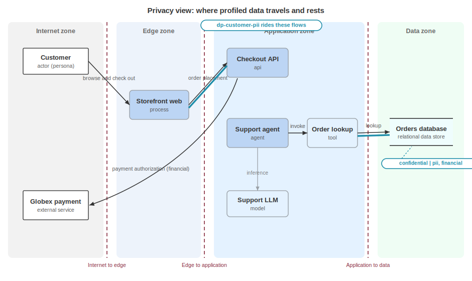

# Analyzing Privacy

A data protection officer scoping a DPIA, a privacy engineer running LINDDUN, and an auditor checking a processing record all ask the same first question: what personal data does this system hold, about whom, for what purpose, and under which law? The data stores and data sets answer the structural question, which store holds which records with which attributes. A data profile answers the privacy question: it gathers classification, subjects, purposes, jurisdictions, regulations, and handling rules into one reusable declaration that the architecture references wherever the data travels.

The separation matters: structure describes form, and a profile describes meaning under privacy law. One profile can describe data that lives in several stores, crosses several flows, and appears in several data objects. Declaring it once and referencing it everywhere keeps the privacy picture consistent as the architecture grows.

Data profiles live in a registry under the document root, `profiles.dataProfiles`, drawn from the profile model, and each entry is a `dataProfile` from the enhanced data model. Architecture elements reference profiles by bom-ref: a blueprint flow carries a `dataProfiles` array, a data set lists the profiles its records match, and a data object names the single `profile` that governs it, while component and service data carry their own lighter classification and governance. Acme's data document (`urn:uuid:9999...`) holds one profile, `dp-customer-pii`. The architecture references it from a data set, a data object, and a flow.

## The Data Profile

A `dataProfile` names a category of data and states what a privacy reviewer needs to reason about it, and only `name` is required. Every privacy field is optional, so a profile can start thin and deepen over time, and the head of the profile sets classification, the information types it contains, and the wire formats it appears in.

```json
{
  "bom-ref": "dp-customer-pii",
  "name": "Customer order data",
  "description": "Personal and financial data about retail customers.",
  "classification": "confidential",
  "informationTypes": [ "pii", "financial" ],
  "dataFormats": [ "application/json" ]
}
```

`classification` is a sensitivity label with five predefined values.

| Value | Description |
|---|---|
| `confidential` | Sensitive data limited to those who need it. |
| `internal` | Data intended for use inside the organization. |
| `public` | Data that can be disclosed freely. |
| `restricted` | Data under the tightest handling limits. |
| `classified` | Data subject to a government classification scheme. |

When an organization's scheme does not map onto those five, a custom branch carries a named label with a description instead. `informationTypes` says what kinds of data are present, drawn from a taxonomy whose values include the following.

| Value | Description |
|---|---|
| `pii` | Personally identifiable information. |
| `phi` | Protected health information. |
| `pci` | Payment card data. |
| `financial` | Financial records. |
| `biometric` | Biometric identifiers. |
| `genetic` | Genetic data. |
| `location` | Location data. |
| `credentials` | Authentication credentials. |
| `behavioral` | Behavioral data. |

Acme's profile is confidential data that is both `pii` and `financial`, and `dataFormats` records the media types the data is serialized as, here `application/json`.

## Data Subjects

A `subject` identifies the people or group a category of data describes, the anchor for data subject rights and for any analysis that turns on who is affected.

```json
"subjects": [
  {
    "name": "Retail customers",
    "type": "individual",
    "protectedClass": false,
    "jurisdictions": [ "US-CA", "GB" ],
    "regulations": [ "CCPA", "GDPR" ],
    "description": "Individuals purchasing from the storefront."
  }
]
```

A subject can name a group in free text, as here, or bind to a declared party through `party`, or point at another modeled element through `ref` when the subject is described elsewhere. `type` categorizes the subject, shown here as `individual`, and `protectedClass` is a boolean that marks a group a law singles out for extra protection, such as children or a category covered by anti-discrimination rules. Acme sets it `false` for retail customers as a whole. `jurisdictions` and `regulations` at the subject level record that these particular subjects fall under California and United Kingdom law, so a reviewer can see that one profile may carry subjects with different legal exposure.

## Purposes and Legal Basis

A `purpose` states why the data is processed and, where a law expects one, the legal basis for that processing.

```json
"purposes": [
  { "name": "Order fulfillment", "legalBasis": "contract" },
  { "name": "Customer support", "legalBasis": "legitimate-interest" }
]
```

Acme processes customer data to fulfill orders on the basis of `contract`, and for customer support on the basis of `legitimate-interest`. Both bases are expressed in the terms the governing law uses, here the lawful bases named in GDPR Article 6, and a profile under a different law would use that law's own vocabulary. A purpose records the legal basis as a declared fact, in the law's own words. It does not decide whether the basis is correct or whether the processing is lawful: that is a legal determination, made by people, outside the document.

## Jurisdictions and Regulations

At the profile level, `jurisdictions` and `regulations` state the full legal reach of the category, across all its subjects.

```json
"jurisdictions": [ "US-CA", "GB" ],
"regulations": [ "CCPA", "GDPR", "PCI-DSS" ]
```

`jurisdictions` uses ISO codes, `US-CA` for California and `GB` for the United Kingdom. The reach is machine readable. `regulations` names the regimes as strings, `CCPA`, `GDPR`, and `PCI-DSS`. The profile-level list is broader than any single subject's: the retail customer subject listed CCPA and GDPR, while the profile adds PCI-DSS because the category also carries payment data. As with legal basis, these are declared facts: naming a regulation records that the organization considers it in scope, not an assertion of compliance.

## Handling References

Handling rules are not restated inside the profile: they point at requirements declared elsewhere in the document, so the rule and its status live in one place and the profile references it.

```json
"retention": [ "req-retention" ],
"access": [ "req-access" ]
```

`req-retention` is Acme's requirement that order records are retained for seven years then deleted. `req-access` is its least-privilege access rule, and both are full requirements with an id and an implementation status. The same referencing pattern applies to `handling`, `processing`, and `sharing`, each an array of requirement references for the corresponding rule set. Three more fields describe the data lifecycle in place rather than by reference: `collection` records how the data is gathered, `disposal` how it is destroyed, and `ttl` a time to live after which it expires. Acme's profile leaves those unset.

## Governance and Direction

Component and service data carry a lighter privacy structure than a full profile. Their `governance` field, the data governance object, is an array of the parties accountable for a piece of data, using the same party choice used everywhere else in the model. In `feature-tour.cdx.json`, the reporting service names its data team as the accountable party.

```json
"data": [
  {
    "bom-ref": "cd-reports",
    "type": "dataset",
    "name": "Aggregated order reports",
    "classification": "internal",
    "governance": [ "party-data-team" ]
  }
]
```

Service data adds `dataFlowDirection`, an enum recording which way data moves across a service interface.

| Value | Description |
|---|---|
| `bi-directional` | Data moves both ways. |
| `inbound` | Data flows into the service. |
| `outbound` | Data flows out of the service. |
| `unknown` | The direction is not known. |

Services are converging into components in 2.0, so the same fields will appear under component data over time.

## From Data Flow to Privacy Flow



Data becomes analyzable the moment the architecture references a profile. A blueprint flow that carries a `dataProfiles` array is an arrow with known sensitivity, known subjects, and known regulations. Acme's order lookup flow carries `dp-customer-pii`, which turns the data flow diagram into a privacy flow diagram: every edge that moves customer PII is now visible as such.

```json
{
  "bom-ref": "flow-read-orders",
  "name": "Order lookup",
  "source": "zone-internal",
  "destination": "ds-orders",
  "type": "data",
  "encrypted": true,
  "dataProfiles": [ "dp-customer-pii" ]
}
```

This is the surface a LINDDUN analysis attaches to: privacy threats live in the same `threats` container as every other threat, classified under the LINDDUN taxonomy rather than STRIDE. A LINDDUN threat references the affected data indirectly, through the assets and flows that carry the profile, not by copying the profile into the threat. The edge lives in the asserting document: the threat points at the data and the profile does not list its threats, so linkability, identifiability, and the rest of the LINDDUN categories have concrete flows and stores to land on.

## Consuming a Privacy Analysis

A recipient resolves each profile reference to read the privacy picture without walking the whole schema. From `dp-customer-pii` a tool can list every flow, data set, and data object that carries it, then report where customer PII moves and rests. It can group subjects by jurisdiction, collect the regulations in scope, and follow the retention and access references to their requirement status. A DPIA tool reads the profile as its processing record. A LINDDUN tool reads the flows that carry it as its analysis surface.

A data profile classifies a category of data and records the legal facts around it. It does not adjudicate compliance, score privacy risk, or decide whether a legal basis holds: the risk register carries the rating, under a privacy impact category. Refer to Managing Risk for ratings, to Modeling Data Stores and Data Sets for the structural side, which store holds which records with which attributes, and to Threat Modeling for the privacy threats, their LINDDUN classification, and their reference chain back to the data. The privacy analysis is complete when the data is profiled and the architecture points at the profile.

<div style="page-break-after: always; visibility: hidden">
\newpage
</div>
