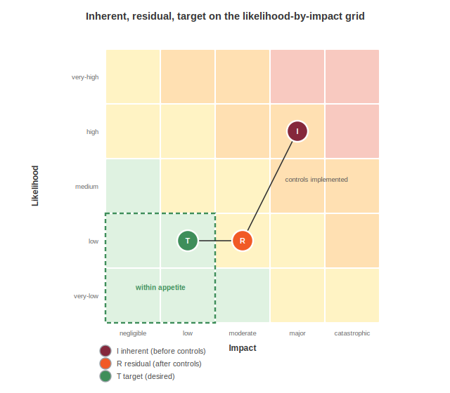

# Managing Risk

A risk register runs the organization, and it usually lives in a spreadsheet that no other system can read. The risk model makes it a document: a portable, composable register that travels to an acquirer's due diligence team, a regulator, a board packet, or the risk function of a customer sizing up a vendor. It links each risk to the threats that source it, the controls that treat it, the objectives it threatens, and the evidence that anyone checked. The model is deliberately neutral about which framework produced the numbers, so a FAIR shop, an FMEA shop, and a qualitative-matrix shop can all express their work and exchange it. FAIR, DREAD, FMEA, NIST SP 800-30, OCTAVE, OWASP Risk Rating, and a plain likelihood-by-impact grid are all first-class.

Risk is also where a set of newer concerns come home. AI harms, environmental impact, and fairness are risks at heart, and the model carries the fields to price them next to fraud and downtime rather than in a separate tool.

A risk register populates the `risks` container, which holds three arrays: `risks`, `assessments`, and `riskAppetites`.

```json
"risks": {
  "risks": [
    { "bom-ref": "risk-ato", "name": "Customer account takeover", "statement": "Credential stuffing against the storefront may take over customer accounts, leading to fraudulent orders, chargebacks, and loss of customer trust." }
  ],
  "riskAppetites": [ { "bom-ref": "rap-acme", "level": "cautious" } ],
  "assessments": [ { "bom-ref": "asmt-2026-q3", "type": [ "security", "threat" ], "cadence": "continuous", "timestamp": "2026-07-01T00:00:00Z" } ]
}
```

The `risks` array carries the register proper, with one entry per identified risk. Refer to Risk Appetite and Objectives for `riskAppetites` and to Assessing and Attesting for `assessments`. The register references threats and controls beside it and objectives in the intent library, and Acme's register is `acme-risk-register.cdx.json`.

## A Risk

A `risk` requires a `bom-ref`, a `name`, and a `statement`, the plain-language description of source, event, and consequence. Everything else characterizes and connects it.

```json
{
  "bom-ref": "risk-ato",
  "name": "Customer account takeover",
  "statement": "Credential stuffing against the storefront may take over customer accounts, leading to fraudulent orders, chargebacks, and loss of customer trust.",
  "domains": [ { "type": "security" }, { "type": "financial" } ],
  "affects": [
    "urn:cdx:1111...#comp-web",
    "urn:cdx:1111...#party-customer"
  ],
  "relatedThreats": [ "urn:cdx:4444...#ts-ato-campaign" ],
  "relatedBusinessObjectives": [ "urn:cdx:2222...#obj-protect-data" ],
  "status": "mitigated",
  "owner": "urn:cdx:1111...#party-acme"
}
```

`domains` classifies the risk through the `riskDomain` object, whose `type` values include the following, with a custom branch for anything else:

| Value | Description |
|---|---|
| `security` | Exposure to compromise of confidentiality, integrity, or availability |
| `privacy` | Exposure involving personal data and data subjects |
| `operational` | Exposure to disruption of business operations |
| `financial` | Direct or indirect monetary exposure |
| `safety` | Exposure to physical harm |
| `strategic` | Exposure to the organization's position or direction |
| `ethical` | Exposure arising from ethically contested outcomes |
| `human-rights` | Exposure affecting fundamental rights |
| `supply-chain` | Exposure inherited from suppliers and dependencies |
| `environmental` | Exposure affecting the physical environment |

`affects` is a single unified reference that may point at a component, a service, a data set, or a model, or at a party such as a person, persona, or organization, because the thing at risk might be an asset or might be a group of people. The related-reference family wires the risk into the rest of the stack without copying anything, each entry a reference by bom-link or bom-ref. `relatedThreats`, `relatedVulnerabilities`, and `relatedWeaknesses` point at the threat side, while `relatedRequirements`, `relatedStandards`, `relatedClaims`, and `relatedBusinessObjectives` point at the governance side. `status` and `owner` track the lifecycle and name the accountable party.

A domain can also carry a `priority` and a `description`, so the register can say which exposure matters most within a multi-domain risk:

```json
"domains": [
  { "type": "security", "priority": "high", "description": "Primary security exposure for the order store." }
]
```

## Inherent, Residual, and Target Ratings



A risk carries up to three ratings that share one structure: `inherentRisk` before any response, `residualRisk` after the responses in place, and `targetRisk` where the organization wants to land. Expressing all three is the spine of treatment, because it makes the value of controls legible as the distance between inherent and residual, and the remaining work as the distance from residual to target.

```json
"inherentRisk": {
  "likelihood": {
    "level": "high",
    "factors": [
      { "name": "Weaponized tooling widely available", "type": "exploit-maturity", "level": "very-high" },
      { "name": "Single-factor login for most customers", "type": "control-effectiveness", "level": "high" }
    ]
  },
  "impact": {
    "level": "major", "polarity": "harm",
    "categories": [ "financial", "reputation" ],
    "quantification": {
      "currency": "USD",
      "financialLossRange": { "minimum": 200000, "mostLikely": 850000, "maximum": 3000000 }
    }
  },
  "score": { "level": "high", "score": 7.2, "methodology": "owasp-risk-rating" }
},
"residualRisk": {
  "likelihood": { "level": "low" },
  "impact": { "level": "moderate", "categories": [ "financial" ] },
  "score": { "level": "medium" },
  "rationale": "Step-up authentication and edge rate limiting are implemented and verified."
},
"targetRisk": { "score": { "level": "low" } }
```

A `rating` decomposes into `likelihood`, `impact`, an overall `score`, and optional `detectability`, `confidence`, and `rationale`. Here the inherent rating is high and quantified as a probable-loss range, the residual rating drops to medium once step-up authentication is verified, and the target is low. The register's second risk, agent overreach, follows the same spine from a medium inherent likelihood to a low residual.

The register keeps most ratings terse, and a fuller rating, drawn from `risk-tour` in `feature-tour.cdx.json`, shows every field a quantitative method can populate.

## Inside Likelihood

`likelihood` states an overall `level` on non-overlapping bands, each defined by a probability range so two teams read the same word the same way, and carries the quantitative fields a numeric method needs.

| Value | Description |
|---|---|
| `very-low` | Rare under current conditions |
| `low` | Possible but not expected |
| `medium` | As likely to occur as not |
| `high` | Expected to occur |
| `very-high` | Expected to occur repeatedly |
| `certain` | Occurring or effectively guaranteed |

```json
"likelihood": {
  "level": "medium",
  "probability": 0.4,
  "frequency": 2,
  "timeframe": "P1Y",
  "range": { "minimum": 0.2, "mostLikely": 0.4, "maximum": 0.6 },
  "factors": [
    { "name": "Token exposure", "type": "exposure", "level": "medium" },
    { "name": "Monitoring coverage", "type": "detectability", "level": "low" },
    { "name": "Attacker capability", "type": "threat-capability", "level": "medium" }
  ]
}
```

`probability` is a decimal, `frequency` is an expected event count that may exceed one for methods such as FAIR loss-event frequency, and `timeframe` is an ISO 8601 duration such as `P1Y`. `range` is an `estimateRange`, a three-point `minimum`, `mostLikely`, `maximum` estimate for methods that reason over a distribution rather than a single value. Each `likelihoodFactor` names an independent dimension by `type` and rates it with its own `level`, with the dimension drawn from the following set:

| Value | Description |
|---|---|
| `attack-vector` | How reachable the attack surface is |
| `exploit-maturity` | How far exploitation has progressed in the wild |
| `control-effectiveness` | How well the controls in place perform |
| `threat-capability` | The sophistication and resources of the threat |
| `exposure` | How visible and accessible the target is |
| `detectability` | How likely the activity is to be noticed |

A factor may also carry a numeric `score` and a `weight` from 0 to 1, so a weighted average of factors can produce the overall level, which is how FAIR and OWASP Risk Rating build likelihood from parts.

## Inside Impact

`impact` states a severity `level` on bands that run from nuisance to existential, then says what kind of impact, in how many dimensions, and how large.

| Value | Description |
|---|---|
| `negligible` | No meaningful harm |
| `low` | Limited, recoverable harm |
| `moderate` | Material harm requiring a planned response |
| `major` | Serious harm to operations, finances, or people |
| `catastrophic` | Existential or irreversible harm |

```json
"impact": {
  "level": "major",
  "polarity": "harm",
  "categories": [ "confidentiality", "regulatory" ],
  "factors": [
    { "name": "Records exposed", "category": "confidentiality", "score": 8, "weight": 0.7 }
  ],
  "quantification": {
    "financialLoss": 750000,
    "currency": "USD",
    "affectedUsers": 4200000,
    "downtime": "PT0S",
    "dataRecords": 4200000,
    "recovery": "P30D",
    "affectedGroups": 2
  }
}
```

`categories` draws on the `impactCategory` enumeration, which puts AI-era and societal harms on the same footing as the classic ones, with a custom branch for anything local.

| Value | Description |
|---|---|
| `confidentiality` | Loss of confidentiality. |
| `integrity` | Loss of integrity. |
| `availability` | Loss of availability. |
| `financial` | Monetary loss. |
| `reputation` | Reputational damage. |
| `regulatory` | Regulatory or legal exposure. |
| `bias` | Biased system outcomes. |
| `discrimination` | Discriminatory treatment of a group. |
| `fairness` | Unfair outcomes across populations. |
| `human-rights` | Harm to human rights. |
| `environmental` | Environmental harm. |

Each `impactFactor` measures one dimension with a `category`, a `score`, and a `weight`, mirroring the way OWASP Risk Rating and OCTAVE Allegro derive impact from ranked areas. `riskAttributes` complements the categories by naming which security or privacy attributes the harm affects, drawing from an enumeration of eighteen that includes the following.

| Value | Description |
|---|---|
| `confidentiality` | Confidentiality of data. |
| `integrity` | Integrity of data and systems. |
| `availability` | Availability of systems and data. |
| `privacy` | Privacy of the people the data describes. |
| `data-subject-rights` | The rights of data subjects. |
| `purpose-limitation` | Use of data only for its declared purposes. |
| `minimization` | Collection of no more data than needed. |
| `non-repudiation` | Proof that an action took place. |

`quantification` is the `impactQuantification` object, and it is deliberately broad: a monetary `financialLoss` with `currency`, a `financialLossRange` for a distribution, `affectedUsers` and `dataRecords`, `downtime` and `recovery` as ISO 8601 durations, and `affectedGroups` for the number of distinct populations harmed, which matters when the impact is fairness rather than money.

The register's second risk is where an AI harm becomes visible. Its domain is `ethical`, and its impact reaches for the custom branch of the category list:

```json
{
  "domains": [ { "type": "ethical" }, { "type": "operational" } ],
  "inherentRisk": {
    "impact": {
      "level": "major",
      "polarity": "harm",
      "categories": [ "privacy", "reputation", { "name": "customer-trust" } ]
    }
  }
}
```

## Positive Risk

Two design choices let the register carry upside, not just downside, which is the part of ISO 31000 that most tools ignore. `impact.polarity` is `harm` or `benefit`, so gains are expressible. And the response strategies include `exploit` and `enhance` beside the four defensive dispositions, so a positive risk can be pursued rather than only defended against. Every impact in Acme's register is `harm`, but the fields are there for the opportunity that a growth or experimentation risk represents.

## Scoring

`riskScore` records the overall result as a qualitative `level`, a numeric `score`, or both, with a `vector` and a `methodology` saying how it was derived.

```json
"score": { "level": "high", "score": 7.5, "vector": "OWASP/L:M/I:H", "methodology": "owasp-risk-rating" },
"detectability": { "score": 4, "description": "Bulk reads resemble reporting traffic." },
"confidence": 0.6
```

The `methodology` enumeration is curated on one principle: it lists only methods that define a scoring calculation, plus a custom branch.

| Value | Description |
|---|---|
| `dread` | The DREAD scoring model. |
| `fair` | Factor Analysis of Information Risk. |
| `fmea` | Failure mode and effects analysis. |
| `nist-sp-800-30` | The NIST SP 800-30 assessment method. |
| `octave` | The OCTAVE method. |
| `owasp-risk-rating` | OWASP Risk Rating. |
| `qualitative-matrix` | A plain likelihood-by-impact grid. |

Program frameworks that govern the risk process but prescribe no score, such as ISO 31000 or the NIST AI Risk Management Framework, are recorded through `relatedStandards`, not misfiled here as if they produced a number. The `vector` string carries the metric values in the methodology's own notation, the way a CVSS vector does. Two optional axes round out the rating: `detectability`, a third dimension for methods such as FMEA whose risk priority number multiplies severity, occurrence, and detection, and `confidence`, a measure from 0 to 1 of how much to trust the rating, for quantitative methods that reason over uncertainty.

## Risk Responses

A `riskResponse` pairs an ISO 31000 disposition with the controls that carry it out.

```json
{
  "bom-ref": "rr-ato-reduce",
  "strategy": "reduce",
  "description": "Step-up authentication on risky logins and high-value orders, plus credential-replay detection at the edge.",
  "controls": [ "urn:cdx:6666...#ctl-mfa", "urn:cdx:6666...#ctl-waf" ],
  "status": "implemented",
  "effectiveness": { "rating": "good", "percentage": 0.8 },
  "priority": "high",
  "owner": "urn:cdx:1111...#party-acme",
  "addresses": [ "urn:cdx:4444...#th-credential-stuffing" ]
}
```

`strategy` is the disposition, and the schema defines six values spanning defensive and positive treatment.

| Value | Description |
|---|---|
| `avoid` | Eliminate the risk by stepping away from the activity. |
| `reduce` | Lower likelihood or impact through controls. |
| `transfer` | Move the risk to another party. |
| `accept` | Retain the risk as it stands. |
| `exploit` | Pursue a positive risk for its upside. |
| `enhance` | Increase the likelihood or benefit of a positive risk. |

The response does not describe the safeguard. It references controls, which carry their own status and effectiveness from the control model, and it can rank itself with `priority` and name an `owner` and a `targetDate`. This is the risk-to-control seam, and it is a reference, not a copy: the same `ctl-mfa` control serves this response, its threat's mitigations, and the control inventory, described once. `addresses` points back at the threat, vulnerability, weakness, or risk the response acts on. The register's second risk pairs a `reduce` response, `rr-agent-reduce`, with a tool allowlist and behavior monitoring, taking agent overreach from a high inherent score to a medium residual.

`priority` ranks how urgent a response or domain is, on a five-value scale.

| Value | Description |
|---|---|
| `none` | No priority assigned. |
| `low` | Lowest active priority. |
| `medium` | Moderate urgency. |
| `high` | High urgency. |
| `critical` | Most urgent, act first. |

Its companion enum is `criticality`.

| Value | Description |
|---|---|
| `minimal` | Marginal to the business. |
| `low` | Limited business importance. |
| `moderate` | Moderate business importance. |
| `high` | High business importance. |
| `critical` | Essential to the business. |

Criticality ranks how essential something is to the business rather than how urgent an action is: it attaches where the model weighs business importance, such as a business objective, while priority attaches where it ranks work, such as a domain or a response.

## Consuming a Risk Register

A board or acquirer reads statements, domains, and residual scores for the portfolio view. A risk owner tracks inherent to residual to target to see whether treatment is working, and reads the factor breakdown to see why a number is what it is. An auditor follows `relatedClaims` into CDXA to see which risks are backed by evidence, and a partially met claim is what justifies a residual that is lower than inherent but not zero. A vendor-risk team consumes a supplier's register directly instead of mailing a questionnaire. Because the scoring methodology travels with every score, a consumer can tell a FAIR loss figure from an OWASP average and compare like with like.

A risk register asserts what could go wrong in consequence terms and how the organization judges and treats it, referencing threats rather than deriving them, controls rather than implementing them, and claims rather than containing evidence. Refer to Risk Appetite and Objectives for how much risk the organization will accept and for the objectives that appetite serves. The register is the judgment layer. Refer to Assessing and Attesting for the record that an evaluation happened, by whom and against what evidence: the assessment is where judgment meets proof.

<div style="page-break-after: always; visibility: hidden">
\newpage
</div>
