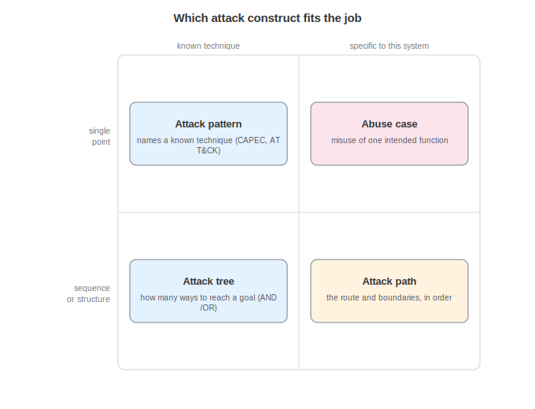
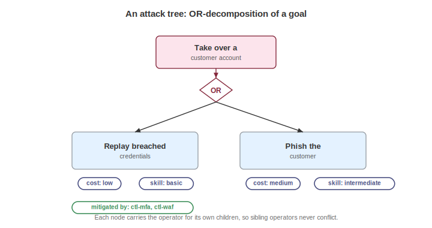
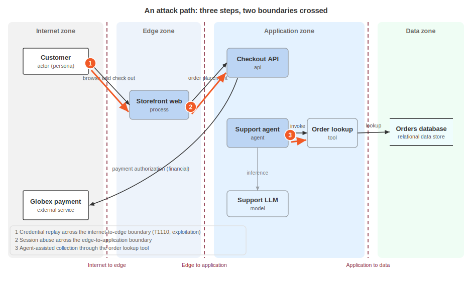

# Modeling Attacks

A threat says what could go wrong. Modeling the attack says how, and a security responder, a red team, or a threat modeler at Acme needs the mechanics written down: the named technique, the ways a goal breaks into subgoals, the ordered route across boundaries, and the misuse of a feature working as designed. Each is structurally different, so CycloneDX gives each its own construct instead of forcing one catch-all object to carry all four meanings.

These objects live in the `threats` root container, defined by the threat model (`cyclonedx-threat-2.0`). In Acme's documents they sit in `acme-threat-model.cdx.json` (`urn:uuid:4444...`) next to the threats and the one realization scenario. The container exposes `attackPatterns`, `attackTrees`, `attackPaths`, `abuseCases`, and `trustBoundaries` as sibling arrays. `attackVector` and `exploitability` attach to a threat scenario. Everything an attack points at, an asset, a boundary, a threat, a control, is referenced by BOM-Link. The fragments below abbreviate the serial number for reading: the form is `urn:cdx:<serial>/<version>#<bom-ref>`.

## Choosing the Construct



Four constructs describe an attack, and picking the right one is most of the work:

- Attack pattern names a known, reusable technique. Reach for it to answer "what is this move called," anchored to public catalogs.
- Attack tree decomposes a goal into subgoals to show how many ways there are to reach it. AND and OR nodes capture "all of these" against "any of these."
- Attack path traces the sequential route an actor takes through the system, step by step. It answers "which boundaries, in what order," including lateral movement.
- Abuse case describes the misuse of an intended function. It is the security counterpart of a use case: same structure, adversarial intent.

They compose. The Acme model uses all four at once: a pattern names a move, a tree shows the ways into an account, a path traces the campaign end to end, and an abuse case captures the agent misuse.

## Attack Pattern and Technique

An `attackPattern` names a known, reusable adversary technique and ties it to public catalogs. It carries a `capecId`, a `name` and `description`, `prerequisites` that make it viable, worked `examples`, one or more `techniques`, and optional `mitigations`. A `technique` is the ATT&CK-level detail inside it: `id`, `name`, `tactic`, and a `procedure` that says how the technique is carried out in this specific context.

```json
{
  "bom-ref": "apx-tour",
  "capecId": 116,
  "name": "Excavation",
  "description": "An adversary extracts data through repeated queries.",
  "prerequisites": [ "Valid service-account credentials" ],
  "examples": [ "Bulk extraction of order records via the reporting API" ],
  "techniques": [
    { "id": "T1005", "name": "Data from Local System", "tactic": "collection", "procedure": "Query the orders database directly with a stolen token." }
  ]
}
```

`prerequisites` records what the adversary needs in hand first, here a valid token. The `procedure` is the concrete how. When a countermeasure is known, `mitigations` holds BOM-Links to controls in the control inventory. A threat references its patterns by bom-ref, so the tour threat points at `apx-tour` without copying it.

## Attack Tree and Attack Tree Node



An `attackTree` decomposes a goal. It is a flat list of `nodes` plus a `root` naming the top node by bom-ref. Keeping nodes flat rather than nested lets a node be shared between parents and keeps the tree easy to walk. Each `attackTreeNode` names a subgoal and carries an `operator`, `and` or `or`, that governs its own child group: `or` means any child reaches the node, `and` means every child is required. Because the operator sits on the parent and not on the edges, sibling operators cannot conflict.

```json
{
  "bom-ref": "at-account-takeover",
  "name": "Take over a customer account",
  "root": "atn-goal",
  "nodes": [
    { "bom-ref": "atn-goal", "name": "Take over a customer account", "operator": "or", "children": [ "atn-stuffing", "atn-phish" ] },
    { "bom-ref": "atn-stuffing", "name": "Replay breached credentials", "cost": "low", "skill": "basic", "detectability": "moderate" },
    { "bom-ref": "atn-phish", "name": "Phish the customer", "cost": "moderate", "skill": "intermediate" }
  ]
}
```

The root is an `or`: replaying credentials or phishing each reaches account takeover. Leaf nodes carry attacker economics: `cost`, `skill`, and `detectability` rate how expensive, how skilled, and how visible a branch is, so a defender can find the cheapest route in.

A leaf can also bind to the rest of the model. The `atn-token` node in `feature-tour.cdx.json` links a weakness, a pattern, and a control:

```json
{ "bom-ref": "atn-token", "name": "Abuse a stolen service-account token", "attackPattern": "apx-tour", "weakness": "wk-token", "cost": "low", "skill": "intermediate", "detectability": "moderate", "mitigations": [ "ctl-token-binding" ] }
```

`attackPattern` reuses `apx-tour` instead of restating it, `weakness` points at the flaw the node exploits, and `mitigations` names the control that closes it.

## Attack Path and Attack Path Step



An `attackPath` traces the sequential route an actor takes, from first access to objective, lateral movement included. It carries an `objective`, the `actor` by bom-ref, an ordered list of `steps`, `realizes` (the threats the path makes real), and `relatedRisks` linking the risk register. Each `attackPathStep` describes one move: an optional `technique`, a `killChainPhase`, a `source` and `destination` asset, the `boundaryCrossed`, what it `exploits`, and step-level `mitigations`.

```json
{
  "bom-ref": "ap-ato-exfiltration",
  "objective": "Bulk exposure of customer order data",
  "actor": "party-attacker",
  "realizes": [ "th-credential-stuffing", "th-prompt-injection" ],
  "steps": [
    {
      "bom-ref": "aps-1",
      "name": "Credential replay",
      "technique": { "id": "T1110", "name": "Brute Force", "tactic": "credential-access" },
      "killChainPhase": "exploitation",
      "source": "urn:cdx:1111.../1#asset-customer",
      "destination": "urn:cdx:1111.../1#asset-web",
      "boundaryCrossed": "urn:cdx:1111.../1#bnd-edge"
    }
  ]
}
```

The source, destination, and boundary are BOM-Links into the architecture blueprint, and step `aps-1` crosses `bnd-edge`, the internet-to-edge boundary. A later step crosses `bnd-app` on the way to the checkout asset, and the final step drives the support agent into the order-lookup tool with its own `mitigations` link to the tool allowlist. Reading the steps in order shows exactly which boundaries the campaign traverses and where, and `realizes` ties the whole path back to the credential-stuffing and prompt-injection threats. On any step, `exploits` names the weakness turned into access.

## Abuse Case

An `abuseCase` is the security counterpart of a use case: it uses the same fields so the two read side by side, one intended, one adversarial. `abuser` is the party by bom-ref, `realizes` links the threats it makes concrete, `mainFlow` is the numbered misuse sequence, `targets` names the abused assets, `detectionOpportunities` lists the signals that would catch it, and `mitigations` links controls. `preconditions`, when declared, records what has to hold before the misuse works.

```json
{
  "bom-ref": "ab-bulk-order-enum",
  "name": "Bulk order enumeration through the agent",
  "abuser": "party-attacker",
  "realizes": [ "th-prompt-injection" ],
  "mainFlow": [
    { "number": 1, "description": "The abuser embeds instructions in a support conversation." },
    { "number": 2, "description": "The agent is induced to invoke the order lookup tool with broadened parameters." }
  ],
  "targets": [ "urn:cdx:1111.../1#asset-order-tool" ],
  "detectionOpportunities": [
    "Tool invocations with parameters outside the conversation's customer scope",
    "Order lookups per conversation above the p99 baseline"
  ],
  "mitigations": [ "urn:cdx:6666.../1#ctl-tool-allowlist" ]
}
```

Where the paired use case reads "an authorized customer asks the agent about their own orders," this abuse case reads "an abuser induces the agent to enumerate everyone's." Same function, inverted intent.

## Attack Vector and Exploitability

The constructs above say how an attack works: two small objects rate how exposed and how mature a specific run of it is, and both attach to a threat scenario, not to the durable threat. `attackVector` rates the route with CVSS-aligned dimensions:

```json
"attackVector": {
  "type": "network",
  "complexity": "low",
  "privileges": "none",
  "userInteraction": "none"
}
```

`type` places the route on a four-value scale ordered by how remote the attacker can be.

| Value | Description |
|---|---|
| `network` | Reachable remotely over a network. |
| `adjacent` | Requires a foothold on an adjacent network. |
| `local` | Requires local access to the system. |
| `physical` | Requires physical access. |

`complexity` rates conditions outside the attacker's control, `privileges` the access needed first, `userInteraction` whether a victim has to act, and `scope` whether impact stays inside the vulnerable component or spreads beyond it. This campaign is reachable over the network with low complexity, no privileges, and no user interaction. That is the easy end of every axis.

`exploitability` rates how mature and repeatable the attack is:

```json
"exploitability": {
  "level": "weaponized",
  "complexity": "trivial",
  "skillRequired": "basic",
  "automatable": true
}
```

`level` runs from an idea to reliable tooling, in order:

| Value | Description |
|---|---|
| `theoretical` | Plausible on paper, never demonstrated |
| `proof-of-concept` | Demonstrated once under controlled conditions |
| `functional` | Working exploitation that succeeds in practice |
| `weaponized` | Reliable, packaged tooling |

`complexity` and `skillRequired` gauge effort and expertise, and `automatable` flags whether it runs at machine scale. Weaponized, automatable, and basic skill together describe a commodity attack: cheap, scripted, and widely available. Keeping these on the scenario, the realization, rather than on the threat keeps documentation separate from circumstance: the threat states what could happen, the scenario states one situation in which it does.

## Annotating Where Trust Changes

A `trustBoundary` annotates a boundary the blueprint already defines, and it does not redraw it.

```json
{
  "bom-ref": "tb-edge",
  "name": "Internet to edge",
  "boundary": "urn:cdx:1111.../1#bnd-edge",
  "trustLevel": "untrusted",
  "threatsAtBoundary": [ "th-credential-stuffing" ],
  "controlsAtBoundary": [ "urn:cdx:6666.../1#ctl-waf" ]
}
```

The `boundary` field is a BOM-Link to `bnd-edge` in the architecture blueprint, where the zones it separates and its crossing requirements already live. The trust boundary adds only the security overlay: `trustLevel` (here `untrusted`, the internet side), `threatsAtBoundary` (the threats that apply as traffic crosses), and `controlsAtBoundary` (the controls stationed there). It does not restate the boundary's zones or crossing requirements: this is annotation, not duplication. The references also point one way, outward from the asserting document: the trust boundary names its threats and controls, while neither the boundary nor the control lists the trust boundary back.

## Consuming Attack Models

A recipient reads the container to answer operational questions. A defender walks the attack tree to find the cheapest branch and confirm each leaf has a mitigation, and a detection engineer turns `detectionOpportunities` and threat indicators into rules. A responder follows the attack path to see which boundaries an intrusion in progress has already crossed and which control each step names. Because every attack references threats, assets, weaknesses, and controls by BOM-Link, a tool can trace a step to the control that would break it and then check whether that control is implemented over in the control inventory.

An attack model describes how an attack works, not how much the resulting loss matters or what the organization does about it. Refer to Managing Risk for the register's ratings, responses, and appetite that answer those questions. The controls an attack references are instances in the control inventory, named by BOM-Link only, and the zones, boundaries, flows, and assets belong to the blueprint and are pointed at, not restated. The attack constructs also stop at the durable actor profile: the sophistication and skill set of an actor live in the threat profile, while the motivation and intent of a specific campaign live on the threat scenario. Refer to Threat Modeling for the threats these attacks realize and the scenarios that bind them to actors.

<div style="page-break-after: always; visibility: hidden">
\newpage
</div>
