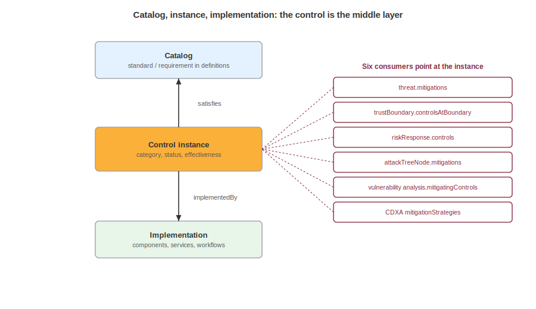

# Managing Controls and Demonstrating Compliance

Managing controls is the use case that stands apart from threat modeling most clearly, and the strongest case for one model family covering design and assurance. A governance, risk, and compliance (GRC) team maintains a control inventory, answers security questionnaires, produces a system security plan, and hands an auditor proof that controls exist and work. None of that requires a threat model, and the control model was made first-class at the document root precisely so a control inventory can stand alone. A GRC team can own it, maintain it on its own cadence, and sign it independently, while a threat model somewhere else references it by BOM-Link.

A control inventory populates `controls` at the root and, usually, the `definitions.standards` catalog the controls satisfy, and it need contain nothing else.

```json
{
  "specFormat": "CycloneDX",
  "specVersion": "2.0",
  "serialNumber": "urn:uuid:6666...",
  "version": 1,
  "controls": [ ... ],
  "definitions": { "standards": [ ... ] }
}
```

The schema describes `controls` as the safeguards and countermeasures that are recommended or in place, declared on their own for governance, risk, and compliance, or referenced from threats, trust boundaries, and risk responses. Acme's control inventory, `acme-controls.cdx.json`, is exactly this: five controls and the internal standard they map to.

## The Three Control Layers



Controls exist at three layers, and CycloneDX models all three:

1. Catalog, the definition: a requirement in a standard or an internal catalog, in the `definitions` declarative library.
2. Implementation, the doing: the component, service, or workflow that carries out the safeguard.
3. Instance, the control itself: what is recommended or in place, with a status and an assessed effectiveness, the `control` model.

The instance layer is what every mitigation reference in the design and assurance models points at: `threat.mitigations`, `trustBoundary.controlsAtBoundary`, `riskResponse.controls`, an attack tree node's `mitigations`, a vulnerability `analysis.mitigatingControls`, and a CDXA claim's `mitigationStrategies`. Six consumers, one control object, and the edges live in each consumer, never in the control.

## A Control

A `control` requires only `bom-ref` and `name`, so a converter can emit a name-only control and enrich later.

```json
{
  "bom-ref": "ctl-mfa",
  "name": "Step-up authentication",
  "category": "preventive",
  "status": "implemented",
  "appliesTo": [ "urn:cdx:1111...#bnd-edge" ],
  "implementedBy": [ "urn:cdx:1111...#comp-web" ],
  "satisfies": [ "urn:cdx:2222...#req-mfa", "sreq-auth-1" ],
  "effectiveness": { "rating": "good", "percentage": 0.8 },
  "owner": { "bom-ref": "party-acme-sec", "roles": [ { "role": "owner" } ], "organization": { "name": "Acme Product Security" } }
}
```

`category` classifies the safeguard by function, with a custom branch for an organization's own taxonomy:

| Value | Description |
|---|---|
| `preventive` | Stops an unwanted event before it occurs. |
| `detective` | Identifies and records an unwanted event when it occurs. |
| `corrective` | Repairs the effects of an event after it occurs. |
| `compensating` | Substitutes for a primary control that cannot be applied. |
| `deterrent` | Discourages an attempt without blocking it outright. |
| `recovery` | Restores systems and data to normal operation after an event. |

`appliesTo` names what the control protects, here an architecture boundary in another document, and its absence means the whole organization or system. `implementedBy` names what carries the control out, the implementation layer, referenced rather than copied. `satisfies` maps the control to the requirements it meets, and this one maps to two at once: an internal requirement in the intent document and `sreq-auth-1` from the standard in this document's own library. `owner` is the accountable party, given inline here, though a bare reference to a previously declared party is equally valid, as the sibling control `ctl-waf` shows with `"owner": "party-acme-sec"`.

`effectiveness` records how well the control works, as a `rating` on a five-step scale and an optional `percentage` from 0 to 1:

| Value | Description |
|---|---|
| `ineffective` | The control provides no meaningful protection. |
| `marginal` | The control provides limited protection. |
| `adequate` | The control provides acceptable protection. |
| `good` | The control provides strong protection. |
| `excellent` | The control provides the strongest protection the scale records. |

The rating supports a quick read, and the percentage supports rollups and trending across an inventory. Step-up authentication is `good` at 0.8 here, while the compensating edge control is `adequate` at 0.6.

## Implementation Status

The `implementationStatus` vocabulary is the subtle part, because it carries the asserting party's stance, not just a lifecycle position, and it closes with a custom branch:

| Value | Description |
|---|---|
| `recommended` | Asserted by a party that cannot itself decide to adopt: a producer, a standard, or an external assessor suggesting the control before the adopting organization has ruled. |
| `proposed` | The control has entered the adopting organization's decision process. |
| `approved` | The organization has decided to adopt the control. |
| `rejected` | A considered decline, recorded so a compensating control's justification can point at what was rejected and why. |
| `planned` | Implementation is scheduled but not started. |
| `in-progress` | Implementation is underway. |
| `implemented` | The control is in place. |
| `verified` | The control is in place and its operation has been confirmed. |
| `decommissioned` | The control has been retired. |

The stance values matter for exchange between parties: an outside party can put a control on the record that it cannot itself adopt, and a considered decline stays visible for a compensating control's justification to cite, while the rest track the implementation lifecycle in order. Acme's inventory holds one control whose `status` is `recommended`.

```json
{
  "bom-ref": "ctl-session-binding",
  "name": "Session-to-device binding",
  "category": "preventive",
  "status": "recommended",
  "appliesTo": [ "urn:cdx:1111...#bnd-edge" ],
  "externalReferences": [
    { "type": "risk-assessment", "url": "https://assessor.example/reports/acme-2026-q3",
      "comment": "Recommended by the external assessor in the Q3 assessment; not yet through Acme's adoption decision." }
  ]
}
```

The external assessor suggested session-to-device binding, and Acme has not adopted it. Rather than omit it silently, the inventory carries it at `recommended` with a reference to the assessment, openly marked as advised and not yet decided, and when Acme rules on it, the single edit is `status`. Because `status` and `effectiveness` are shared definitions, reused by risk responses, a control's status means the same thing whether a consumer meets it in the inventory or through a risk.

## The Catalog It Satisfies

The controls reference a standard in the declarative library, and a `standard` carries its requirements identified as the standard publishes them.

```json
"definitions": {
  "standards": [
    {
      "bom-ref": "std-acme-secure-design",
      "name": "Acme Secure Design Standard",
      "version": "1.2",
      "requirements": [
        { "bom-ref": "sreq-auth-1", "identifier": "ASDS-AUTH-1", "title": "Strong customer authentication",
          "text": "Customer-facing systems shall require a second authentication factor for actions with elevated fraud or data exposure risk." }
      ]
    }
  ]
}
```

Each standard requirement keeps the publisher's own `identifier`, `title`, and `text`, so an auditor can match `ASDS-AUTH-1` to its source. A standard requirement carries another party's rule, while its counterpart, the generic `requirement`, models an organization's own requirements engineering with fields such as type, priority, and acceptance criteria: refer to the Declaring Intended Use and Requirements chapter. The `shall` in the text belongs to Acme's standard, not to CycloneDX, and the `satisfies` array on `ctl-mfa` closes the loop by naming `sreq-auth-1`.

## How Other Models Cite a Control

Because the edges live in the asserting document, a control instance stays a clean, referenceable fact that other models point at without the inventory needing to know they exist. A vulnerability analysis is a frequent consumer: a VEX statement can call a component unaffected because named controls neutralize the flaw.

```json
"analysis": {
  "state": "not_affected",
  "justification": "protected_by_mitigating_control",
  "mitigatingControls": [ "ctl-waf", "ctl-mfa" ],
  "detail": "Session identifiers are regenerated at login, replay is throttled at the edge, and step-up authentication gates high-value actions."
}
```

The same two controls appear in a threat's `mitigations`, a trust boundary's `controlsAtBoundary`, and a risk response's `controls`, each reference living in the threat, boundary, or risk that makes the assertion. The control is described once and cited everywhere.

## The System Security Plan Pattern

The three layers assemble into a system security plan with no new machinery: the catalog is the standard in `definitions`, the instances are the controls at the root, and the assessment is a CDXA claim that targets a control and binds the judgment to evidence.

```json
{ "bom-ref": "clm-strong-auth", "target": "ctl-mfa",
  "predicate": "Step-up authentication is enforced for all high-value customer actions.",
  "mitigationStrategies": [ "ctl-key-rotation" ] }
```

The claim points at the control through `target` and, where a gap remains, references the controls that will close it through `mitigationStrategies`, the sixth reference into the control model: refer to the Assessing and Attesting chapter for CDXA in full. What matters here is the separation: the catalog states the rule, the control states what is in place, and the claim, backed by evidence and signed, turns a self-statement into something a third party can rely on.

## Consuming a Control Inventory

A questionnaire responder maps each questionnaire item to a control and returns the inventory instead of a spreadsheet, machine-readable, the vendor-security-posture use case. An auditor reads status and effectiveness and follows `satisfies` to see coverage of a standard, then follows CDXA claims to the evidence. A risk team consumes the same inventory their responses already reference, and a regulator receives proof of controls for product security obligations. Because the inventory stands alone and is separately signable, none of these consumers needs the threat model, and the GRC team never needs to touch one.

A control inventory asserts what safeguards exist, in what state, applied to what, satisfying which requirements, and how well they work as assessed by their owner. It does not prove the effectiveness assertion, which CDXA evidence does, and it does not enumerate the threats the controls answer, which the threat model does. It does not price the residual risk, which the register does. It is the safeguard record, designed to be useful with nothing else attached.

<div style="page-break-after: always; visibility: hidden">
\newpage
</div>
