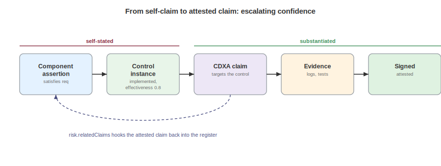

# Assessing and Attesting

A blueprint declares the architecture, a control records that it is implemented and effective, and a risk register prices what could go wrong, all statements a producer makes about its own system. At some point a consumer asks the harder question: says who, and on what basis? The answer runs in two connected steps: an `assessment` records that an evaluation happened, by whom, when, over what, and what it concluded, and CycloneDX Attestations, CDXA, binds a specific judgment to evidence and signs it. The first gives an evaluation a portable record, and the second makes an individual claim something an outside party can check for itself. Auditors, regulators, and cautious customers tend to need both.

An assessment lives in the risk model, in the `risks` container, as an entry in `risks.assessments`, and Acme's sits in `acme-risk-register.cdx.json` next to the risks and appetites it evaluates. A CDXA claim lives in `declarations.claims`, and the composite document `acme-composite.cdx.json` carries one so the seam is visible in a single file. Neither container restates the objects it points at: the assessment references risks and appetites by their bom-ref, and the claim references the control it is about. This is the annotation over duplication rule at work: an evaluation and an attestation are documentation of a judgment, kept separate from the controls and risks the judgment is about.

## The Assessment

An `assessment` requires `bom-ref`, `type`, `cadence`, and `timestamp`, and records a point-in-time or continuous evaluation.

```json
{
  "bom-ref": "asmt-2026-q3",
  "name": "Q3 2026 storefront risk assessment",
  "type": [ "security", "threat" ],
  "cadence": "continuous",
  "timestamp": "2026-07-01T00:00:00Z",
  "scope": "The storefront, checkout, and support agent as modeled in the storefront blueprint.",
  "status": "completed",
  "assessors": [
    "urn:cdx:1111...#party-jordan",
    { "bom-ref": "party-ccm", "roles": [ { "role": "verifier" } ],
      "system": { "kind": "automation", "identifiers": [ { "scheme": "spiffe", "value": "spiffe://acme.example/ccm/risk-engine" } ] } }
  ],
  "summary": "Account takeover risk is mitigated to within appetite. Agent overreach remains above target pending behavior-monitor tuning.",
  "risks": [ "risk-ato", "risk-agent-overreach" ],
  "overallRisk": { "method": "maximum", "score": { "level": "medium" } },
  "assumptions": [ "Edge rate limiting remains enabled in all regions." ],
  "recommendations": [ "Tune the behavior monitor to alert on tool invocations outside the declared set within one hour." ],
  "riskAppetites": [ "rap-acme" ],
  "nextReview": "2026-10-01T00:00:00Z"
}
```

Two fields carry the design intent. `type` is an array because one exercise is often several at once: this one is both a security and a threat assessment. The vocabulary covers these kinds, among others:

| Value | Description |
|---|---|
| `security` | An assessment of security posture. |
| `threat` | An assessment of the threats facing the subject. |
| `privacy` | A privacy assessment. |
| `ai-impact` | An AI impact assessment. |
| `data-protection-impact` | A data protection impact assessment. |
| `model-risk` | A model risk assessment. |
| `fundamental-rights-impact` | A fundamental rights impact assessment. |

`cadence` is kept separate from `type` on purpose, so that "what kind of assessment" and "how often" stop being conflated:

| Value | Description |
|---|---|
| `initial` | The first evaluation of the subject. |
| `periodic` | Repeated on a schedule. |
| `continuous` | Ongoing evaluation rather than a point-in-time exercise. |
| `triggered` | Run in response to a defined event. |
| `ad-hoc` | Run on demand, outside any schedule. |

A `continuous` cadence paired with an automated assessor is the continuous controls monitoring pattern, and it is why `assessors` accepts systems and agents, not only people.

The two assessors differ in kind: the first is a person, Jordan Kim, referenced by BOM-Link to the party document, and the second is inline, an `automation` with a SPIFFE workload identity, cast in the `verifier` role. Continuous controls monitoring becomes data this way, because the machine that checks the controls is named the same way as the human who signs off on the exercise.

The rest is references and findings, not restatement: `scope` bounds the exercise in prose, `status` tracks the assessment's own lifecycle, `completed` here, and `summary` states the conclusion. `risks` lists the evaluated risks by bom-ref, and `overallRisk` records how those individual risks roll up into a single figure, with `method` naming the rule:

| Value | Description |
|---|---|
| `maximum` | The overall score is the highest of the individual risk scores. |
| `average` | The overall score is the mean of the individual risk scores. |
| `weighted-average` | The overall score is a weighted mean, for when a blended number is wanted. |

`assumptions` are first-class, following NIST SP 800-30: an assessment's conclusions are only as sound as the conditions it assumed, so the model makes those conditions explicit and reviewable rather than leaving them implied. `recommendations` carry the actions the evaluation produced, and `nextReview` sets the date the finding goes stale. `riskAppetites` references the appetite the result is measured against, by bom-ref, so a reader sees not just the score but whether Acme considers it tolerable.

## From Assertion to Attestation



An assessment says an evaluation happened and what it concluded, but it does not, on its own, prove any single judgment within it. That is CDXA's job, and the seam between them is deliberate. The full attestation machinery, evidence encodings, signatures, and conformance scoring, is the subject of the Authoritative Guide to Attestations. What matters here is how the design and assurance models plug into it.

A CDXA claim targets an object and states a predicate about it, and in v2.0 the set of things a claim can target explicitly includes controls and risks, so the judgments the design and assurance models produce become directly attestable.

```json
"declarations": {
  "claims": [
    {
      "bom-ref": "clm-strong-auth",
      "target": "ctl-mfa",
      "predicate": "Step-up authentication is enforced for all high-value customer actions.",
      "mitigationStrategies": [ "ctl-key-rotation" ],
      "reasoning": "Authentication logs and test evidence show step-up prompts on all orders above the threshold. Session-key rotation is planned to close the remaining key-age finding."
    }
  ]
}
```

The claim points at the control through `target`, states what is claimed through `predicate`, and, where a gap remains, names the controls that will close it through `mitigationStrategies`. Those strategies reference control instances, and a control instance carries its own status, so a planned mitigation is visibly planned:

```json
{ "bom-ref": "ctl-key-rotation", "name": "Automated session-key rotation", "category": "preventive", "status": "planned" }
```

A reader following `mitigationStrategies` to `ctl-key-rotation` finds a control whose `status` is `planned`, not a vague promise to improve. Evidence attaches through CDXA and does the convincing, and `reasoning` is the human-readable summary of it. The direction follows the asserting-document rule: the claim points at the control, and the control keeps no list of claims about itself. The attestation lives with the party making it, and the control inventory stays clean.

## Closing the Loop

Declared intent and managed controls both end in self-statements. A component asserts that it satisfies a requirement, a `satisfies` assertion against the requirement catalog, and a control reports itself implemented and effective through its `status` and `effectiveness`. A CDXA claim, targeting that control, backed by evidence, and signed, is what turns the self-statements into something a third party can rely on without taking the producer's word for it.

The risk register completes the circuit from the other direction. A risk carries `relatedClaims`, so it can cite exactly which attested claims reduce it, which lets a residual rating be defended rather than asserted. In the register, `risk-ato` is rated `high` inherent, `medium` residual, and `low` target. The gap between inherent and residual is real only if the controls behind it hold. A partial CDXA conformance score, a claim whose evidence meets its predicate in part, is exactly what justifies a residual that sits below inherent yet above zero. Full conformance would drive residual toward target, and no evidence would leave it at inherent. Attested, partial conformance is the defensible middle, and `relatedClaims` is the wire that carries it.

## Consuming Assessments and Attestations

An auditor reads the assessment for scope, assessors, and assumptions, then follows `relatedClaims` and CDXA targets to the evidence for the judgments that matter, ignoring the rest. A regulator receives a signed assessment plus its attested claims as one compliance package. A customer's risk team consumes a vendor's assessment and appetite together, to judge whether the vendor operates inside a tolerance the customer finds acceptable. A continuous-monitoring platform emits an assessment on a schedule, each one a signed, timestamped point in a trend rather than a one-off report.

An assessment asserts that an evaluation occurred and what it found. A CDXA claim asserts a single judgment and points at its evidence. Neither performs a safeguard, which is the control's job, and neither enumerates the adversity, which is the threat model's job. The evidence formats, signature envelopes, and conformance scoring that make an attestation verifiable are documented in the Authoritative Guide to Attestations. Applying that machinery to a specific reported flaw, where a claim that a component is not affected has to be defended, belongs to the vulnerability response: refer to the Reporting and Responding to Vulnerabilities chapter. This is the layer that says the work was done and here is the proof, and its value rests on stating assumptions and attaching real evidence, which the model makes structurally easy and cannot make automatic.

<div style="page-break-after: always; visibility: hidden">
\newpage
</div>
