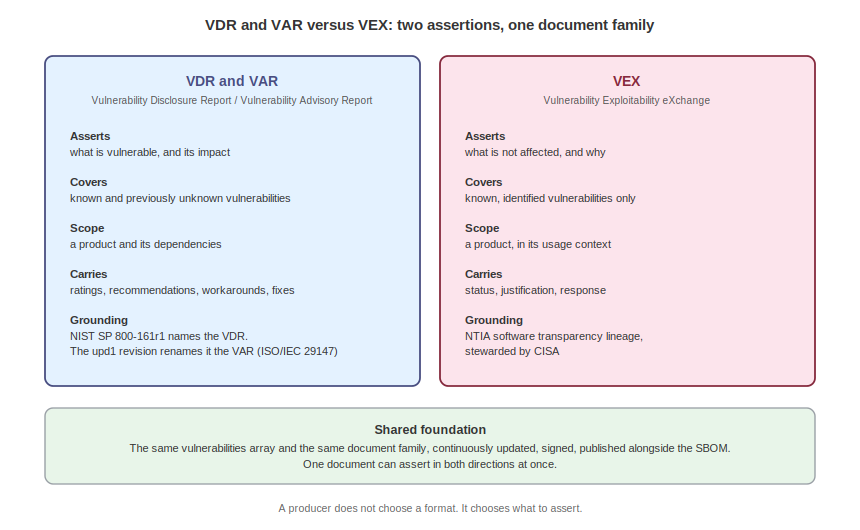
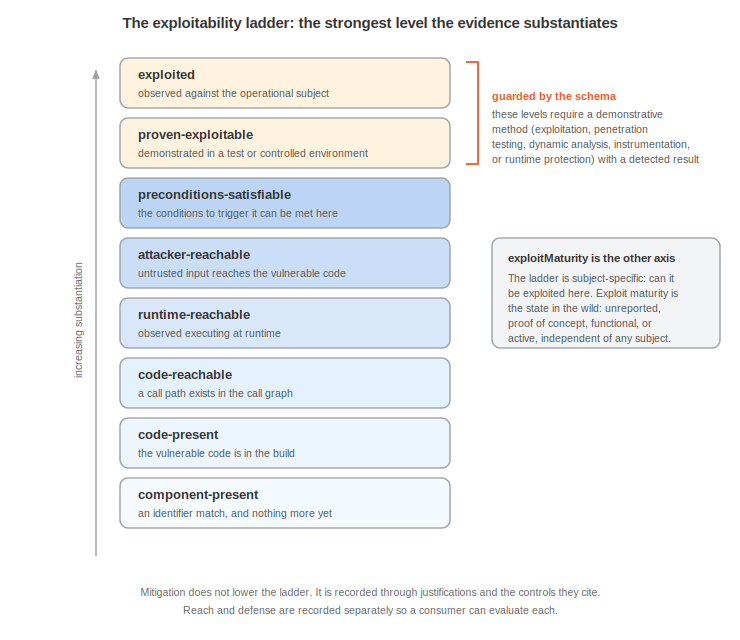

# Reporting and Responding to Vulnerabilities

A vulnerability in isolation is a number and a severity. In context it is a decision: exploitable here or not, mitigated here or not, worth acting on now or not. CycloneDX wires vulnerabilities, VDR, and VEX into the design and assurance stack and gives them an evidence model, so a response can cite the control that neutralizes a finding, name the weakness it shares with a modeled threat, and show the analysis that substantiates the verdict.

Two distinct jobs share the vulnerability model. A Vulnerability Disclosure Report (VDR), called a Vulnerability Advisory Report (VAR) in newer NIST usage, asserts what is vulnerable: the vulnerabilities that affect a product and its dependencies, with the impact analysis behind each. A Vulnerability Exploitability eXchange (VEX) asserts the opposite pole: which known vulnerabilities a product is not affected by, so consumers can stop chasing findings that do not matter to them. The two travel well together, often in the same document, but each stands on its own, answers to its own guidance, and serves its own consumer. A third thread serves both: evidence that records how each determination was reached, by whom, with what confidence, and on what proof.

The people doing the job are the PSIRT publishing advisories, the product security responders triaging what scanners report, and the analysts who publish exploitability statements. Everything they produce populates the root `vulnerabilities` array, and the weakness model supplies the `weaknesses` array that vulnerabilities and threats share. The controls, risks, and threats a response points at live in their own documents and are referenced by `bom-ref` or BOM-Link. Acme adds a document for the job: `acme-vulnerability-response.cdx.json`, a standalone response for the storefront that reports one exploitable finding, states one non-finding, and discloses one vulnerability that has no CVE. The composite document `acme-composite.cdx.json` carries the mitigating-control justification alongside the controls it cites.

## The Shared Weakness Model

Vulnerabilities, threats, and attack tree nodes classify flaws with one shared `weakness` model. A `weakness` is one of two branches and never both: a `cweId`, or a named weakness with a `name` and an optional `description`. The credential stuffing threat carries one of each in a single array:

```json
"weaknesses": [
  { "cweId": 307 },
  {
    "name": "Password reuse by customers",
    "description": "Customers reuse passwords that appear in unrelated breach corpora."
  }
]
```

CWE 307 is improper restriction of excessive authentication attempts. The named entry captures something the CWE catalog does not enumerate cleanly, a behavior of the user population rather than a defect in the code.

The named branch matters more every year: emerging AI and agent weakness classes often have no CWE assignment yet, and the model expresses them without waiting for the taxonomy to catch up. The storefront's prompt injection finding names one with no CWE at all:

```json
"weaknesses": [
  { "name": "Untrusted conversation content influences tool selection" }
]
```

Written as a named weakness today, it can gain a `cweId` later without restructuring any document that references it.

A weakness holds no exploitability and no scope, on purpose. Whether a flaw is weaponized, how hard it is to reach, and what it touches all live where they belong, on vulnerability ratings and evidence and on a threat scenario's `exploitability` and `attackVector`. Keeping that off the weakness lets the same classification be shared without dragging one context's circumstances into another. Because the model is shared, a weakness a threat exploits and a weakness a vulnerability arises from speak the same language, and a consumer can pivot from one to the other. Attack tree nodes reuse the identical structure through a singular `weakness` property, so a leaf in an attack tree names the flaw it exploits with the same vocabulary.

The object form, rather than a bare integer, is what enables the named branch: a flaw with no CWE assignment is still expressible.

## Vulnerability Disclosure and Advisory Reports

The first job is disclosure. A supplier, or a third party assessing on a consumer's behalf, reports the vulnerabilities that affect a product and its dependencies, together with an analysis of what each one means: exploitable or not, fixed in which release, worked around how. The report is a standing artifact, not a one-time notice: it is updated as new vulnerabilities surface and as analysis matures, and it is signed so a consumer can verify who said so.

This artifact has two names in NIST guidance, and they name the same recommendation. NIST SP 800-161r1 introduced it as the Vulnerability Disclosure Report, in the supplemental guidance to control RA-5: a report that demonstrates complete vulnerability assessments for the components listed in an SBOM, covering each vulnerability's impact, or lack of impact, and the plan to address it. The November 2024 revision, SP 800-161r1-upd1, renames it the Vulnerability Advisory Report and defines it by way of ISO/IEC 29147 as a publication describing a vulnerability with a focus on remediation and mitigation. The same publication's Executive Order 14028 guidance asks acquirers to require the report in an automated, machine-readable format. Two names across two revisions, one artifact, and a CycloneDX vulnerability response satisfies either.

A report of this kind asserts presence, so it carries the full weight of the vulnerability object. Identity comes first: an `id` and its `source`, plus `references` that correlate the same flaw across other intelligence sources that assigned it different identifiers. Severity comes next, as `ratings` that may carry several scores from several sources across CVSSv4, CVSSv3.1, OWASP, and SSVC, each with a vector and a justification. This is the mark of the reporting use case: a report communicates risk, including a supplier's own rating of its product's exposure, not just a verdict. Then the response guidance: `recommendation`, `workaround`, and published `advisories`. Then reach: `affects` entries that reference components and services by `bom-ref` or BOM-Link, with version ranges in vers syntax and a per-version status. The first entry in Acme's response document shows the fields:

```json
{
  "bom-ref": "vuln-checkout-deserial",
  "id": "CVE-2026-21507",
  "source": { "name": "NVD" },
  "references": [
    { "id": "GHSA-4f2q-8mjx-9c31", "source": { "name": "GitHub Advisories" } }
  ],
  "description": "Unsafe deserialization in the checkout API's legacy order import endpoint allows remote code execution when a crafted payload is processed.",
  "weaknesses": [ { "cweId": 502 } ],
  "ratings": [
    {
      "source": { "name": "Acme PSIRT" },
      "score": 8.1,
      "severity": "high",
      "method": "CVSSv4",
      "vector": "CVSS:4.0/AV:N/AC:L/AT:P/PR:N/UI:N/VC:H/VI:H/VA:N/SC:N/SI:N/SA:N",
      "justification": "Attack complexity is offset by the endpoint being reachable without authentication in default deployments."
    }
  ],
  "affects": [
    {
      "ref": "urn:cdx:11111111-1111-4111-8111-111111111111/1#comp-checkout",
      "versions": [
        { "range": "vers:generic/>=9.0.0|<9.1.4", "status": "affected" },
        { "range": "vers:generic/>=9.1.4", "status": "unaffected" }
      ]
    }
  ],
  "recommendation": "Upgrade checkout-api to 9.1.4 or later.",
  "analysis": {
    "state": "exploitable",
    "response": [ "update", "workaround_available" ],
    "detail": "The import path deserializes untrusted payloads before validation. A fixed release is available.",
    "firstIssued": "2026-07-12T08:00:00Z",
    "lastUpdated": "2026-07-15T09:30:00Z"
  }
}
```

The document that carries this is an ordinary CycloneDX document. `metadata.component` names the product the response concerns, the `affects` references reach into the product's inventory by BOM-Link, and the whole artifact is signed and distributed alongside the SBOM it complements. Nothing else is required: a valid response document can consist of metadata and the `vulnerabilities` array alone.

One more trait of the reporting use case has no VEX counterpart: it covers what has no identifier yet. A previously unknown vulnerability, found in first-party code or reported to the PSIRT before any CVE is assigned, is reported with an internal `id` and the discovering organization as its `source`. Acme's response document discloses `ACME-2026-0011`, the prompt injection in the support agent, this way, with the named weakness shown earlier and no CVE anywhere. NIST's guidance expects exactly this, complete assessments rather than assessments of the cataloged, and it is why a report is the baseline: it asserts everything the producer knows, not just what public vulnerability databases have labeled.

## Exploitability Statements

The second job runs in the other direction. A consumer holding an SBOM and a scanner sees hundreds of findings, and most of them do not matter in this product's context: the vulnerable function is never called, the affected mode is not compiled in, a control blocks the path, and VEX exists to say so in machine-readable form. It emerged from the NTIA software transparency work and is stewarded by CISA, and its defining move is the negative assertion: this product is not affected by that vulnerability, and here is why. A consumer feeds VEX into triage tooling and the noise drops away, leaving the findings that deserve attention.

In CycloneDX, VEX lives in the `analysis` object of a vulnerability entry, and its `state` carries the verdict:

| Value | Description |
|---|---|
| `exploitable` | The vulnerability is exploitable in the context of the product. |
| `in_triage` | Analysis is underway and has not yet reached a verdict. |
| `false_positive` | The reported finding was determined to be incorrect. |
| `not_affected` | The product is not affected by the vulnerability. |
| `resolved` | The finding has been remediated. |
| `resolved_with_pedigree` | The finding has been remediated, with verifiable commit history in the affected component's pedigree. |

A `not_affected` verdict carries a `justification` from a fixed vocabulary:

| Value | Description |
|---|---|
| `code_not_present` | The vulnerable code is not present in the product. |
| `code_not_reachable` | The vulnerable code is present but no execution path reaches it. |
| `requires_configuration` | Exploitation requires a configuration the product does not use. |
| `requires_dependency` | Exploitation requires a dependency that is not present. |
| `requires_environment` | Exploitation requires an environment that is not present. |
| `protected_by_compiler` | Compiler safeguards prevent exploitation. |
| `protected_at_runtime` | Runtime protections prevent exploitation. |
| `protected_at_perimeter` | Perimeter defenses block the attack path. |
| `protected_by_mitigating_control` | A mitigating control prevents exploitation. |

The `response` array states what the supplier will do, from `update` through `will_not_fix`, and `detail` explains in prose. `firstIssued` and `lastUpdated` date the statement, because a VEX statement is a living record that moves from `in_triage` to a verdict as analysis completes. The second entry in the response document is a complete VEX statement:

```json
{
  "bom-ref": "vuln-llm-tokenizer",
  "id": "CVE-2026-18821",
  "source": { "name": "NVD" },
  "description": "Buffer over-read in a streaming tokenizer mode of the model runtime bundled with acme-support-llm.",
  "weaknesses": [ { "cweId": 125 } ],
  "affects": [
    {
      "ref": "urn:cdx:11111111-1111-4111-8111-111111111111/1#comp-llm",
      "versions": [ { "version": "3.1", "status": "unaffected" } ]
    }
  ],
  "analysis": {
    "state": "not_affected",
    "justification": "code_not_reachable",
    "detail": "The vulnerable streaming tokenizer mode is not compiled into the serving build and no call path reaches it.",
    "firstIssued": "2026-07-13T10:00:00Z",
    "lastUpdated": "2026-07-15T09:30:00Z"
  }
}
```

Scope is what makes VEX its own use case. A VEX statement addresses known, identified vulnerabilities in the context of a specific product, and it does not carry the producer's risk rating: the verdict and its justification are the payload. The per-version `status` in `affects` lets one statement stay precise across a product line, affected in 9.x, unaffected in 10.x, unknown where analysis has not reached. And because a VEX statement is an assertion by whoever publishes it, a supplier's VEX about its product and a consumer's VEX about that product in their environment can both exist, each owned and signed by its author. The `evidence` object on the vulnerability is how either party makes its case.

## Context-substantiated VEX

The operational payoff of the connection is a `not_affected` justification that points at the control doing the protecting. The vulnerability `analysis` gains `mitigatingControls`:

```json
{
  "bom-ref": "vuln-session-fixation",
  "id": "ACME-2026-0007",
  "description": "Session fixation reported in the storefront framework's session handling.",
  "weaknesses": [ { "cweId": 384 } ],
  "affects": [ { "ref": "comp-web" } ],
  "analysis": {
    "state": "not_affected",
    "justification": "protected_by_mitigating_control",
    "mitigatingControls": [ "ctl-waf", "ctl-mfa" ],
    "detail": "Session identifiers are regenerated at login, replay is throttled at the edge, and step-up authentication gates high-value actions."
  }
}
```

CWE 384 is session fixation, the same weakness vocabulary the threats use. The `protected_by_mitigating_control` justification is only as strong as the control it can point at. Here it references control instances that carry their own status, effectiveness, and owner. The step-up authentication control the justification cites records, among other fields, its status and an assessed effectiveness:

```json
{
  "bom-ref": "ctl-mfa",
  "name": "Step-up authentication",
  "category": "preventive",
  "status": "implemented",
  "effectiveness": { "rating": "good", "percentage": 0.8 }
}
```

A consumer reading this VEX does not have to take "mitigated" on faith. They follow `ctl-waf` and `ctl-mfa` to the control instances, read each control's status, effectiveness, and owner, and judge whether the justification holds. That is the difference between a VEX statement that ends an argument and one that starts it. The justification points, and the control describes itself once, in the control inventory. The vulnerability names the control, and the control never lists the vulnerabilities that cite it.

## The Shared Document Family



Treated independently, the two use cases divide cleanly:

| | VDR and VAR | VEX |
|---|---|---|
| Asserts | What is vulnerable, and its impact | What is not affected, and why |
| Covers | Known and previously unknown vulnerabilities | Known, identified vulnerabilities only |
| Scope | A product and its dependencies | A product, in its usage context |
| Communicates risk | Yes, through ratings and analysis | No, the verdict and justification are the payload |
| Grounding | NIST SP 800-161r1 (VDR), SP 800-161r1-upd1 (VAR), ISO/IEC 29147 | NTIA lineage, stewarded by CISA |

The division is real, and so is the overlap: both are continuously updated companions to an SBOM, both are signed assertions by an identified party, and in CycloneDX both are the same `vulnerabilities` array in the same document family. A producer does not choose a format: it chooses what to assert. Acme's response document asserts in both directions at once, two findings reported with impact, one non-finding stated with its justification, and remains one valid, signable artifact. A producer that wants separate artifacts publishes separate documents built from the same objects. Consumers get one object model to parse either way, which is precisely why the hybrid pattern, report all that is known and state what does not apply, costs nothing extra to adopt.

## Substantiating Findings with Evidence

Everything above is assertion: a report says exploitable and a VEX says not affected. Without evidence, both are statements a consumer can weigh only by the reputation of who signed them. The `evidence` object on a vulnerability records how a determination was reached, and it is built for both directions: substantiating presence in a report and substantiating absence in a VEX.

Its center is `presence`, an array of determinations. Each entry is one attributable finding about one subject: a `ref` to the affected component or service it concerns, a `status` reusing the `affected`, `unaffected`, `unknown` vocabulary, and a `justification` reusing the VEX justification vocabulary when the determination is negative. A required `confidence` runs from 0 to 1, the `methods` record what produced the determination, the `tools` name what ran, an `assertion` names the parties involved, and a `timestamp` dates it. The VEX statement above stops being a bare assertion when its evidence is attached:

```json
"evidence": {
  "presence": [
    {
      "bom-ref": "pe-tokenizer-llm",
      "ref": "urn:cdx:11111111-1111-4111-8111-111111111111/1#comp-llm",
      "status": "unaffected",
      "justification": "code_not_reachable",
      "confidence": 0.92,
      "methods": [
        {
          "technique": "reachability-analysis",
          "confidence": 0.92,
          "result": "not-detected",
          "description": "No call path from the serving entry points reaches the streaming tokenizer under any shipped configuration."
        },
        {
          "technique": "binary-analysis",
          "confidence": 0.8,
          "result": "not-detected",
          "value": "streaming_tokenize symbol absent from the shipped serving binary."
        }
      ],
      "tools": [ "tool-reachability" ],
      "assertion": {
        "parties": [ { "party": "party-psirt", "role": { "role": "supplier" } } ]
      },
      "timestamp": "2026-07-14T16:30:00Z"
    }
  ]
}
```

Each method records not just what technique ran but what it found, in `result`:

| Value | Description |
|---|---|
| `detected` | The technique found what it tests for. |
| `not-detected` | The technique ran and did not find it. |
| `inconclusive` | The technique ran without reaching a determination. |

`not-detected` is negative evidence made machine-actionable: a reachability analysis that ran and found no path is meaningful in a way that an analysis nobody ran never is, and it is exactly what a `code_not_reachable` justification should stand on. The technique vocabulary spans more than twenty predefined values, among them:

| Value | Description |
|---|---|
| `source-code-analysis` | Analysis of the subject's source code. |
| `taint-analysis` | Tracking of untrusted input through the code. |
| `binary-analysis` | Analysis of the compiled or shipped binary. |
| `reachability-analysis` | Analysis of whether any execution path reaches the vulnerable code. |
| `dynamic-analysis` | Observation of the subject while it runs. |
| `instrumentation` | Measurement hooks placed in the running subject. |
| `penetration-testing` | Active exploitation attempts against a running system. |
| `exploitation` | Demonstrated exploitation of the vulnerability. |
| `runtime-protection` | Findings surfaced by runtime protection tooling. |
| `manual-review` | Human review of the subject. |
| `unknown` | The determination was imported from a source that did not say how it knew. |

A custom name-and-description branch covers anything unlisted. Each method carries its own confidence, because a filename match and a working exploit do not deserve the same weight. The vocabulary is also filtered by purpose: identification methods substantiate what a component is, assessment methods substantiate a vulnerability, and the schema keeps each technique where it is meaningful, so a filename match can support identity but never an exploitability finding.

Each determination speaks from one vantage, by design. The document-level `analysis` remains the author's consolidated verdict, and `presence` entries let several vantages coexist beneath it: a supplier asserting unaffected from build analysis, a consumer asserting affected from testing a deployed configuration, each entry attributed through `assertion` to its parties, in the roles they played, asserter and reviewer and auditor among them. Per-reference determinations also solve a problem the single `analysis` object cannot: when a vulnerability touches three components and each is unaffected for a different reason, each determination carries its own justification.

Findings in first-party code get one more tool: a method can name the `rule` that produced it, with an identifier, a version, and a reference to the versioned ruleset component it belongs to. A CVE-less finding like the storefront's `ACME-2026-0011` will never appear in a public database, so reproducibility is its provenance: the rule, the ruleset version, and the tool pin down exactly what to re-run to confirm the finding is fixed.

## The Exploitability Ladder



Presence is binary, and exploitability is not. A determination can carry an `exploitability` level recording how far analysis has substantiated that the vulnerability can be exploited in this subject. The ladder runs eight levels in order, and each step up demands more:

| Value | Description |
|---|---|
| `component-present` | The vulnerable component is in the inventory, all a software identifier match alone can support. |
| `code-present` | The vulnerable code is in the build. |
| `code-reachable` | The vulnerable code is reachable in the call graph. |
| `runtime-reachable` | The vulnerable code is observed executing at runtime. |
| `attacker-reachable` | The vulnerable code is reachable by attacker-controlled input. |
| `preconditions-satisfiable` | The vulnerability is triggerable, given preconditions an attacker can satisfy. |
| `proven-exploitable` | Exploitation is demonstrated by a working proof of concept. |
| `exploited` | Exploitation is observed against the operational subject. |

The value records the strongest level the evidence substantiates, and the levels indicate increasing confidence rather than a strict sequence, since reachability and precondition satisfiability are related but independent conditions.

The top of the ladder is guarded: the schema enforces that a determination of `proven-exploitable` or `exploited` is accompanied by at least one method whose result is a detection, drawn from the demonstrative techniques:

- `exploitation`
- `penetration-testing`
- `dynamic-analysis`
- `instrumentation`
- `runtime-protection`

The strongest determinations cannot be bare assertions, by construction, and the prompt injection finding clears the bar:

```json
{
  "bom-ref": "pe-prompt-injection",
  "ref": "urn:cdx:11111111-1111-4111-8111-111111111111/1#comp-agent",
  "status": "affected",
  "exploitability": "proven-exploitable",
  "exploitMaturity": "unreported",
  "confidence": 0.97,
  "methods": [
    {
      "technique": "penetration-testing",
      "confidence": 0.95,
      "result": "detected",
      "description": "An adversarial conversation caused the agent to invoke the order lookup tool for another customer's order."
    },
    {
      "technique": "source-code-analysis",
      "confidence": 0.7,
      "result": "detected",
      "rule": {
        "id": "ACME-AGENT-001",
        "name": "Untrusted content reaches tool dispatch",
        "version": "2026.6",
        "ruleset": "tool-agent-rules"
      }
    }
  ],
  "tools": [ "tool-agent-tester" ]
}
```

`exploitMaturity` sits beside `exploitability` and answers a different question. Exploitability is subject-specific, whether this vulnerability can be exploited here, while exploit maturity describes exploitation activity observed in the wild, in line with the CVSS Exploit Maturity metric and the SSVC Exploitation decision point:

| Value | Description |
|---|---|
| `not-defined` | No statement about exploitation activity is made. |
| `unreported` | No exploitation activity is reported in the wild. |
| `proof-of-concept` | A proof-of-concept exploit is publicly available. |
| `functional` | A working exploit is available. |
| `active` | Exploitation is observed in the wild. |

The storefront's prompt injection is proven exploitable in a controlled environment yet `unreported` in the wild, a combination that tells a triage team the finding is real and the clock has not started. External intelligence signals such as a known-exploited listing or an exploit prediction score ride in `ratings` or `externalReferences`, where they always have.

One boundary keeps the ladder honest: mitigation does not move it, and a vulnerability that is reachable and triggerable but blocked by a control is still exploitable in the ladder's terms. The mitigation is expressed through the `protected_by_mitigating_control` justification and the controls it names, not by quietly lowering the exploitability level, and reach and defense are recorded separately so a consumer can evaluate each.

## Occurrences, Call Stacks, and Captured Data

Two more members of the evidence object locate and preserve. `occurrences` records the individual locations where the vulnerability manifests, file, line, byte offset, and symbol, the same occurrence structure component evidence uses, because a flaw in a shared module can surface in more than one place. `callStacks` records the paths by which it is reached, each one named, ordered from entry point to sensitive operation, and equally at home describing a control flow or a data flow such as untrusted input propagating to a deserializer. A vulnerability reachable three ways carries three stacks, and each frame pins package, module, function, file, and line:

```json
"callStacks": [
  {
    "bom-ref": "cs-prompt-to-tool",
    "name": "Support conversation to tool dispatch",
    "description": "Untrusted conversation content propagates into the tool selection prompt.",
    "frames": [
      { "package": "acme.agent", "module": "chat", "function": "handle_message", "fullFilename": "agent/chat.py", "line": 41 },
      { "package": "acme.agent", "module": "dispatch.tool_router", "function": "select_tool", "fullFilename": "agent/dispatch/tool_router.py", "line": 88 }
    ]
  }
]
```

The `data` array preserves the material itself, labeled items typed by kind:

| Value | Description |
|---|---|
| `request` | A captured request. |
| `response` | A captured response. |
| `payload` | The payload used or observed. |
| `log` | A log excerpt. |
| `report` | A report, such as a full assessment report. |
| `screenshot` | A captured image. |
| `exploit` | Exploit material. |
| `configuration` | A configuration used or observed. |
| `data-flow` | A recorded data flow. |
| `rule` | A rule involved in the determination. |
| `prompt` | A prompt submitted to an AI system under assessment. |
| `completion` | The AI system's response to a prompt. |

The storefront's agent assessment stores the adversarial prompt and the model's response as first-class evidence, each entry carrying a `ref` back to the determination it corroborates so proof stays bound to a specific determination and perspective rather than pooling unattributed at the bottom of the document.

Supporting material demands care that ordinary BOM data does not. A response document is signed and redistributed and cannot be recalled, so the model gives every item the machinery of governed data: a `classification`, a `sensitiveData` description of anything hazardous within, a `redacted` flag, and `contents` that either inline an attachment or reference a URL behind access control, with integrity hashes so a consumer can verify the retrieved material is what was recorded. The working exploit for a finding belongs behind that access-controlled URL, hashed and referenced, not inlined into an artifact that will be forwarded. The storefront example stores its full assessment report exactly that way, while the prompt and completion it inlines are marked redacted.

Evidence in this form is not confined to vulnerabilities: the same model substantiates component evidence, where identity, license, and copyright determinations carry the same methods, confidences, occurrences, assertions, and timestamps. Inventory-side evidence is the Authoritative Guide to SBOM's subject, and evidence connects forward to attestation: a `presence` entry has a `bom-ref` precisely so a CDXA claim can cite the determination it relies on. The word evidence does double duty in the specification, and the two senses stay apart: vulnerability evidence is the analysis trail inside a document, and CDXA evidence is the material bound to a signed claim. The first substantiates a finding, the second substantiates a promise, and a claim can point at the first to do the second.

## Feeding the Register

A vulnerability that is not fully mitigated is a risk input. A threat points at the flaws that realize it through `relatedVulnerabilities`, and a risk points at the vulnerabilities that source it through its own `relatedVulnerabilities`, so adversary analysis and the register both reach the same concrete finding. The loop runs one full turn: the vulnerability is triaged with context, its residual exposure feeds a risk, and the risk's response references controls.

```json
"residualRisk": {
  "likelihood": { "level": "low" },
  "impact": { "level": "moderate" },
  "score": { "level": "medium" }
},
"responses": [
  {
    "bom-ref": "rr-ato",
    "strategy": "reduce",
    "controls": [ "ctl-mfa", "ctl-waf" ],
    "status": "implemented",
    "effectiveness": { "rating": "good" }
  }
]
```

`ctl-mfa` and `ctl-waf` are the same two controls the VEX justification named and the same two the credential stuffing threat lists in its `mitigations`. One set of controls, referenced from the threat, the risk response, and the VEX, and described once. Change the control's status in the inventory and every citation reads the new state. Evidence sharpens the register's inputs too: a risk sourced from a vulnerability whose exploitability is `proven-exploitable` with high confidence is a different conversation than one sourced from `component-present`, and now the difference is data.

## Consuming a Vulnerability Response

A consumer of the reporting side reads the response document against its SBOM: which of its components appear in `affects`, at which versions, with what severity and what fix. Because the report includes what has no CVE, the consumer learns about findings no scanner will surface. A consumer of the VEX side feeds verdicts into triage and suppresses what does not apply, and now audits the suppression: follow the justification to the cited controls, follow the determination to its methods and results, and weigh a `not_affected` backed by a clean reachability analysis differently than one backed by an unaccompanied assertion. An auditor replays the trail end to end, rule and ruleset version, tool, result, confidence, party, and timestamp, and for first-party findings re-runs the named rule to confirm a fix. A security team pivots from a vulnerability's weakness to the threats that share it, to see whether a flaw it is about to deprioritize sits on a modeled attack path. A risk owner reads which open vulnerabilities feed which risks and what residual exposure each leaves. An incident responder, mid-incident, reads the affected components against the blueprint to establish reach, and the call stacks to establish how far an attacker gets.

A vulnerability response asserts what is vulnerable, what is not, and how anyone knows, citing the controls, weaknesses, and evidence that justify each call. It does not replace vulnerability discovery: scanners, PSIRT intake, and researchers still find the flaws, and their output is the input here. It does not itself verify that cited controls work. A control's enforcement and effectiveness become checkable when bound to evidence in a CycloneDX attestation: refer to the Assessing and Attesting chapter. And it does not set the organization's risk tolerance, which is the appetite's job. This use case is where the analysis stack earns its cost, by turning a raw finding into a defensible decision and showing the work behind it.

<div style="page-break-after: always; visibility: hidden">
\newpage
</div>
