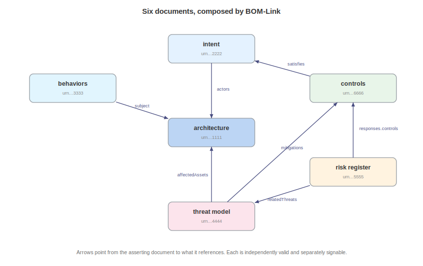

# The Complete Picture

Acme's six documents, assembled in one place, make the composition visible, and the same content takes its two legitimate forms: many linked documents, and one combined document.

## The Linked-document Set

Six documents, each owned by the party best placed to maintain it, each independently valid and signable, composed by BOM-Link:

| Document | Serial | Owner in the story | References out to |
|---|---|---|---|
| `acme-architecture` | `urn:uuid:1111...` | Security architect | intent (use cases, requirements) |
| `acme-intent` | `urn:uuid:2222...` | Product and security | architecture (actors) |
| `acme-behaviors` | `urn:uuid:3333...` | Build pipeline and runtime monitor | architecture (agent, tool) |
| `acme-threat-model` | `urn:uuid:4444...` | Security architect | architecture, behavior, intent, risk, controls |
| `acme-risk-register` | `urn:uuid:5555...` | Risk office | architecture, intent, threats, controls |
| `acme-controls` | `urn:uuid:6666...` | Product security (GRC) | architecture, intent |

Trace one thread through all six. The business objective "protect customer data" is declared in intent, and a use case declares the legitimate support flow that handles that data. Behavior declares what the agent may do and flags what it was seen doing. A threat endangers the objective and exploits the behavior, a scenario realizes the threat with an actor and a rating, and a risk prices the scenario and references the threat. A response treats the risk with controls, the controls apply to the architecture's boundaries and assets and satisfy the intent's requirements, and an assessment evaluates the risk within a stated appetite. Every edge is a reference, nothing is duplicated, and each document could be signed by a different party and exchanged on its own.

This is the design and assurance stack as it is meant to be operated: not one giant file, but a set of coherent, separately owned documents that compose into a complete account of a system.

## The Single-document Form

The same content fits in one document when one party owns it all or when a single self-contained artifact is what a consumer wants. `acme-composite.cdx.json` is a trimmed version: inventory, a blueprint, threats and a scenario, risks with appetite, controls, a vulnerability with a mitigating-control VEX justification, and a CDXA claim, all in one file with same-document references (bare bom-refs rather than BOM-Link URNs) and a TLP AMBER distribution marker.

The choice between the two forms is operational, not semantic: use linked documents when different teams own different layers, when documents have different distribution or signing needs, or when a large model would be unwieldy as one file. Use a single document when one party owns the whole picture, when a consumer wants one artifact, or when the model is small. For the decision criteria, refer to the Exchange and Composition chapter. The linked set and `acme-composite.cdx.json` hold the same content, and the model supports both forms without change.

## The Assembled Account

Assembled, Acme's documents hold an answer to every governance question about one ordinary system. The inventory records what the system is made of, the blueprint how it is arranged, the intent what it is for, and the behavior what it does. The threats record what can go wrong, the risks what that costs, the controls what is done about it, and the assessment and the attested claim whether anyone checked. Each answer is data, each is linkable, and each outlives the meeting that produced it. That is the whole argument for design and assurance as data, standing in a single worked system.

\newpage

