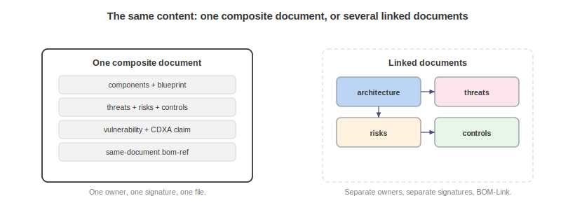

# Exchange and Composition

Design and assurance documents travel as one document or many, and the models define how they link, how separate ownership and signing work, and how a living model is versioned.

## One Document or Many

The models support two composition styles, and the choice is operational.

A single document fits when one party owns the whole picture, a consumer wants one self-contained artifact, the model is small enough to be readable as one file, or one distribution and signing decision covers everything, and references inside a single document are bare `bom-ref` values.

Linked documents fit when different teams own different layers (a GRC team owns controls, a security architect owns the threat model), when documents need different distribution constraints or signatures, when a layer is maintained on its own cadence, or when the combined model would be unwieldy, and references across documents are BOM-Link URNs.

Nothing in the models forces the choice, and it can change over time: a small combined document can be split as ownership diverges, or linked documents can be bundled for a consumer who wants one file, and Acme's documents ship in both forms to prove the point.

## BOM-Link

A BOM-Link URN references an element in another document: `urn:cdx:<serialNumber>/<version>#<bom-ref>`. The serial number and version identify the target document exactly, so a reference resolves to a specific version and does not silently follow a moving target. This is what lets a threat model reference a specific published version of an architecture, and what lets an assessor reference the organization's control inventory without holding a copy of it.

Two practices keep linked sets healthy: reference published versions, not drafts, in anything distributed to consumers, so references resolve to stable targets. And record the reference direction the models expect: the asserting document holds the edge, so the threat model references the architecture and the controls, not the reverse.

## Separate Ownership and Signing

Because each document is independently valid, each can be signed by its owner. The design and assurance stack anticipates a world where a system's account is assembled from parts authored by different parties: the manufacturer publishes architecture and declared behavior, an internal team publishes the threat model, the GRC function publishes controls, and an external assessor publishes an assessment and attested claims. Each artifact carries its own signatures and its own provenance, and BOM-Link stitches them without anyone merging files or surrendering ownership.

Distribution constraints (TLP) travel per document, so a public architecture and an AMBER threat model can reference each other while circulating under different handling rules. Set the constraint on the document whose sensitivity it reflects: a reference from a less-restricted document does not loosen it.

## Perspectives

The `perspectives` model lets one document serve several audiences by mapping its elements to named viewing contexts (application security, privacy, compliance, and dozens more). A perspective does not change the data. It annotates which elements matter to which consumer and how relevant they are. Use it when the same threat model or control inventory is read by, say, both a security team and a compliance team who care about different subsets, so each can filter to their view without a separate document.

## Versioning a Living Model

Design and assurance documents are meant to live, not to be produced once, and three mechanisms support that. Document `version` increments as the document changes under a stable serial number, and BOM-Link references pin to a version. Blueprint `metadata.ordinalVersion` gives a blueprint an ordered version for comparison across releases, and its `validityPeriod` with a review cadence makes staleness visible. And the assessment `cadence` of `continuous`, with automated assessors, expresses a model that is re-evaluated on a schedule rather than at a point.

The consumer-facing payoff is diffability: because the artifacts are data with stable references, a consumer can diff two versions of an architecture to see structural drift, two versions of a control inventory to see what changed status, or two versions of a risk register to see how a treatment moved residual risk. The community asked for exactly this when it asked to know what changed architecturally between releases without re-deriving it. Versioned, referenceable documents deliver it across the whole stack.

## Composition Checklist

Five checks precede publishing a linked set:

- Every BOM-Link resolves to a real element in a real document version.
- Reference directions follow the asserting-document rule.
- Distribution constraints are set on the documents that need them.
- Each document is independently valid against the schema.
- Each document is signed by the party accountable for it.

A set that passes this checklist can be handed to a consumer who reassembles the complete picture from the parts, which is the entire point of composition.

\newpage

