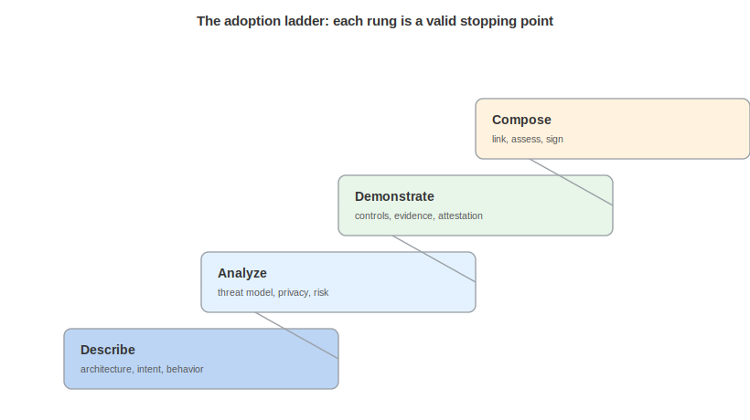

# Tooling and Adoption

Teams produce and consume these documents with systems they already run: threat modeling tools, GRC and risk platforms, build and runtime systems, and architecture tools each supply a layer.

## Producing Documents

From threat modeling tools: the threat model container was designed as an interchange target, and the OWASP Threat Model Library conversions proved it lossless across five real models. A tool exports its element graph as blueprint assets, zones, boundaries, and flows, its findings as threats and scenarios, and its countermeasures as controls. The minimal required fields are deliberately small (a control needs only a name, and so does a threat) so a tool can emit a coarse document and enrich it over time rather than failing to emit anything.

From GRC and risk platforms: a control inventory or risk register exports directly from the systems that already hold that data. Because controls and risks are root-level containers, a GRC platform can emit a control BOM with no threat modeling content at all, which is the standalone use case the model was built for.

From build and runtime systems: declared behavior comes from the build pipeline and product documentation, and observed behavior comes from analysis and runtime monitoring. The behavior document is where these two producers meet, and the pattern operates at scale in the authenticity work: refer to the Describing Behavior chapter.

From architecture and modeling tools: a blueprint exports from a modeling tool or is authored directly. The ten model types and the twenty-plus visualization types let a tool round-trip both the model and its rendering.

## Consuming Documents

The consumers of each document type are named alongside the use case that produces it, and the cross-cutting advice is to consume by reference and validate before trusting. Resolve BOM-Links to the specific versions cited, validate each document against the bundled schema before acting on it, and respect distribution constraints. Read the honesty fields, scope, assumptions, acknowledgment, and status, because they state what a document does not assert, which is as important as what it does.

## Fidelity When Converting

When converting from a narrower format into CycloneDX, the discipline that worked during development was: map the source concept onto the CycloneDX construct that carries its meaning, and park the exact source string in a property so nothing is lost even when the vocabularies differ. An independent fidelity audit of the OWASP Threat Model Library conversions checked every source value for recoverability and found no substantive loss across roughly 1,800 data points. Converters should aim for the same bar: round-trip the meaning through native constructs, preserve the exact source text in `properties`, and log anything that cannot be mapped rather than dropping it silently.

## CI Integration

Treat these documents as code: validate them in continuous integration against the bundled v2.0 schema, the check every Acme example passes. Regenerate behavior baselines and diff them, because a new observed-only behavior is a build signal. Diff control status and risk ratings across releases and flag regressions. A design and assurance document that is generated and checked in CI stays current, and one that is produced by hand once goes stale exactly as the diagrams and spreadsheets it replaces did.

## A Maturity Ladder

Adoption does not have to be all at once, and the stack has a natural order:

1. Describe: start with a blueprint, or with declared behavior, or with intent, and any one is useful alone and requires no analysis.
2. Analyze: add a threat model, a privacy analysis, or a risk register on top of the description, which is where the composition begins to pay off.
3. Demonstrate: add controls, connect them to threats and risks, and substantiate the important claims with CDXA evidence.
4. Compose and assess: link the layers across separately owned documents, add assessments on a cadence, and sign.

Most organizations will climb this ladder one rung at a time, and each rung is a valid stopping point.

## Where to Get Help

The CycloneDX project publishes the schema, the bundled artifacts, and the example corpus, and the community develops the standard in the open through Ecma TC54. The substrate, the inventory, and CDXA each have a home of their own: refer to the CycloneDX 2.0 foundation documentation for the substrate, the Authoritative Guide to SBOM for inventory, and the Authoritative Guide to Attestations for CDXA. Start with the use case that matches a job the team already has, borrow the matching Acme document as a template, and validate early.

\newpage

