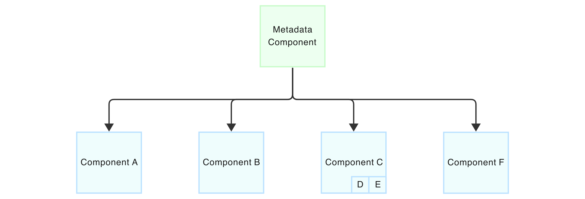
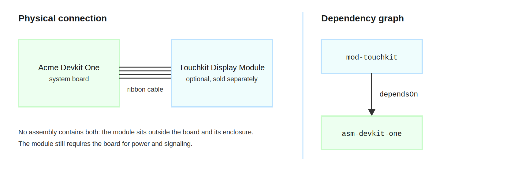

# Inventorying a Hardware Assembly

A hardware inventory names every part and every substance, locates them, classifies them, and states how long replacement takes. A finished part is a component of type `device` and a substance is a component of type `material`, and the physical properties are reserved accordingly: `classification` and `leadTime` apply to both, `boardLocation` and `deviceType` apply only to devices, and `materialForm` applies only to materials. The schema rejects each property on any other component type.

## Classification

`classification` places the part in a hierarchy: a free-text category such as semiconductor or passive, an optional subcategory such as microcontroller, and an array of `codes` that bind the part to external taxonomies. Each code names its issuing `standard`, the `value`, and an optional description and URL, so one part can carry an HS customs heading, a NAICS industry code, and a JEDEC package outline at once:

```json
"classification": {
  "category": "semiconductor",
  "subcategory": "microcontroller",
  "codes": [
    { "standard": "NAICS", "value": "334413" },
    { "standard": "JEDEC", "value": "MS-011" }
  ]
}
```

Codes are what make classification machine-comparable across producers. Two suppliers may disagree on category wording, and an HS heading of 8542.31 settles the question for customs purposes either way.

## Board Location

`boardLocation` records placement: a required list of reference designators, the board layer, and an optional functional subsystem, so the capacitor record covering six placements lists all six designators. The `layer` vocabulary distinguishes the two board faces from placement embedded in an inner layer.

| Value | Description |
|---|---|
| `top` | Top side of the board |
| `bottom` | Bottom side of the board |
| `inner` | Embedded in an inner layer of a multi-layer board |

## Device Type

`deviceType` names the package and mounting style, either as a predefined value or as a custom object with a required name for packages outside the predefined set, such as a land grid array declared as `{ "name": "lga" }`.

| Value | Description |
|---|---|
| `smd` | Generic surface-mount device |
| `pth` | Plated through-hole, leaded part inserted into the board |
| `dip` | Dual in-line package, through-hole |
| `sip` | Single in-line package, through-hole |
| `qfn` | Quad flat no-leads, surface-mount |
| `qfp` | Quad flat package with leads, surface-mount |
| `bga` | Ball grid array, surface-mount |
| `csp` | Chip-scale package, surface-mount |
| `sot` | Small-outline transistor package, surface-mount |
| `to` | Transistor outline package |
| `wlcsp` | Wafer-level chip-scale package |
| `module` | Pre-assembled module containing multiple devices |
| `die` | Bare semiconductor die, without a package |
| `discrete` | Discrete component without a standardized package |

## Lead Time

`leadTime` records how long procurement takes: a numeric `value` with a `unit`, an optional observed `range` for volatile supply, and the date the quote was observed. The `unit` field constrains the time base of the quote to one of three predefined values.

| Value | Description |
|---|---|
| `days` | Lead time expressed in days |
| `weeks` | Lead time expressed in weeks |
| `months` | Lead time expressed in months |
 A 16-week typical with a 12-to-24-week range tells an availability planner more than any prose remark, and the observed date says how much to trust it.

## Materials

A `material` is a physical substance in raw or processed form, such as a metal, an alloy, a polymer, or a chemical, tracked for sourcing, provenance, and regulatory compliance. The dividing rule is finished versus feedstock: a connector is a `device`, and the solder paste that attaches it is a `material`. Materials carry the same classification, parties, identifiers, and lead time as devices, plus `materialForm`, the physical form in which the material is supplied, as a predefined value or a custom object with a required name. Solder paste, for example, declares the custom form `{ "name": "paste" }` rather than forcing a fit into the predefined set.

| Value | Description |
|---|---|
| `powder` | Finely divided particulate form |
| `ingot` | Cast mass intended for further processing |
| `billet` | Semi-finished form intended for extrusion, forging, or rolling |
| `bar` | Solid elongated form of uniform cross section |
| `rod` | Solid elongated form of round cross section, smaller than a bar |
| `wire` | Drawn form of small round cross section |
| `sheet` | Flat rolled form of uniform thickness, thinner than plate |
| `foil` | Flat rolled form thinner than sheet |
| `plate` | Flat rolled form thicker than sheet |
| `tube` | Hollow elongated form of uniform cross section |
| `pellet` | Small compacted body of regular form |
| `flake` | Thin irregular particulate form |
| `sponge` | Porous granular form from reduction processes, such as titanium sponge |
| `liquid` | Liquid form, including melts, solutions, and suspensions |
| `gas` | Gaseous form, including compressed and liquefied gases |

Form matters to risk, because supply of the same substance in different forms comes from different suppliers with different constraints, and a program that can buy titanium plate has solved nothing about titanium sponge. Where a material came from, stage by stage, is origin data rather than inventory data. Refer to Origin and Foreign Influence Analysis for declared origin distributions and the parties that performed each stage.

## Part Identifiers

Identifiers are attributed, not bare. An `identifiers` entry names the asserting party and the identity claims it makes, each pairing a scheme with a value. The scheme vocabulary is shared across all of CycloneDX, and the following subset lists every scheme applicable to devices and materials, omitting software schemes such as `purl` and `swid`, which the Authoritative Guide to SBOM covers.

| Value | Description |
|---|---|
| `epc-rfid` | Electronic Product Code carried in an RFID tag |
| `giai` | GS1 Global Individual Asset Identifier |
| `gln` | GS1 Global Location Number |
| `gmn` | GS1 Global Model Number |
| `gtin-8` | Global Trade Item Number, 8 digits |
| `gtin-12` | Global Trade Item Number, 12 digits, the UPC-A number |
| `gtin-13` | Global Trade Item Number, 13 digits |
| `gtin-14` | Global Trade Item Number, 14 digits |
| `mpn` | Manufacturer part number, assigned by the original manufacturer |
| `part-number` | Part number assigned by a distributor, integrator, or operator |
| `model-number` | Model number assigned by the manufacturer |
| `sku` | Stock keeping unit, assigned by a seller or distributor |
| `serial-number` | Identifier of an individual unit of a product |
| `asset-tag` | Asset tag assigned by the owning or operating organization |
| `udi-di` | Unique Device Identification, device identifier portion |
| `udi-pi` | Unique Device Identification, production identifier portion |
| `fcc-id` | U.S. FCC equipment authorization identifier |
| `imei` | International Mobile Equipment Identity of a mobile device |
| `mac-address` | IEEE 802 media access control address |
| `tei` | Transparency Exchange Identifier |

A scheme outside the predefined set takes the custom form, an object with a required `name`, so a private vocabulary such as an internal ERP number travels without posing as a standard scheme:

```json
{ "scheme": { "name": "acme-erp-sku" }, "value": "100-4417" }
```

Attribution matters because part numbers collide. The manufacturer asserts the MPN, a distributor asserts its own SKU for the same part, and a consumer can weigh each claim by who made it.

## Component Assemblies

The board itself is a `device` component in document metadata, and its parts sit in the `components` array, which states inclusion: every listed part belongs to the finished product. Deeper structure nests, because any component may carry its own `components`, and the hierarchy follows how manufacturing already decomposes a product, system to subsystem to part. The Acme Touchkit, a touchscreen display module designed for the Devkit One and sold separately, contains a TFT panel and a driver board:

```json
{
  "type": "device",
  "bom-ref": "mod-touchkit",
  "name": "Touchkit Display Module",
  "components": [
    { "type": "device", "bom-ref": "comp-tft-panel", "name": "4.3 inch TFT panel" },
    { "type": "device", "bom-ref": "comp-driver-board", "name": "Display driver board" }
  ]
}
```



Nesting is containment and nothing more. In the figure, the metadata component includes Components A through F, and Component C contains an assembly of D and E, which states how D and E entered the product and nothing about who needs whom. A recipient walks the hierarchy from the finished product down to the last passive without leaving the document, and a subassembly, with its own parts nested inside it, can be signed by the supplier who built it.

## Dependencies

A `dependencies` entry records function rather than structure: the components a part requires to operate, each named by `bom-ref` in a flat graph. Hardware depends across assembly boundaries. The Touchkit ships outside every Devkit One assembly and connects over a ribbon cable, yet without the board it has no power and nothing to drive it, so a document describing the deployed pair lists both components, nests neither inside the other, and records the functional relationship in one entry:

```json
"dependencies": [
  {
    "ref": "mod-touchkit",
    "dependsOn": [ "asm-devkit-one" ]
  }
]
```



Containment and dependency answer different questions, and a consumer reads both. The nested inventory prices and sources the module part by part, while the dependency graph warns that a Devkit One recall reaches every Touchkit in the field, a conclusion no amount of walking the assembly hierarchy would produce.

<div style="page-break-after: always; visibility: hidden">
\newpage
</div>
