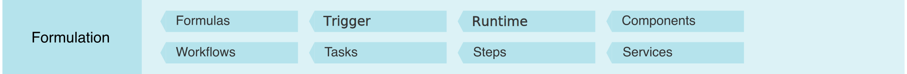
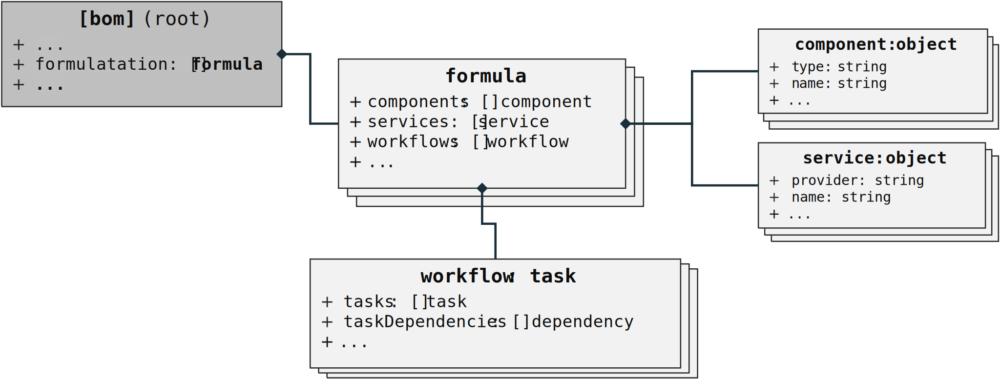

# CycloneDX Formulation Object Model

## Overview

Formulation describes how something was manufactured or deployed. CycloneDX achieves this through the support of multiple formulas, workflows, tasks, and steps, which represent the declared formulation for reproduction along with the observed formula describing the manufacturing process.

## Object relationships

**Note**: *The object diagrams do not show every field that is available for a given object, but only includes those that are relevant to conveying the relational model.*

## Formula relationships

#### Formulation

The `formulation` attribute of the CycloneDX BOM object can be used to describe the *set of processes*, as `formula`, which detail how the top-level component or service described by the BOM was manufactured.

#### Formula

A `formula` can describe a set of `workflow` objects each detailing one or more phases of how the associated component or service was tested, built, delivered, or deployed as a set of dependent `tasks`. 

#### Workflow

A `workflow` can describe a manufacturing process as a directed acyclic graph of dependent typed `task` objects each d.

**Note**: *The `workflow` object is also a `task` object as this allows it to be referenced as a task in another workflow.*

#### Components

TODO

#### Services

TODO

#### Task

- detail the low-level steps or commands
- with components and services used (observed) in those processes

#### Dependency

TODO

#### Task types

Describes the named types of tasks that are included in the associated `workflow`. The following `taskType` values are defined:

- "copy": "A task that copies software or data used to accomplish other tasks in the workflow.",
- "clone": "A task that clones a software repository into the workflow in order to retrieve its source code or data for use in a build step.",
- "lint": "A task that checks source code for programmatic and stylistic errors.",
- "scan": "A task that performs a scan against source code, or built or deployed components and services. Scans are typically run to gather or test for security vulnerabilities or policy compliance.",
- "merge": "A task that merges changes or fixes into source code prior to a build step in the workflow.",
- "build": "A task that builds the source code, dependencies and/or data into an artifact that can be deployed to and executed on target systems.",
- "test": "A task that verifies the functionality of a component or service.",
- "deliver": "A task that delivers a built artifact to one or more target repositories or storage systems.",
- "deploy": "A task that deploys a built artifact for execution on one or more target systems.",
- "release": "A task that releases a built, versioned artifact to a target repository or distribution system.",
- "clean": "A task that cleans unnecessary tools, build artifacts and/or data from workflow storage.",
- "other": "A workflow task that does not match current task type definitions."

**Note:** *The current set of task types currently favor those that typically appear in modern Continuous Integration and Continuous Delivery (CI/CD) applications and platforms for software.* *Future versions of this specification may add additional task types for other domains.* 

#### Workspace

TODO

\newpage

