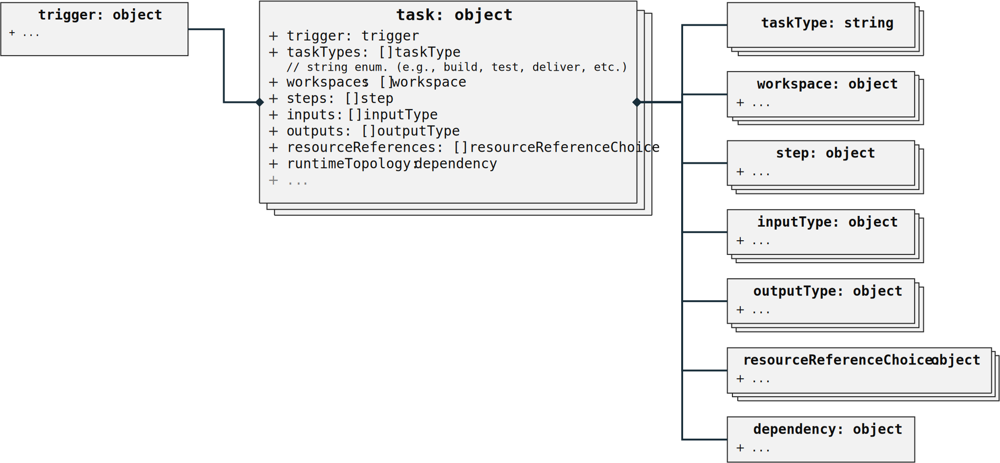
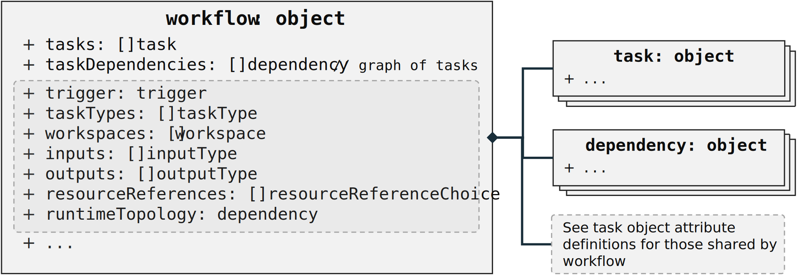
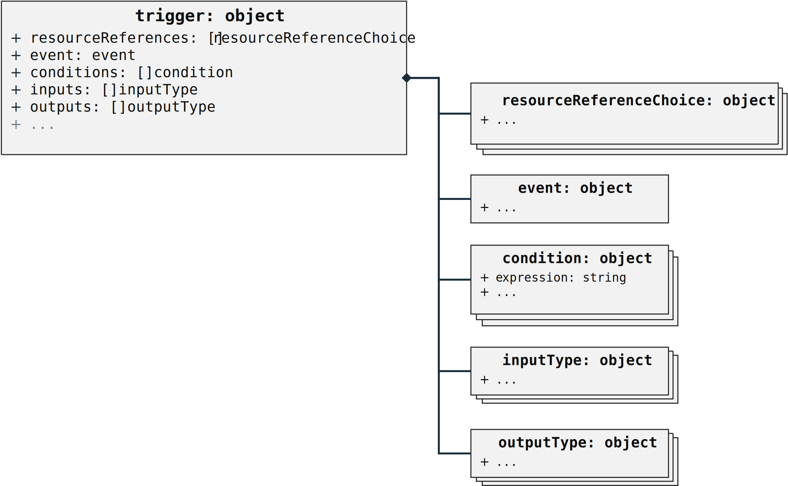

# CycloneDX Formulation Object Model

## Overview

Formulation describes how something was manufactured or deployed. CycloneDX achieves this through the support of multiple formulas, workflows, tasks, and steps, which represent the declared formulation for reproduction along with the observed formula describing the manufacturing process.

## Object relationships

**Note**: *The object diagrams do not show every field that is available for a given object, but only includes those that are relevant to conveying the relational model.*

## Formula relationships

#### `formulation`

The `formulation` attribute of the CycloneDX BOM object can be used to describe the *set of processes*, as `formula`, which detail how the top-level component or service described by the BOM was manufactured.

#### `workflows`

The list of workflows which were executed in order to manufacture a BOM's respective `component`.

#### `formula`

A `formula` can describe a set of `workflow` objects each detailing one or more phases of how the associated component or service was tested, built, delivered, or deployed as a set of dependent `tasks`. 

#### `components`

The list of software, hardware or other `components` that are referenced by one or more formula and its workflows or tasks which have not been declared elsewhere within the same BOM document.

For example, build frameworks and tools, scanning tools, test tools and their data, runtime hardware, and software environment information, etc.

**Note**: *Any component referenced by formula must be declared within the same BOM document for the formula to be considered valid.*

#### `services`

The list of `services` that are referenced by one or more formula and its workflows or tasks which have not been declared elsewhere within the same BOM document.

For example, services used for security scanning, artifact and data storage, logging, testing, deployment, etc.

**Note**: *Any service referenced by the formula must be declared within the same BOM document for the formula to be considered valid.*

## Task relationships

#### `trigger`

Describes the manual (human) or automated action or event that triggered the task execution (i.e., caused its `steps` to be executed). 

#### `taskTypes`

Describes the types of `tasks`, as a list, that are included in the associated `workflow` for informational purposes. The following `taskType` values are defined:

- **copy**: A task that copies software or data used to accomplish other tasks in the workflow.
- **clone**: A task that clones a software repository into the workflow in order to retrieve its source code or data for use in a build step.
- **lint**: A task that checks source code for programmatic and stylistic errors.
- **scan**: A task that performs a scan against source code, or built or deployed components and services. Scans are typically run to gather or test for security vulnerabilities or policy compliance.
- **merge**: A task that merges changes or fixes into source code prior to a build step in the workflow.
- **build**: A task that builds the source code, dependencies and/or data into an artifact that can be deployed to and executed on target systems.
- **test**: A task that verifies the functionality of a component or service.
- **deliver**: A task that delivers a built artifact to one or more target repositories or storage systems.
- **deploy**: A task that deploys a built artifact for execution on one or more target systems.
- **release**: A task that releases a built, versioned artifact to a target repository or distribution system.
- **clean**: A task that cleans unnecessary tools, build artifacts and/or data from workflow storage.
- **other**: A workflow task that does not match current task type definitions.

**Note:** *The current set of task types currently favor those that typically appear in modern Continuous Integration and Continuous Delivery (CI/CD) applications and platforms for software.* *Future versions of this specification may add additional task types for other domains.*

#### `workspaces`

The list of `workspace` objects that are associated with the `workflow`. A workspace is an accepted abstraction of a filesystem that is shared between `tasks` and their steps. For example, a workspace can hold the source for the BOM component being built, the binary produced by a build step, output from scanning tools, etc.

#### `steps`

Describes the sequence of steps, which may include the actual commands, that were executed by the `task`.

#### `inputs`

Describes references to resources or data made accessible, as input, to the task (and its step's commands) at runtime by the executor. For example, a `configuration` file used by a `tool`.  

**Note**: the actual configuration file would be declared as a `component` or `externalReference` within the task itself or its parent workflow.

#### `outputs`

Describes references to resources or data produced, as output, by the task (and its step's commands). For example, a `log` file or `metrics` data.

**Note**: the actual `log` or `metrics` data files would be declared as `components` or `externalReferences` within the task itself or its parent workflow.

#### `resourceReferences`

References to `component` or `service` resources that are used to realize the resource instance within the execution environment.  For example, a `logging` service or artifqct `storage` service reference.

#### `runtimeTopology`

A graph of the component runtime topology for workflow's instance.

## Workflow relationships

#### `workflow`

A `workflow` can describe a logical phase of the manufacturing process as a directed acyclic graph of dependent typed `task` objects.

The `workflow` object is a viewed (and can be treated) as a specialized "task" which shares most of the same attributes or fields as the `task` object. This  allows a `workflow` to be referenced as a task in another workflow as part of the `taskDependencies` graph. 

The `workflow` object uniquely adds the following object attributes described below:

* tasks
* taskDependencies  

and duplicates the attributes described for the `task` object:

* trigger
* taskTypes
* workspaces
* inputs
* outputs
* resourceReferences
* runtimeTopology

**Note**: *The concept of the `workflow` object as a "near subclass" of a `task` object was too complex to map easily to JSON schema so it is described here.* 

#### `tasks`

The list of `task` objects that contain the the low-level steps or commands

#### `taskDependencies`

A dependency graph of the `tasks` for the `workflow` indicating (observed) execution order.

**Note:** *The task dependency graph should be acyclic and map to the production of one or more output artifacts* 

## Trigger relationships

### `trigger`

Describes a resource that can conditionally activate (or "fire") tasks based upon associated events and their data.  Triggers are a common event-driven concept that can be defined and managed within the context of typical CI/CD platforms or systems.  They enable the conditional execution of associated workflows or tasks in response to manual or automated events.

Triggers are an important part in understanding the context of why a workflow was run and affirm that any security and compliance policies were adhered to.

#### `resourceReferences`

References to component or service resources that are used to instantiate the trigger.  These can include references to component or service resources, apart from the event data, that were used by the trigger to evaluate conditions (along with inputs) or produce outputs that would be consumed by the associated task or workflow.

#### `event`

Describes the event data that caused the associated trigger to be executed.

#### `conditions`

A list of conditions used to determine if a trigger should be activated and cause its associated task or workflow to be executed.

#### `inputs`

Represents resources and data provided to the trigger at runtime by the underlying execution environment that provide additional information used to evaluate `conditions`.

#### `outputs`

Represents resources and data provided by the trigger at runtime to the associate task or workflow.

## Step relationships

#### `commands`

A text representation of the executed command.  For example, this might be an interpolated shell command that copied files or ran a tool.

## Workspace relationships

#### `resourceReferences`

References to component or service resources that are used to realize the workspace.  These could include references to resources such as storage services.

#### `volume`

Information about the actual volume instance, if applicable, allocated to workspace.

\newpage

