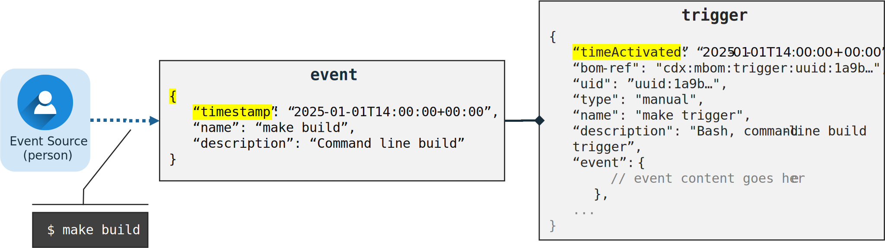

## Use Case: Simple software application

This example shows how a simple `helloworld` application's build process can be captured by an MBOM. 

### Workflow overview

#### Application source code

The application itself is composed a single "C" source file, `helloworld.c`, which contains the following code:

```c
#include <stdio.h>

int main() {
    printf("Hello, World!\n");
    return 0;
}
```

#### Application Makefile

The application is built using the GCC compiler using the following `Makefile`:

```make
CC = gcc
CFLAGS = -Wall

build: clean hello

hello: helloworld.c
    $(CC) $(CFLAGS) -o hello helloworld.c

clean:
    rm -f hello
```

#### Build process

The application can be built by manually running the following command in a terminal/shell of a suitable operating system:

```shellSession
$ make build
```

which would cause the Makefile's `build` target (task) to be executed which would, in turn, case the dependent `clean` and `hello` targets to be executed in order and result in the creation of an executable file called `hello`.

### Assumptions

When representing the manufacturing process in CycloneDX format, this example assumes:

* The formulation represents a local, manual build process that is executed on a single machine of source code already cloned from a GitHub repository.
* All referenced "tools" are already installed on the local system.
* For readability, component `name` values will use "short" names. For example, `helloworld.c` will be used instead of a best practice name `CycloneDX/MBOM-examples/simple-application-makefile/helloworld.c`; however, the corresponding `bom-ref` values will be based on the GitHub repository URL and commit hash to preserve uniqueness of identity.
* We will not attempt to encode the non-essential components for the Software Bill-of-Materials (SBOM) which is better show in other guides. For example use case, the "include" (header) file `stdio.h` is not represented.

---

## MBOM Representation

For effectively conveying the essential representation of the build process using the CycloneDX Formulation objects, this example will initially focus on capturing only the key build artifacts, tools, and information.  Then, we will show how additional information can be added to encode a more complete picture of the entire manufacturing process.

In order to simplify the readability of relationships in an MBOM, CycloneDX `bom-ref` values shown in the example will take the URI form: `"cdx:mbom:<CycloneDX entity name>:uuid:<uuid>"` although this is not a requirement of the CycloneDX Formulation.

### Components

This section defines the essential `component` objects referenced in building the simple application. For files in this example, we will use the `file://` URI scheme with an empty `host` to reference the local file system.  

The `component` objects are defined as follows:

#### Source components

- `helloworld.c`:  
  ```json
  {
    "bom-ref": "file:///CycloneDX/MBOM-examples/simple-application-makefile/helloworld.c",
    "type": "file",
    "name": "helloworld.c",
    "version": "1.0",
    "hashes": [
      {
        "alg": "SHA-256",
        "content": "..."
      }
    ]
  }
  ```

#### Build components

- `Makefile`  
  ```json
  {
    "bom-ref": "file:///CycloneDX/MBOM-examples/simple-application-makefile/Makefile",
    "type": "file",
    "name": "Makefile",
    "version": "1.0",
    "hashes": [
      {
        "alg": "SHA-256",
        "content": "..."
      }
    ]
  }
  ```

- `gcc` - GCC compiler  
  ```json
  {
    "bom-ref": "file:///Applications/Xcode.app/Contents/Developer/Toolchains/XcodeDefault.xctoolchain/usr/bin/gcc",
    "type": "application",
    "name": "gcc",
    "version": "16.0.0 (clang-1600.0.26.4)"
  }
  ```

- `make` utility  
  ```json
  {
    "bom-ref": "file:///Applications/Xcode.app/Contents/Developer/Toolchains/XcodeDefault.xctoolchain/usr/bin/make",
    "type": "application",
    "name": "GNU Make",
    "version": "3.81"
  }
  ```

### Event-Trigger relationship

This section describes how the human action `make build` can be represented in `event` and `trigger` data structures as shown here:



#### Event

In all cases, workflows are triggered by some sort of explicit, human or automated event. In this example, a person manually executed the following command in a Bash command prompt:

```shellSession
$ make build
```

this event could be represented as follows:

```text
timestamp: "2025-01-01T14:00:00+00:00",
name: "make build",
description: "Command line build"
```

**Note**: *Workflows may be triggered by events dynamically received from other systems or services. In these cases, the event could include the raw event `data` itself as well as information.about the `source` system or service the event was sent by.* 

#### Trigger

The trigger provides context about an event, as well as describing any additional information or resources used to augment an event before "triggering" an associated workflow. For this use case, the event and trigger represents a "manual" event `type` with a clear `name` and identifier (i.e., a `uid`) along with a more detailed `description`.

This could be represented as follows:

```jsonc
{
  "timeActivated": "2025-01-01T14:00:00+00:00",
  "bom-ref": "cdx:mbom:trigger:uuid:1a9b…",
  "uid": "uuid:1a9b…",
  "type": "manual",
  "name": "make trigger",
  "description": "Bash, command-line build trigger",
  "event": {
    // event content goes here
  },
  ...
}
```

**Note**: *In this simple example, the trigger directly represents the event itself so the event's `timestamp` value is the same as the  trigger's `timeActivated` value. However, in more complex event-driven build systems, the trigger represents a separable action subject to external rules such that the event `timestamp` value would reflect an earlier date-time than the trigger's `timestamp` value.*

### Task-workflow relationship


#### Tasks

In this example, there is only one logical "task"; that is, the build process initiated by the `make build` command step. This task itself can be represented as:

```json
{
  "bom-ref": "cdx:mbom:task:uuid:dbb6c5c0-6958-4a18-ac67-d897dbee76b6",
  "uid": "uuid:dbb6c5c0-6958-4a18-ac67-d897dbee76b6",
  "taskTypes": ["clean", "build"],
  "name": "make build task",
  "description": "A task that captures 'make build' step.",
  ...
}
```

As you can see we provide the two logical `taskType` values of `clean` and `build` to represent the logical steps the `make` command would perform as a result of resolving the target dependencies within the `Makefile`.

##### Adding steps to the task

The single command-line, build `step` can be added to the task:

```json
{
  "bom-ref": "cdx:mbom:task:uuid:dbb6....",
  "uid": "uuid:dbb6...",
  "name": "make build task",
  ...
  "steps": [
    {
      "name": "run make build",
      "commands": [ 
        {
          "executed": "make build"
        }
      ]
    }
  ]
}
```

The `trigger` defined previously can be added to the task as follows:

```json
{
  "bom-ref": "cdx:mbom:task:uuid:dbb6....",
  "uid": "uuid:dbb6...",
  "name": "make build task",
  ...
  "trigger": {
    "bom-ref": "cdx:mbom:trigger:uuid:1a9b...",
    "uid": "uuid:1a9b....",
    "type": "manual",
    "name": "make trigger",
    "description": "Bash, command-line build trigger",
  },
  ...
}
```

#### Workflow

In this example, the workflow represents the single `task` execution as follows:

```jsonc
{
  "bom-ref": "cdx:mbom:workflow:uuid:431ff656-8f90-410b-a614-c3916b842036",
  "uid": "uuid:431ff656-8f90-410b-a614-c3916b842036",
  "taskTypes": ["clean", "build"],
  "tasks": [
    // task goes here
  ],
  "taskDependencies": [
    { 
      "ref": "cdx:mbom:task:uuid:dbb6…"
    }
  ],
  "trigger": {
    // trigger goes here
  },
  "resourceReferences": [...],
  "runtimeTopology": [...],
  ...
}
```

### Formulation-Formula-Components relationship


#### Formula

The `formula`for building this example application, in addition to describing the single `workflow` for this example, also includes the full listing (or manifest) of resources referenced by the workflow and its task. These elements can be represented as follows:

```jsonc
{
  "components": [ 
       // component content goes here
  ],
  "workflows": [
      // workflow content goes here
  ]
}
```

and finally the `formula` is placed under the CycloneDX BOM's `formulation` keyname of the Software Bill of Materials (SBOM):

```jsonc
{
  "bomFormat": "CycloneDX",
  "specVersion": "1.6",
  "serialNumber": "urn:uuid:2820...",
  "metadata": {
    "component": {
      "type": "application",
      "name": "simple-application",
      ...
    },
    ...
  },
  "formulation": [{
      // formula content goes here
    }
  ],
  ...
}
```

#### Why list components under the `formula`?

In our example, we chose to list components used to build the application under the `formula` keyname. However, it is possible to instead list them under the top-level `components` array's keyname.  

This choice was made since this allows the MBOM information to be separated into a separate document from the associated SBOM and linked via the [CycloneDX `BOM-Link` capability](https://cyclonedx.org/capabilities/bomlink/).  This would be accomplished in the same manner as described for separating vulnerability information using the [CycloneDX Vulnerability Disclosure Report (VDR) capability](https://cyclonedx.org/capabilities/vdr/).

---

## Advanced representation of the build process

For many security and compliance use cases, it is necessary to represent the runtime topology (i.e., the build or manufacturing platform) of a software application and allowing independent verification the process is repeatable.  This section shows how to add some of this information to the MBOM for this example. 

### Runtime topology


The runtime topology represents any software frameworks, platforms, tools, hardware and other resources used to create the software application used to run the workflow and its tasks.

This section will show how to represent the runtime topology for the simple application's build process which includes a Bash shell running on a Mac OS X machine.


#### Platform

For this example, we can choose to represent the key platform elements used to run the `make` command.  This could include the shell and the operating system used to run the build process as CycloneDX `components`. For example:

- The `Bash` shell used to run the `make` command:  
  ```json
  {
    "bom-ref": "file:///bin/bash",
    "type": "platform",
    "name": "GNU bash",
    "version": "3.2.57(1)-release (arm64-apple-darwin23)"
  }
  ```
- The `OS X` operating system the Bash terminal was running on:  
  ```json
  {
    "bom-ref": "urn:cdx:os://macosx@14.6.1+23G93",
    "type": "operating-system",
    "name": "macOS",
    "version": "14.6.1+23G93"
  }
  ```

#### Hardware

Additionally, we could describe the actual device used for the build process to an appropriate level of detail:

- `Mac OS X` machine  
  ```json
  {
    "bom-ref": "urn:cdx:device:sn:CBFX71DM3",
    "type": "device",
    "name": "Matt's MacBook Pro",
    "description": "Apple M3 Max, 16 inch"
  }
  ```

### Runtime topology relationships


---

### Including the BOM creation in the Makefile

It is envisioned that Software-Bill-of-Materials (SBOM) will be created as part of the build process including Manufacturing (MBOM) information. This could be reflected as a post-build target in the `Makefile` which would bring additional SBOM generation tooling into the manufacturing process itself and be reflected in the SBOM/MBOM document as well.
