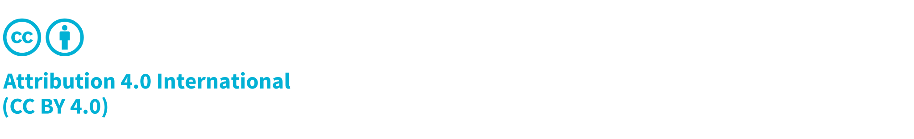

\newpage

# Frontispiece

## About the Guide
CycloneDX is a modern standard for the software supply chain. It has been ratified as [ECMA-424](https://ecma-international.org/publications-and-standards/standards/ecma-424/) by Ecma International.

The content in this guide results from the work of the CycloneDX AI/ML Working Group with continuous community feedback and input from leading experts in the field. This guide would not be possible without valuable feedback from peers at the CycloneDX Industry Working Group (IWG), the CycloneDX Core Working Group (CWG), the many CycloneDX Feature Working Groups (FWG), Ecma International Technical Committee 54, and a global network of contributors and supporters.

## Copyright and License

Copyright © 2026 The OWASP Foundation.

This document is released under the [Creative Commons Attribution 4.0 International](https://creativecommons.org/licenses/by/4.0/). For any reuse or distribution, you must make clear to others the license terms of this work.

\emptyparagraph

First Edition, 03 March 2026

\emptyparagraph

| Version       | Changes         | Updated On | Updated By                    |
|---------------|-----------------|------------|-------------------------------|
| First Edition | Initial Release | 2026-03-03 | CycloneDX AI/ML Working Group |

\newpage

