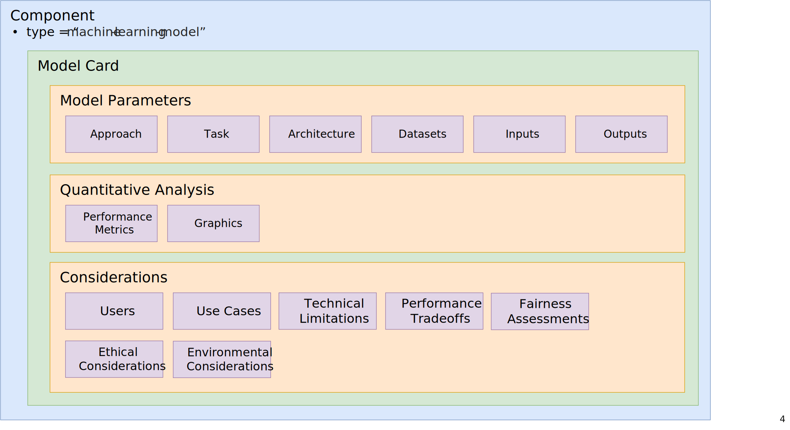
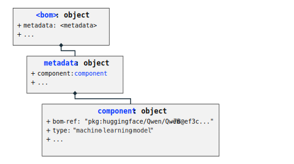
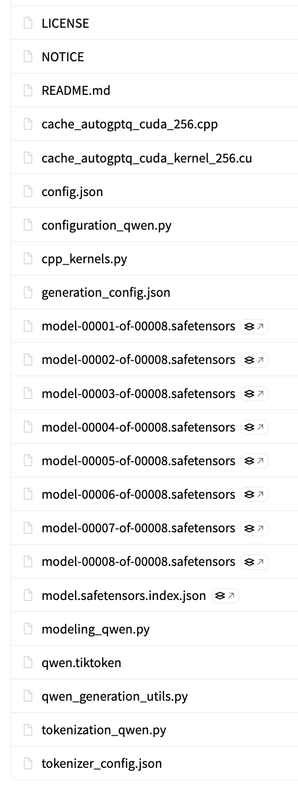

# ML-BOM Design and Best Practices

## Overview

A Machine Learning Bill-of-Materials (MLBOM or ML-BOM) is an object model to describe a machine learning model, its compositional assets, and other descriptive information often used to assess risk and compliance. Support for MLBOM is included in CycloneDX v1.5 and higher.

An MLBOM relies on many of the common, core elements of the CycloneDX schema, as well as unique aspects specific to ML components, their architectures, metadata, training, and other information used to gauge regulatory compliance.

This guide will provide specifics and best practices for conveying ML-related information using the CycloneDX schema.

The [Core Concepts](0x15-Core-Concepts.md#key-components-of-an-ml-bom) listed in the previous section will be used to provide details, best practices, and examples for providing the corresponding information using CycloneDX schema objects.

For convenience, here are links to the specific sections for each of those informational areas:

* [Anatomy of an ML-BOM](#anatomy-of-an-ml-bom)
* [Declaring ML Models](#declaring-ml-models)
  * [Describing models as components](#describing-models-as-components)
  * [Model repositories as components](#model-repositories-as-components)
  * [Model identifiers](#model-identifiers)
  * [Describing a model repository as a CycloneDX assembly](#describing-a-model-repository-as-a-cyclonedx-assembly)
  * [Declaring a model's pedigree](#declaring-a-models-pedigree)

<div style="page-break-after: always; visibility: hidden">
\newpage
</div>

## Anatomy of an ML-BOM

In CycloneDX, a model is considered a `component` where general best practices for providing information such as component identification, metadata, provenance, pedigree, etc. should be followed as documented in the [CycloneDX Authoritative Guide to SBOM](https://cyclonedx.org/guides/OWASP_CycloneDX-Authoritative-Guide-to-SBOM-en.pdf).



## Declaring ML models

### Describing models as components

A model should always be declared as a CycloneDX `component`.  If the model itself is the subject of the BOM, then the BOM is considered an ML-BOM, and the `component` representing it would be declared in the top-level BOM `metadata` object.

The object model's pseudo-schema would look something like this:


###### Example: Declaring an ML model in an ML-BOM

The CycloneDX JSON pseudocode below shows how an ML model would be declared as the "subject" `component` of an ML-BOM within the top-level `metadata`:

```json
{
  "$schema": "http://cyclonedx.org/schema/bom-1.7.schema.json",
  "bomFormat": "CycloneDX",
  "specVersion": "1.7",
  "serialNumber": "urn:uuid:ec45525e-516c-4405-9de3-4fbdaef7f09a",
  "version": 1,
  "metadata":
  {
    "component":
    {
      "type": "machine-learning-model",
      "bom-ref": "pkg:huggingface/Qwen/Qwen-7B@ef3c5c9",
      "purl": "pkg:huggingface/Qwen/Qwen-7B@ef3c5c9c57b252f3149c1408daf4d649ec8b6c85",
      "version": "ef3c5c9c57b252f3149c1408daf4d649ec8b6c85",
      // ...
    }
    // ...
  }
  // ...
}
```

###### Field discussion

* **bom-ref** - Please note the `bom-ref` value includes the first seven characters of the larger hash value from the `purl` component identifier which is sufficient for local identification within the BOM itself.

#### Model repositories as components

When referencing an ML model as a component, it typically means you are referencing a **model repository** comprised of metadata and a set of files (e.g., pre-trained tensor data in various formats, model configurations, tokenizers, tokenizer configurations, prompt templates, Python code, etc.) which would be selectively used with various, compatible AI or ML applications and frameworks.

If possible, these model repositories should be treated as a software "package" in a Software Bill of Materials (SBOM) when declaring them as `machine-learning-model` type CycloneDX components.

###### Example: CycloneDX for the Qwen-7B model repository

The following example shows how the Hugging Face [Qwen/Qwen-7B](https://huggingface.co/Qwen/Qwen-7B) model repository would be declared as a CycloneDX `component` of type `machine-learning-model` in a CycloneDX ML-BOM as its subject component.

Since the model repository is hosted on Hugging Face, the [Huggingface package type](https://github.com/package-url/purl-spec/blob/main/types/huggingface-definition.json) may be used [Package URL specification](https://github.com/package-url/purl-spec) to identify the model.

<div style="page-break-after: always; visibility: hidden">
\newpage
</div>

```json
{
  "$schema": "http://cyclonedx.org/schema/bom-1.7.schema.json",
  // ...
  "metadata":
  {
    "component":
    {
      "type": "machine-learning-model",
      "bom-ref": "pkg:huggingface/Qwen/Qwen-7B@ef3c5c9",
      "purl": "pkg:huggingface/Qwen/Qwen-7B@ef3c5c9c57b252f3149c1408daf4d649ec8b6c85",
      "group": "Qwen"
      "manufacturer": "Alibaba Cloud",
      "supplier": "Hugging Face",
      "name": "Qwen/Qwen-7B",
      "version": "ef3c5c9c57b252f3149c1408daf4d649ec8b6c85",
      "description": "Qwen-7B is a Transformer-based large language model, which is pretrained on a large volume of data, including web texts, books, codes, etc.",
      "externalReferences": [
        {
          "type": "vcs",
          "url": "https://huggingface.co/"
        },
        {
          "type": "model-card",
          "url": "https://huggingface.co/Qwen/Qwen-7B"
        }
      ],
      "modelCard": {
        // ...
      }
    }
  }
}

```

###### Field discussion

This section provides best practice guidance on how the component fields were filled out for this example.

- **bom-ref** - Since a PURL is available, it can also be used as the `bom-ref`.
- **purl** - The Package URL (PURL) follows the [Huggingface package type](https://github.com/package-url/purl-spec/blob/main/types/huggingface-definition.json) using a commit hash.
- **manufacturer** - The name of the company which built the Qwen model.
- **group** - In this example, we chose to include the optional group field to acknowledge the specific model repository is part of the Qwen family of models.
- **name** - The model name reflects how the model is identified under Hugging Face using the `<owner_name>/<repository_name>` format.
- **version** - Models are not always versioned in the way software packages are (e.g., using `semver` format); however, within repositories such as Huggingface, the version is determined by its version control system's *commit hash*, *tag*, or *branch*. In the above example, the model's commit hash matches the `purl` value.
- **externalReferences** - Used to provide unambiguous links to component's model repository and originating model card.
  - **vcs** - Provides a link to the version control system (i.e., the model provider aka. `supplier`). In this example, Hugging Face is used to affirm the associated PURL identifier.
  - **model-card** - Provides a link to the model's Hugging Face model card which is comprised of mostly unstructured information in the form of a markdown file (i.e., README.md).</br>*The CycloneDX representation of model card information will be detailed in a subsequent section.*

#### Model identifier(s)

As you can see in the above example, the `component` has a `bom-ref` that is also a valid [Package URL (PURL)](https://github.com/package-url/purl-spec) for a ["Qwen-7B" model hosted in a Huggingface model repository](https://huggingface.co/Qwen/Qwen-7B) using the [Hugging Face PURL type](https://github.com/package-url/purl-spec/blob/main/types-doc/huggingface-definition.md). When a valid `purl` value is available for a model, it is recommended that it also be used as its component's `bom-ref`.

If the model being described by an ML-BOM is instead hosted in a GitHub repository, it can also be referenced using a [GitHub Package URL](https://github.com/package-url/purl-spec/blob/main/types-doc/github-definition.md). For example, the ONNX vision model: [tiny-yolov2](https://github.com/onnx/models/tree/main/validated/vision/object_detection_segmentation/tiny-yolov2/model) would have a `github` PURL type.

###### Example: JSON for model component with GitHub PURL

 **Note**: The derivative `bom-ref`, based upon the PURL, is also shown.

```json
"component":
{
  "type": "machine-learning-model",
  "purl": "pkg:github/onnx/models@4c46cd00fbdb7cd30b6c1c17ab54f2e1f4f7b177#validated/vision/object_detection_segmentation/tiny-yolov2/model",
  "bom-ref": "pkg:github/onnx/models@244fd47#tiny-yolov2/model"
  // ...
}
```

##### Adding domain-specific identifiers

Organizations that produce BOMs for hardware or software components they produce may have multiple domain-specific identifiers for the same component.  In these cases, it is best practice to register (reserve) an official namespace for these domains with the [CycloneDX Property Taxonomy](), which is the authoritative source of official namespaces used in CycloneDX `properties`.

###### Example:

The following example shows how a registered name for a fictional company, ACME, which registered the namespace `acme`, could provide a property to identify one of its internal ML models.

```json
"component": {
  "properties": [
    {
      "name": "acme:research:model:llm:id",
      "value": "MODEL-ID-12345-INTERNAL"
    },
    // ...
  ],
  // ...
}
```

##### Identifying a specific model quantization

Some model repositories may contain different [quantizations](0x90-Appendix-A_Glossary.md#quantization) to choose from, which optimize for different target inference runtimes and hardware footprints.

In general, these are referenceable as (often single) files within a model repository, each of which can be described as a CycloneDX component, as shown in the next section [Describing a model repository as a CycloneDX assembly](#describing-a-model-repository-as-a-cyclonedx-assembly).

###### Example: Qwen/Qwen3-8B-GGUF

This example uses the model repository [Qwen/Qwen3-8B-GGUF](https://huggingface.co/Qwen/Qwen3-8B-GGUF), which contains several quantizations of the Qwen3-8B model (published originally in a non-quantized format elsewhere) in [GGUF format](0x90-Appendix-A_Glossary.md#gguf-gpt-generated-unified-format).

These quantized GGUF models are each individual files in the repository:

* Qwen3-8B-Q4_K_M.gguf
* Qwen3-8B-Q5_0.gguf
* Qwen3-8B-Q6_K.gguf
* Qwen3-8B-Q8_0.gguf

Each can be specifically identified in a CycloneDX component using a Package URL (PURL). For example, the `Qwen3-8B-Q4_K_M.gguf` model would be declared as follows:

```json
{
  "$schema": "http://cyclonedx.org/schema/bom-1.7.schema.json",
  "bomFormat": "CycloneDX",
  "specVersion": "1.7",
  "serialNumber": "urn:uuid:1ad676cb-6b40-4068-ae91-ebd1533dbf58",
  "version": 1,
  // ...,
  "components": [
    {
      "name": "Qwen3-8B-Q4_K_M.gguf",
      "type": "machine-learning-model",
      "bom-ref": "pkg:huggingface/Qwen/Qwen3-8B-GGUF@7c41481#Qwen3-8B-Q4_K_M.gguf",
      "purl": "pkg:huggingface/Qwen/Qwen3-8B-GGUF@7c41481f57cb95916b40956ab2f0b139b296d974#Qwen3-8B-Q4_K_M.gguf",
      "version": "7c41481f57cb95916b40956ab2f0b139b296d974",
      // ...
    }
  ],
  // ...
}
```

###### Field discussion

* **type** -  the type has the value `machine-learning-model` since the single file contains all the information (e.g., default configuration parameters, references to architectures and tokenizers, prompt template, etc.) needed to run the model in GGUF inference frameworks.


#### Describing a model repository as a CycloneDX assembly

CycloneDX allows for declarations of software compositions (e.g., hardware products, software applications, packages, libraries, archives, etc.).

In the case of a model repository like those hosted in Hugging Face, one can describe the files that comprise it as a composition with an ML-BOM.  Specifically, it would be declared as a composition of an assembly type.

Specifically, a `component` entry would be created for each file and declared in the ML-BOM's `components` array hierarchically under the model's `component` then declare the assembly relationship within within the BOM's `compositions` array under `assemblies` by providing the `bom-ref` link to the model component that contains the hierarchy of the constituting (file) components within the model repository.

###### Example: Qwen/Qwen-7B model repository files

If we look inside the repository for the [Qwen/Qwen-7B model in Huggingface](https://huggingface.co/Qwen/Qwen-7B), we see the complete list of files that make up the "model" in its repository:



###### CycloneDX for the Qwen/Qwen-7B assembly

The simplified JSON below shows how to declare a few files from the model repository's complete file list within the BOM's `component` under the model's `metadata` declaration.

> **Note**: In the JSON below, we use the Package URL (PURL) syntax to provide the additional path (with the model repository or "package") to each individual file by appending it using the `#` hash symbol as a separator.  Also, notice that the commit hash (identifier) varies per file.

```json
{
  "$schema": "http://cyclonedx.org/schema/bom-1.7.schema.json",
    // ...,
    "metadata":
    {
      "component":
      {
        "type": "machine-learning-model",
        "bom-ref": "pkg:huggingface/Qwen/Qwen-7B@ef3c5c9",
        // ...
        "components": [
          {
              "type": "file",
              "name": "config.json",
              "description": "Model configuration file using the 'QWenLMHeadModel' model class in Hugging Face Transformers",
              "bom-ref": "pkg:huggingface/Qwen/Qwen-7B@e7a368b#config.json",
              "purl": "pkg:huggingface/Qwen/Qwen-7B@e7a368b0774370edec29674e7c51f52fc7663f59#config.json",
              // ...
          },
          {
              "type": "file",
              "name": "configuration_qwen.py",
              "description": "Python 'QWenConfig' class implementation for the Qwen-7B model using Hugging Face Transformers",
              "bom-ref": "pkg:huggingface/Qwen/Qwen-7B@a6ca629#configuration_qwen.py",
              "purl": "pkg:huggingface/Qwen/Qwen-7B@a6ca629d063f56f34d184852301e8852a7afbd58#configuration_qwen.py",
              // ...
          },
          {
              "type": "data",
              "name": "model-00001-of-00008.safetensors",
              "description": "Model tensor data (01 of 08)",
              "bom-ref": "pkg:huggingface/Qwen/Qwen-7B@abcb6d6#model-00001-of-00008.safetensors",
              "purl": "pkg:huggingface/Qwen/Qwen-7B@abcb6d6d8ec63ce606f816e2d08072da6309f965#model-00001-of-00008.safetensors",
              "data": {
                "type": "dataset",
                // ...
              }
              // ...
          },
          {
              "type": "data",
              "name": "model-00002-of-00008.safetensors",
              "description": "Model tensor data (02 of 08)",
              "bom-ref": "pkg:huggingface/Qwen/Qwen-7B@abcb6#model-00002-of-00008.safetensors",
              "purl": "pkg:huggingface/Qwen/Qwen-7B@abcb6d6d8ec63ce606f816e2d08072da6309f965#model-00002-of-00008.safetensors",
              "data": {
                "type": "dataset",
                // ...
              }
              // ...
          },
          // ...
        ]
      }
    }
  // ...
}
```

Then the model component's new hierarchy of composing files would be described as an assembly composition as follows:

```json
{
  "$schema": "http://cyclonedx.org/schema/bom-1.7.schema.json",
  // ...,
  "composition": [
    {
      "aggregate": "complete",
      "assemblies": [
        "pkg:huggingface/Qwen/Qwen-7B@ef3c5c9",
      ]
    }
  ],
  // ...
}
```

###### Discussion of composition fields

- **aggregate** - Note the composition `aggregate` value is assigned to be "complete" since all constituent files are known and declared in the ML-BOM as part of the model component's `components` hierarchy.


### Declaring a model's pedigree

ML models are often derived from existing, pre-trained models to optimize performance, reduce resource consumption, and adapt to specialized tasks without training from scratch.  Some reasons for this include:

* **Fine-Tuning**: Specialized adaptation where a general model (e.g., LLM) is retrained on a smaller, targeted dataset to improve performance for specific domains.
* **Quantization**: Reduces model size and increases inference speed by mapping parameters to lower-precision tensor formats (e.g., from [`FP32`](https://en.wikipedia.org/wiki/Single-precision_floating-point_format) to `int8` or `Q4_K_M` precision), which also lowers energy consumption for edge devices.
* **Format Conversions**: Transforming models between frameworks (e.g., PyTorch to ONNX) ensures interoperability, allowing deployment on different frameworks and accelerators.
* **Pruning**: Derives a smaller model by removing redundant or less important parameters (weights) that do not significantly contribute to output accuracy.
* **Adapters**: Adding small, trainable layers (adapters) to a frozen base model to adapt it to new tasks without changing the original, large model weights, saving on storage for multi-task scenarios.

It is important to capture any of these transformations in the model's lineage ("pedigree") or in an ML-BOM.  This should be accomplished via the CycloneDX `pedigree` object and describing a model's `ancestors` as a hierarchical graph.

###### Example: Declaring the finetuning of llama3 model for a coding variant

```json
{
  "$schema": "http://cyclonedx.org/schema/bom-1.7.schema.json",
  // ...,
  "metadata": {
    "component": {
      "type": "machine-learning-model",
      "name": "unsloth/Llama-3.2-3B-Instruct",
      "purl": "pkg:huggingface/unsloth/Llama-3.2-3B-Instruct@1.0.0",
      "bom-ref": "pkg:huggingface/unsloth/Llama-3.2-3B-Instruct@1.0.0",
      "publisher": "Unsloth",
      "description": "A pre-optimized, specialized versions of the meta-llama/Llama-3.2-3B-Instruct model designed to work seamlessly with Unsloth's training framework",
      // ...,
      "pedigree": {
        "ancestors": [
          {
            "type": "machine-learning-model",
            "name": "meta-llama/Llama-3.2-3B-Instruct",
            "publisher": "Meta",
            "purl": "pkg:huggingface/meta-llama/Llama-3.2-3B-Instruct",
            "description": "The original base model from Meta Llama used for fine-tuning."
          }
        ]
      }
    }
  }
}
```

###### Field discussion

* **ancestors** - `ancestors` entries are themselves CycloneDX `component` objects. It should be noted that these models may have their own ML-BOMs, which can be located via their identifiers (e.g., `purl`) or via `externalReferences` for readers to follow.

##### Declaring known descendents

If, at the time an ML-BOM is created for a model, its downstream model variants (e.g., finetunings, quantizations, etc., derived from the model) are known, these can also be recorded within the `pedigree` object as `descendants` in a similar manner.

<div style="page-break-after: always; visibility: hidden">
\newpage
</div>
