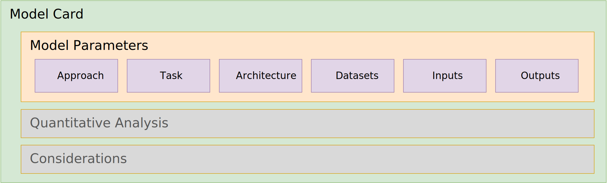

# ML-BOM Design and Best Practices

## Model parameters



This section will feature guidance on filling out information in the Cyclone model card's `modelParameters` object and its subcomponents including:

* [Model metadata](#model-metadata)
  * [Approach](#approach) - The overall approach to learning used by the model for problem solving.
  * [Task](#task) - Directly influences the input and/or output. Examples include classification, regression, clustering, etc.
  * [Architecture family](#architecture-family) - The model architecture family such as a Transformer network, Convolutional Neural Network (CNN), residual neural network (RNN), LSTM neural network, etc.
  * [Model architecture](#model-architecture) - The specific architecture of the model such as Transformer, GPT-1, ResNet-50, YOLOv3, etc.
  * [External references](#external-references)
* [Datasets](#datasets) - The datasets used to train and evaluate the model.
  * [Declaring datasets](#declaring-datasets)
* [Inputs & Outputs](#inputs--outputs) - Describes the input and output data types (formats) of the model.
* [Declaring other properties](#declaring-other-properties)
  * [Configuration parameters & hyperparameters](#configuration-parameters--hyperparameters)

---

### Model metadata

The `modelCard` fields, grouped in this section, are intended to describe so of the classifying metadata of the associated ML model.

#### Approach

Describes the general learning approach used to train the model.  Currently, the approach is simply described by a single `type` field which has the following supported values:

| Type | Description |
|---|---|
| **supervised** | Supervised machine learning involves training an algorithm on labeled data to predict or classify new data based on the patterns learned from the labeled examples. |
| **unsupervised**	| Unsupervised machine learning involves training algorithms on unlabeled data to discover patterns, structures, or relationships without explicit guidance, allowing the model to identify inherent structures or clusters within the data.
| **reinforcement-learning** | Reinforcement learning is a type of machine learning where an agent learns to make decisions by interacting with an environment to maximize cumulative rewards, through trial and error. |
| **semi-supervised** | Semi-supervised machine learning utilizes a combination of labeled and unlabeled data during training to improve model performance, leveraging the benefits of both supervised and unsupervised learning techniques. |
| **self-supervised** | Self-supervised machine learning involves training models to predict parts of the input data from other parts of the same data, without requiring external labels, enabling learning from large amounts of unlabeled data. |

Please note that links to external documentation that detail the model training approach (and other detailed information) can be provided using [external references](#external-references) which is discussed later in this section.

#### Task

Describes the primary task of (or goal) of the machine learning model.  Some examples include:

* **Anomaly Detection** - Identifying outliers or unusual patterns in data.
* **Classification** - Categorizing inputs into predefined labels (e.g., spam/not-spam, image recognition).
* **Clustering** - Grouping unlabeled data based on similar characteristics (e.g., customer segmentation).
* **Dimensionality Reduction** - Simplifying complex data by reducing the number of variables while preserving core information.
* **Generation** - Creating new data based upon prompted instructions (e.g., Large Language Models (LLMs), image or audio diffusion models, etc.).
* **Recommendation/Association** - Finding relationships between items (e.g., "users who bought this also bought...").
* **Regression** - Predicting continuous numerical values (e.g., house prices, temperature forecasting).

#### Architecture family

The model architecture family th

such as a Transformer network, Convolutional Neural Network (CNN), residual neural network (RNN), LSTM neural network, etc.

An architecture family defines the structural and data processing methodology of the model's neural network.  It does not typically describe a single model, but rather describes the general design of the neural network (NN), mathematical approach, context and attention mechanisms and the like.  It should provide insight to those versed in the field as how the model general is constructed.

Some examples of commonly referenced neural network (NN) architecture families include:

* **Transformers** - an architecture designed to process sequential data (like text, speech, or images) in parallel rather than in order.
* **Convolutional Neural Network (CNN)** - an architecture designed to process efficiently detect patterns (like edges, shapes, and textures) to typically classify or analyze visual (videos/image) or auditory data, but can applied to text analysis, behavioral patterns and more.
* **Recurrent Neural Network (RNN)** - an architecture designed for processing sequential data like text, speech, and time series, typically used for tasks where order matters, such as language translation, speech recognition and time-series forecasting.
* **Long Short-Term Memory (LSTM)** -  a specialized variant of a Recurrent Neural Network (RNN) architecture designed specifically to overcome the limitations of traditional RNNs in learning long-term dependencies.
* **Gated Recurrent Units (GRUs)** a specialized variant of a Recurrent Neural Network (RNN) architecture designed to overcome challenges like the vanishing gradient problem and enhance the modeling of long-term dependencies in sequential datasets.
* **Generative Adversarial Networks (GANs)** - an architecture used to train two neural networks, a *Generator* and a *Discriminator*, to compete against each other to generate more authentic data from a starting training dataset. The Generator tries to fool the Discriminator by creating fake data, while the Discriminator tries to identify fakes, leading to continuous improvement in data quality.

Again, the list above represents architecture families that are commonly referenced in research to establish an understanding of general model design; however, the architectural landscape continues to grow as researchers specialize and optimize for different use cases, goals and datasets.

#### Model architecture

TODO

The model architecture field is intended to include a specific keywords to identify an implementation (class or library) or technical descriptors of the architectural "blueprint" needed to run a specific model.

These are typically found in one of several locations relative to the model:

* **Model Card** - the associated "model card" (e.g., `README.md` in Hugging Face) may contain a mentions of specific class names like `LlamaForCausalLM`, `BertModel`, or `VisionTransformer`.
* **Framework-Specific Implementation Keywords** or tags -
Depending on your code environment (PyTorch, TensorFlow, llama.cpp, etc.) that identify specific model code within the platform or environment.
* **Framework-Specific Configuration files** (e.g., Hugging Face transformer's `config.json` file) - may contain the name of the class or function used to configure the framework for the specific implementation recommended for the associated model.
* **Academic Research Papers** (e.g., arXiv) - may include detailed descriptors of processing algorithms, supported training or inference engines or specific, named implementations

###### Example: Model card metadata for the Qwen-7B model

This example shows best practice for the Qwen-7B model using information published within and for the model's repository in Hugging Face.

```json
{
  "$schema": "http://cyclonedx.org/schema/bom-1.7.schema.json",
  ...,
  "metadata":
  {
    "component":
    {
      "type": "machine-learning-model",
      "bom-ref": "pkg:huggingface/Qwen/Qwen-7B@ef3c5c9",
      ...,
      "modelCard": {
        "modelParameters": {
          "task": "text-generation",
          "architectureFamily": "transformer",
          "modelArchitecture": "QWenLMHeadModel",
          "approach": {
            "type": "supervised"
          },
        ...
      }
    }
  }
}
```

###### Field discussion

* **modelArchitecture** - the value `QWenLMHeadModel` was located in the model's `config.json` model configuration file.

#### External references

Most models are fully described in terms of research papers, articles and other reference documents.  In those cases, they should be provided as `externalReferences` under the `component`.

###### Example: "Qwen Technical Report"

This shows how the Qwen research team disclosed comprehensive details about the Qwen model's design, training, implementation and evaluation as a formal research paper in the the Cornell University's arXiv scholarly article distribution service.

```json
{
  "$schema": "http://cyclonedx.org/schema/bom-1.7.schema.json",
  ...
  "metadata":
  {
    "component":
    {
      "type": "machine-learning-model",
      "bom-ref": "pkg:huggingface/Qwen/Qwen-7B@ef3c5c9",
      ...,
      "externalReferences": [
        {
          "type": "documentation",
          "url": "https://arxiv.org/abs/2309.16609",
          "comment": "Qwen Technical Report"
        }
      ],
      ...
    }
  }
}

```

---

### Datasets

Details the datasets used to train and evaluate the model.

#### Declaring datasets

Using CycloneDX there are two methods to provide information on the datasets used to train, test, and evaluate machine learning models.

Specifically, the component `modelCard` object includes `modelParameters` which includes an array of `datasets` objects which can be of the following types:

1. **In-line information**: provides in-line objects that provide for direct description of datasets and some of their typically cited attributes and characteristics.
2. **Data component references**: provides for the complete description of each dataset as its own CycloneDX component and referenced via its `bom-ref`.

The next sections will discuss the considerations for each and example how to use both of these methods.

#### In-line information

This method simplifies the association between training datasets and model cards, specifically addressing scenarios where data is difficult to reference as an independent component.

Key applications:

* **Filtered Data**: Documenting specific slices or individual snippets of data used for fine-tuning or testing.
* **Private Repositories**: Providing transparency via BOMs for non-public datasets in public model cards (e.g, private data used for models in the healthcare or financial services industries).
* **Unstructured Sources**: Referencing data not housed in traditional databases or management tools (e.g., data within S3 buckets, event data within Security information and event management (SIEM) systems).


##### Example: Custom health model with private dataset

This example shows a model fine-tuned (by a fictional "ACME Health" company) from the public [m42-health/Llama3-Med42-8B](https://huggingface.co/m42-health/Llama3-Med42-8B) model using a private dataset.

```json
{
  "$schema": "http://cyclonedx.org/schema/bom-1.7.schema.json",
  "bomFormat": "CycloneDX",
  "specVersion": "1.7",
  "serialNumber": "urn:uuid:3e671687-395b-41f5-a30f-a58921a69b79",
  "version": 1,
  "metadata": {
    "component":
    {
      "type": "machine-learning-model",
      "bom-ref": "pkg:huggingface/acme-health/custom-Llama3-Med42-8B@2ee9dc9",
      "purl": "pkg:huggingface/acme-health/custom-Llama3-Med42-8B@2ee9dc99-cc50-4490-9d6e-9ebf6e39f82f",
      "description": "Customized Med42-v2 large language models (LLMs) which uses the Llama3 architecture and fine-tuned using private clinical dataset."
      ...,
      "modelCard": {
        "modelParameters": {
          ...,
          "datasets": [
            {
              "type": "dataset",
              "name": "UltraFeed-
back dataset",
              "classification": "public",
              "contents": {
                "url": "https://huggingface.co/datasets/openbmb/UltraFeedback"
              }
            },
            ...,
            {
              "type": "dataset",
              "name": "ACME Midwest health data",
              "classification": "private",
              "contents": {
                "url": "https://acme.ai/adatasets/health/patient?region=midwest"
              }
            }
          ],
          ...
        }
      }
    }
  }
}
```

#### Data component references

This method is preferable for use in most security and compliance contexts as it allows for full expression of provenance, pedigree, attestations and other contextual information as a full, CycloneDX component.

##### Example:  health model with private dataset

This example shows the recommended best practice of declaring the datasets for the base model used in the previous "in-line" example (i.e., [m42-health/Llama3-Med42-8B](https://huggingface.co/m42-health/Llama3-Med42-8B)) as their own CycloneDX components.

The public datasets, as documented in the model's research paper include:

* [openbmb/UltraFeedback](https://huggingface.co/datasets/openbmb/UltraFeedback)
* [snorkelai/Snorkel-Mistral-PairRM-DPO](https://huggingface.co/snorkelai/Snorkel-Mistral-PairRM-DPO)

```json
{
  "$schema": "http://cyclonedx.org/schema/bom-1.7.schema.json",
  "bomFormat": "CycloneDX",
  "specVersion": "1.7",
  "serialNumber": "urn:uuid:eb033070-85d1-45f4-9eb7-f50510f83853",
  "version": 1,
  "metadata": {
    "component":
    {
      "type": "machine-learning-model",
      "bom-ref": "pkg:huggingface/acme-health/custom-Llama3-Med42-8B@ceab7e7",
      "purl": "pkg:huggingface/acme-health/Llama3-Med42-8B@ceab7e7ee4b9dbde7ba82867f34274db51487d83",
      "description": "an open, clinical large language models (LLM) instruct and preference-tuned by M42 to expand access to medical knowledge. Built off LLaMA-3 and designed to provide high-quality answers to medical questions."
      ...,
      "modelCard": {
        "modelParameters": {
          ...,
          "datasets": [
            {
              "ref": "pkg:huggingface/openbmb/UltraFeedback@40b4365"
            },
            {
              "ref": "pkg:huggingface/snorkelai/Snorkel-Mistral-PairRM-DPO@07af5d0a"
            }
          ],
          ...
        }
      }
    }
  },
  ...,
  "components": [
    {
      "name": "UltraFeed-back dataset",
      "type": "data",
      "bom-ref": "pkg:huggingface/openbmb/UltraFeedback@40b4365",
      "purl": "pkg:huggingface/openbmb/UltraFeedback@40b436560ca83a8dba36114c22ab3c66e43f6d5e",
      ...
    },
    {
      "name": "UltraFeed-back dataset",
      "type": "data",
      "bom-ref": "pkg:huggingface/snorkelai/Snorkel-Mistral-PairRM-DPO@07af5d0a",
      "purl": "pkg:huggingface/snorkelai/Snorkel-Mistral-PairRM-DPO@07af5d0a875b4c692dfaff6c675b10af07b45511",
      ...
    }
  ]
}
```

---

### Inputs & outputs

Describes the input and output data types (formats) of the model.

>[!Note] Please see the [](#mode)

```json
{
  "$schema": "http://cyclonedx.org/schema/bom-1.7.schema.json",
  ...
  "metadata":
  {
    "component":
    {
      "type": "machine-learning-model",
      ...
      "modelCard": {
          ...
          "inputs": [
            {"format": "string"}
          ],
          "outputs": [
            {"format": "string"}
          ]
      }
    }
  }
}
```


---

### Complete model card example

###### Example: CycloneDX Model Card for the Qwen-7B model

Again, we  continue to showcase the [Qwen/Qwen-7B](https://huggingface.co/Qwen/Qwen-7B) model from Hugging Face.  You may follow the link to its home page in Hugging Face which should show you its [README.md]() file which contains some structured, but mostly unstructured model card information to see how it is translated to CycloneDX objects and schema.

```json
"modelCard": {
  "modelParameters": {
    "approach": {
    "type": "supervised"
    },
    "task": "task goes here",
    "architectureFamily": "the architecture family goes here",
    "modelArchitecture": "The architecture of the model.",
    "datasets": [
      {
          "type": "dataset",
          "name": "Training Data",
          "contents": {
          "url": "https://example.com/path/to/dataset"
          },
          "classification": "public"
      }
    ],
  },

  "considerations": {
    "users": [
        "Who are the intended users of the model?"
    ],
    "useCases": [
        "Who are the intended users of the model?"
    ],
    "technicalLimitations": [
        "What are the known technical limitations of the model? E.g. What kind(s) of data should the model be expected not to perform well on? What are the factors that might degrade model performance?"
    ],
    "performanceTradeoffs": [
        "What are the known tradeoffs in accuracy/performance of the model?"
    ],
    "ethicalConsiderations": [
      {
          "name": "The name of the risk",
          "mitigationStrategy": "Strategy used to address this risk"
      }
    ],
    "fairnessAssessments": [
      {
          "groupAtRisk": "The groups or individuals at risk of being systematically disadvantaged by the model",
          "benefits": "Expected benefits to the identified groups",
          "harms": "Expected harms to the identified groups",
          "mitigationStrategy": "With respect to the benefits and harms outlined, please describe any mitigation strategy implemented."
      }
    ]
  }
}
```
---

### Declaring other properties

#### Configuration Parameters & hyperparameters

In general, model configuration parameters describe values that are directly used to configure model processing applications and frameworks and their implementations of model architectures.  For example, most models that appear in Hugging Face typically include configuration files for both the models and the tokenizers they are designed for use with the [Hugging Face Transformers](https://huggingface.co/docs/transformers/) library and its underlying use of the PyTorch framework.

> [!NOTE] The CycloneDX ModelParameters were initially based upon [Tensorflow ModelCard Toolkit](https://github.com/tensorflow/model-card-toolkit) (now archived) which defines [ModelParameters](https://www.tensorflow.org/responsible_ai/model_card_toolkit/api_docs/python/model_card_toolkit/ModelParameters) that include key-value maps for both inputs and outputs alongside an array of their types; these maps will be accomplished using CycloneDX properties and the [CycloneDX Property Taxonomy](https://github.com/CycloneDX/cyclonedx-property-taxonomy) reserved namespace `cdx:ai-ml:model:parameter` and `cdx:ai-ml:model:hyperparameter` as needed.

###### Example: Model parameters & hyperparameters for the Qwen-7B model

As shown in the [Qwen/Qwen-7B model repository files](0x20-Design-Model-Component-Metadata.md#example-qwenqwen-7b-model-repository-files) example in the previous section, we see the model includes several configuration files including:

- [config.json](https://huggingface.co/Qwen/Qwen-7B/blob/main/config.json) - which contains configuration parameters (as key-value pairs) used for initializing the model's implementation.
- [generation_config.json](https://huggingface.co/Qwen/Qwen-7B/blob/main/generation_config.json) - which contains model hyperparameters (as key-value pairs) and their suggested (default) values used for configuring the model for token generation (inference).

The JSON below shows how a few of the [Qwen/Qwen-7B](https://huggingface.co/Qwen/Qwen-7B) model's parameters, as contained in the [config.json](https://huggingface.co/Qwen/Qwen-7B/blob/main/config.json) configuration file, would be declared within the CycloneDx `modelCard` object's `properties` array using the CycloneDx reserved namespace for AI/ML.

```json
{
  "$schema": "http://cyclonedx.org/schema/bom-1.7.schema.json",
  ...
  "metadata":
  {
    "component":
    {
      "type": "machine-learning-model",
      "bom-ref": "pkg:huggingface/Qwen/Qwen-7B@ef3c5c9",
      ...,
      "modelCard": {
        "modelParameters": {
          ...
          "properties": [
            {
              "name": "cdx:ai-ml:model:parameter:total_parameters",
              "value": "7B"
            },
            {
              "name": "cdx:ai-ml:model:parameter:context_length",
              "value": "8192"
            },
            {
              "name": "cdx:ai-ml:model:parameter:vocab_size",
              "value": "151936"
            },
            {
              "name": "cdx:ai-ml:model:parameter:quantization_support",
              "value": "4-bit, 8-bit"
            },
            ...
          ]
        },
        ...
      }
    }
  }
}
```

###### Discussion of model card properties

The model card from above contains the following `cdx:ai-ml:model` properties:

- **properties**

  * **total_parameters** - Total number of parameters in the model.
  * **context_length** - The maximum sequence length the model supports during training and inference.
  * **vocab_size** - The size of the model's vocabulary.
  * **quantization_support** - Supported quantization levels for reduced memory usage, as seen in community variations like TheBloke/Qwen-7B-Chat-GPTQ.

---

<div style="page-break-after: always; visibility: hidden">
\newpage
</div>
