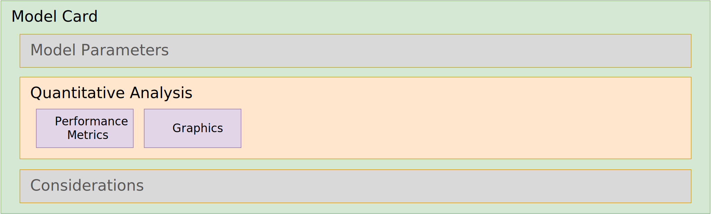

# ML-BOM Design and Best Practices

## Quantitative analysis



This section will feature guidance on filling out information in the Cyclone model card's `quantitativeAnalysis` object and its subcomponents including:

* [Performance metrics](#performance-metrics)
* [Graphics](#graphics)

---

# What is quantitative analysis

A quantitative analysis of an AI model involves using mathematical and statistical methods to objectively measure and evaluate its performance, behavior, and outputs using numerical data, focusing on how much or how often, unlike qualitative analysis which looks at why. It assesses metrics like accuracy, precision, recall, efficiency, and consistency, transforming raw data into verifiable insights to understand patterns, test hypotheses, and ensure reliability for decision-making, moving beyond subjective human interpretation.

#### Key Aspects of Quantitative AI Analysis:

* **Numerical Metrics**: Uses measurable data (e.g., error rates, latency, performance scores) rather than subjective feedback.
* **Performance Benchmarking**: Calculates specific scores (like F1-score, AUC, BLEU for LLMs) to compare models rigorously.
* **Objective Evaluation**: Provides reproducible, scalable results that can be compared across different models or versions.
* **Pattern & Trend Detection**: Identifies numerical patterns, correlations, and trends within large datasets that might be missed manually.
* **Testing Hypotheses**: Statistically tests assumptions about model behavior (e.g., "Does Model X consistently outperform Model Y on this task?").
* **Automation**: AI itself can automate complex quantitative analysis, handling vast amounts of data and uncovering intricate relationships.


---

#### Performance metrics

```json
{
  "$schema": "http://cyclonedx.org/schema/bom-1.7.schema.json",
  ...
  "metadata":
  {
    "component":
    {
      "type": "machine-learning-model",
      ...
      "modelCard": {
        ...
        "quantitativeAnalysis": {
        "performanceMetrics": [
          {
              "type": "benchmark_score",
              "value": "The value of the performance metric",
              // "slice": "The name of the slice this metric was computed on. By default, assume this metric is not sliced",
              "slice": "Specific benchmark name (e.g., MMLU, GSM8K)"
              "confidenceInterval": {
              "lowerBound": "The lower bound of the confidence interval",
              "upperBound": "The upper bound of the confidence interval"
              }
            }
          ]
        }
      }
    }
  }
}
```

#### Graphics

TODO

### Quantitative analysis

```json
{
  "$schema": "http://cyclonedx.org/schema/bom-1.7.schema.json",
  ...
  "metadata":
  {
    "component":
    {
      "type": "machine-learning-model",
      ...
      "modelCard": {
        ...
        "quantitativeAnalysis": {
          "graphics": [
            {
              "description": "benchmark_score",
              "collection": [
                {
                  "name": "string",
                  "image": {
                    "contentType": "",
                    "encoding": "base64",
                    "content": "string"
                  }
                }
              ]

            }
          ]
        }
      }
    }
  }
}
```

<div style="page-break-after: always; visibility: hidden">
\newpage
</div>
