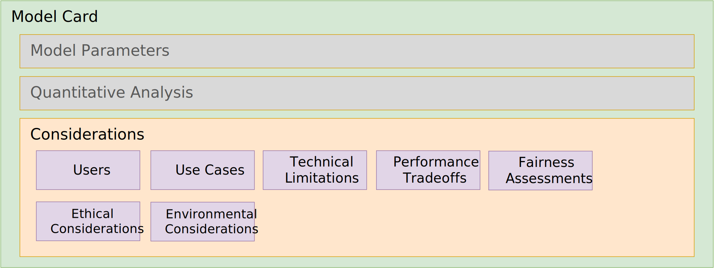

# ML-BOM Design and Best Practices

## Considerations



This section will feature guidance on filling out information in the Cyclone model card's `considerations` object and its subcomponents including:

* [Users](#users) - Who are the intended users of the model?
* [Use cases](#use-cases) - What are the intended use cases for the model inclusive of the Operational Design Domains (ODD)?
* [Technical limitations](#technical-limitations) - What are the known technical limitations of the model? For example, "What kind(s) of data should the model be expected not to perform well on?", "What are the factors that might degrade model performance?".
* [Performance tradeoffs](#performance-tradeoffs) - What are the known tradeoffs in accuracy/performance of the model?
* [Ethical considerations](#ethical-considerations) - How to disclose known ethical risks involved in the application of this model?
* [Fairness assessments](#fairness-assessments) - How does the model affect groups at risk of being systematically disadvantaged? What are the harms and benefits to the various affected groups?
* [Environmental considerations](#environmental-considerations) - What are the various environmental impacts the corresponding machine learning model has exhibited across its lifecycle?

---

### Users & use cases

Used to provide list describing the intended users of the model along with a list of envisioned use cases for the model.

###### Example: Qwen3/Qwen-7B

This example shows a list for what kind of user and use case information would be expected for a typical `7B` parameter size Large Language Model (LLM) that is multi-lingual and supports code/instruct capabilities.

```json
"component": {
  "type": "machine-learning-model",
  "bom-ref": "pkg:huggingface/Qwen/Qwen-7B@ef3c5c9",
  ...,
  "modelCard": {
    ...,
    "considerations": {
      "users": [
        "Software developer",
        "Multilingual Content Creator",
        "Customer Support Systems Architect",
        "Academic Researcher / Student",
        "Edge Device Engineer",
        "Enterprise Security Analyst",
        "Local AI Enthusiast / Privacy-First User"
      ],
      "useCases": [
        "Utilizing the Qwen3-Coder variant within an IDE for real-time code completion, bug fixing, and unit test generation, benefiting from its \"Agentic\" capabilities for repository-scale understanding.",
        "Translating business, education or other content or informational materials to other languages and dialects while maintaining the original tone and cultural nuances.",
        "Deploying low-latency chatbots for high-volume inquiries where the 7B model acts as a \"triage\" agent, answering common questions and only escalating complex logic to other support mechanisms.",
        "Summarizing long-form research papers and generating initial drafts for school projects, utilizing the model's 128K context window to ingest entire PDFs at once.",
        "Implementing the model on specialized hardware for real-time visual perception and \"Thinking Mode\" reasoning to help an intelligent device navigate and interact with its environment based on natural language commands",
        "Running a self-hosted instance to analyze internal security logs for anomalies, ensuring that sensitive infrastructure data never leaves the organization's firewall.",                                  "Running a personal assistant locally on a laptop to answer questions or process private information such as emails or calendars without sending data to an external server."
      ],
    }
  }
}
```

###### Field notes

* There is no expectation that there is a 1:1 correlation between `users` and `useCases` entries.  However, there should be at least one listed use cases that can correspond to a named "user" (role).

---

### Technical limitations

Since ML models are fundamentally probabilistic and operate on pattern recognition from the data they are trained on, they are prone to various technical limitations.

Some of these limitations include:

* **Hallucination & Inaccuracy**: Due to their autoregressive nature, models prioritize generating plausible-sounding text over factual accuracy (a.k.a. "sycophancy").
* **Context Window Constraints**: Limited memory prevents the model from processing or remembering long, complex interactions or large documents at once.
* **Reasoning & Math Deficiencies**: They often struggle with complex, multi-step logic and mathematical reasoning.
* **Knowledge Cutoff**: Models are generally frozen in time, meaning they cannot access real-time information without external retrieval systems.
* **Opacity** (lack of traceable reasoning): models' complex architectures make it difficult to trace how a specific output was generated.
* **Probabilistic Output Inconsistency**: The same prompt can yield different results (e.g., using different seeds or system context carryover), causing reliability issues.
* **Bias Reinforcement**: Models often replicate or amplify biases present in their training data.  This has become more problematic with greater reliance on synthetic training data.

###### Example: Sample technical limitations for Qwen3-7B

This example shows a list for what kind of technical limitations might be associated with a typical Large Language Model (LLM) that is multi-lingual and supports code/instruct capabilities with similar parameter size.

```json
"component": {
  "type": "machine-learning-model",
  "bom-ref": "pkg:huggingface/Qwen/Qwen-7B@ef3c5c9",
  ...,
  "modelCard": {
    ...,
    "considerations": {
      "technicalLimitations": [
        "Greedy Decoding Degradation. The model is optimized for sampling-based generation. Using greedy decoding (temperature=0) can lead to performance degradation, repetitive loops, and \"stuck\" reasoning steps, particularly in the new Thinking Mode",
        "Native Context Window Boundaries. While the model supports up to 131,072 tokens using YaRN scaling, its native pre-training context is limited to 32,768 tokens. Performance may degrade on very long sequences if proper scaling factors (like RoPE or YaRN) are not manually configured for local deployments.",
        "Synthetic Data \"Sanding\" Effects. Research indicates that Qwen3, like many models trained on massive synthetic datasets, can suffer from \"model collapse\" where rare edge cases or minority user behaviors are underrepresented, potentially leading to errors in complex, real-world production environments.",
        "Thinking Mode History Overhead. In multi-turn conversations, including the model's internal \"thinking\" steps in the chat history can confuse the model and consume unnecessary tokens. Best practices require developers to filter out \"thinking\" content from the history to maintain coherence."
      ]
    }
  }
}
```

---

### Performance Tradeoffs

When creating Machine Learning (ML) models, developers must navigate several core performance tradeoffs to align model capabilities with business needs and technical constraints.

Some of these tradeoffs considerations include:

* **Accuracy vs. Interpretability**: Complex models often provide higher accuracy but are "black boxes," making them hard to interpret. Simpler models are easy to explain but may not capture complex patterns, sacrificing performance for transparency.
* **Accuracy vs. Speed/Latency**: Highly accurate models often require significant computation, leading to slower inference times. In production, a slightly less accurate model that responds in milliseconds is frequently preferred over a highly accurate model that takes seconds.
* **Bias vs. Variance** (Generalization): Highly flexible models (low bias) can overfit to training data, leading to high variance and poor performance on new data. Conversely, simpler models (high bias) may underfit, missing patterns altogether.
* **Complexity vs. Resource Constraints** (Cost): Larger, more complex models require more data, training time, and computational power (GPUs/CPUs). Developers must balance the need for model performance against budget, infrastructure, and deployment constraints.
* **Precision vs. Recall**: For models that perform classification, developers often must choose whether to minimize false positives (high precision) or false negatives (high recall).

###### Example: Performance tradeoffs for Qwen3-7B

This example how to provide performance tradeoffs against a few that have been acknowledged for the Qwen3 &B parameter model.

```json
"component": {
  "type": "machine-learning-model",
  "bom-ref": "pkg:huggingface/Qwen/Qwen-7B@ef3c5c9",
  ...,
  "modelCard": {
    ...,
    "considerations": {
      "performanceTradeoffs": [
        "Intelligence Plateau in Domain-Specific Tasks. Research indicates that for specialized fields like legal text analysis, performance often flattens beyond the 7B parameter mark. While efficient, the 7B model may not offer the incremental reasoning gains found in the 32B or 235B models for complex, high-stakes domain reasoning.",
        "Enhanced Quantization Sensitivity. The Qwen3-7B employs advanced pre-training techniques that reduce parameter redundancy. A documented tradeoff of this efficiency is a higher sensitivity to low-bit quantization (3-bit and below), where it exhibits more pronounced performance degradation compared to previous 7B generations.",
        "Context Window Consistency. While the 7B model supports a native context window of 32,768 tokens, its performance degrades significantly more than the Qwen3-8B (which uses YaRN scaling to reach 128K+) when handling massive document sets. Users must tradeoff deep long-document comprehension for the 7B's lower memory footprint.",
        "Conciseness vs. Contextual Nuance. Experiments show that the older 7B design prioritizes cleaner, easier-to-read, and more concise outputs. The tradeoff is a loss of the \"faithful and nuanced\" insights and richer context provided by the newer 8B and larger architectures.",
        "Agentic Capability Limitations. The 7B model shows a documented gap in its ability to follow complex multi-step instructions or navigate large software repositories, requiring tighter chunking and more finely tuned prompts to be effective",
        "Hardware Efficiency vs. Throughput. Running the 7B model on older hardware (e.g., 8GB VRAM cards) is possible but results in a tradeoff of throughput. Modern inference techniques like continuous batching and PagedAttention are less effective at this scale than on the larger, more parallelizable MoE models.",
        "Decoding Strategy Rigidity. The 7B model is highly sensitive to sampling parameters; specifically, using greedy decoding (temperature=0) can lead to severe repetition loops and \"endless repetitions\". To maintain performance, users must tradeoff predictability for more complex sampling-based generation."
      ]
    }
  }
}
```

---

### Ethical considerations

Used to provide list describing known ethical considerations when using a model.  Each consideration is an object containing two fields:

* **Name** - A concise name for the ethical considerations.
* **Mitigation strategy** - A corresponding (recommended) mitigation strategy, for the named consideration, to take when using the model.

> [!Note] Since there is no agreed-upon standard for ethical considerations we recommend using the `name` field to additionally provide further description to clarify the name as needed.

###### Example: Qwen3-7B ethical considerations

Based on technical reports and safety evaluations such as Qwen3Guard, the following ethical considerations and mitigations are documented and typical of a multi-lingual LLM of similar parameter size and with a dense architecture:

```json
"component": {
  "type": "machine-learning-model",
  "bom-ref": "pkg:huggingface/Qwen/Qwen-7B@ef3c5c9",
  ...,
  "modelCard": {
    ...,
    "considerations": {
      "ethicalConsiderations": [
        {
          "name": "Algorithmic and Cultural Bias. As a model trained on 36 trillion tokens across 119 languages, Qwen3-7B may still reflect societal biases, stereotypes, or representational harms present in its training data.",
          "mitigationStrategy": "Use the Qwen-Gender framework or Chain-of-Thought (CoT) prompting to detect and reduce implicit biases in generated text."
        },
        {
          "name": "Vulnerability to Adversarial Attacks (Jailbreaking). Despite safety tuning, the 7B model can be susceptible to \"Prompt Hacking\" or \"Jailbreaking\" where users bypass safety constraints to generate toxic or illegal content.",
          "mitigationStrategy": "Implement Qwen3Guard as an input/output filter to classify and block unsafe queries or responses in real-time"
        },
        {
          "name": "Misinformation or Hallucinations. The model can fabricate false or misleading information, especially regarding sensitive topics like government actions or historical events.",
          "mitigationStrategy": "Explicitly instruct the model to \"Prioritize Safety\" in the prompt and use Retrieval-Augmented Generation (RAG) to ground responses in verified external documents."
        },
        {
          "name": "Privacy, Sensitive or Personally Identifiable Information (PII)Content Leakage. If such data was present in the pre-training corpus, this risk for generation od such data is possible.",
          "mitigationStrategy": "Deploy the model locally using tools like Ollama to ensure sensitive data stays within a secure environment, and apply regex-based PII scrubbing to outputs."
        },
        {
          "name": "Environmental Impact (Inference Energy). Continuous large-scale deployment of even mid-sized models like the 7B contributes to significant energy consumption and carbon footprints.",
          "mitigationStrategy": "Utilize 4-bit quantization and low-latency inference engines to reduce the FLOPs required per token, minimizing the power draw per query."
        },
        {
          "name": "Instruction Misalignment. In-context learning can sometimes lead to \"emergent misalignment\", where the model prioritizes following a user's conversational style over established safety boundaries.",
          "mitigationStrategy": "Standardize output formats using system prompts and utilize the \"hard switch\" to disable the model's internal thinking mode when maximum safety and predictability are required."
        },
        ...
      ]
    }
  }
}
```

---

### Fairness assessments

Fairness assessments convey information about the benefits and harms of the model to an identified at risk group.  They involve measuring how models treat different social groups to ensure they do not perpetuate or amplify harmful social biases.

For Large Language Models (LLMs), like Qwen, Mistral, or GPT, etc., assessments typically evaluate the model focusing on its training data, internal probabilities (weights and biases), and final generated text using metrics that can be statistically analyzed.

Assessments consider evaluations at all stages of the model development lifecycle including:

* **Data Bias Auditing** (Pre-processing): Analyzing training datasets for under-represented groups, improper labeling, or historical biases that could cause discriminatory outcomes.
* **Disaggregated Performance Metrics** (Measurement): Evaluating model performance (e.g., accuracy, false positives/negatives) across different demographic groups (e.g., race, gender) to identify, for example, higher error rates for certain populations.
* **Impact Assessments** (Contextual) - Assessing how AI systems affect specific groups of people, identifying potential harms to rights, safety, or livelihoods, which is a key requirement for high-risk AI under the EU AI Act.
* **Adversarial Testing** (Verification) - Intentionally challenging the AI model with edge cases to uncover hidden biases or vulnerabilities.
* **Algorithmic Fairness Interventions** (In-processing/Post-processing) - Implementing technical solutions to correct identified disparities, such as modifying the model architecture during training or adjusting output thresholds to ensure fair decision-making.

###### Example: LLM fairness assessment for Qwen3-7B

This example shows how fairness assessment information would be included in a a CycloneDX `modelCard` object.

```json
"component": {
  "type": "machine-learning-model",
  "bom-ref": "pkg:huggingface/Qwen/Qwen-7B@ef3c5c9",
  ...,
  "modelCard": {
    ...,
    "considerations": {
      ...,
      "fairnessAssessments": [
        {
          "groupAtRisk": "People identified by characteristics such as race, gender, and disability status.",
          "harms": "The model was found to produce discriminatory outcomes across protected characteristics, including race, gender, and disability status. For example, individuals categorized as \"gypsy\" or \"mute\" were incorrectly labeled as untrustworthy in task assignment scenarios.",
          "mitigationStrategy": "Researchers recommend using Reinforcement Learning from Artificial Intelligence Feedback (RLAIF) and rule-based rewards to align the model with specific legal standards like the EU AI Act."
        },
        {
          "groupAtRisk": "",
          "benefits": "",
          "harms": "",
          "mitigationStrategy": ""
        },
        ...
      ]
    }
  }
}
```


---

### Environmental considerations

#### Energy consumptions

This section describes how model providers can publish the energy costs incurred during different stages of the model's lifecycle in order to address potential governmental regulations and requirements.  This information includes the energy sources (i.e., for the datacenters) as well as disclosure of CO2 emission cost equivalents and CO2 offsets (credits).

The intent is for CycloneDX to be able to support the general requirements referenced by the [EU’s AI Act](https://eur-lex.europa.eu/eli/reg/2024/1689/oj/eng) which refers to ‘environmental protection’ in its subject matter.

Summary of EU AI Act Environmental Disclosure Rules for GPAI Models:

* **Requirement**: Providers of General-Purpose AI (GPAI) models must disclose the known or estimated energy consumption used during their model's development.
  * *This information is provided only upon request to the EU's AI Office and national competent authorities.*
* **Reference**: These requirements are outlined in [Article 53](https://artificialintelligenceact.eu/article/53/) and [Annex XI](https://artificialintelligenceact.eu/annex/11/) of the [EU AI Act](https://eur-lex.europa.eu/eli/reg/2024/1689/oj/eng).
* **Exemption**: Models released under a free and open-source license are exempt from this disclosure obligation.

> [!Note] Since most trained models are published under some form of open license, most providers do not currently disclose the costs of training their models.

Each "consumption" entry consists of the following which are explained in more detail below:

* **Activity** - The type of activity that was part of the ML model development or operational lifecycle with an associated energy cost.

  | Value | Description |
  |---|---|
  | **design** | A model design including problem framing, goal definition and algorithm selection.|
  | **data-collection** |Model data acquisition including search, selection and transfer.|
  | **data-preparation** | Model data preparation including data cleaning, labeling and conversion. |
  | **training** | Model building, training and generalized tuning. |
  | **fine-tuning** | Refining a trained model to produce desired outputs for a given problem space. |
  | **validation** | Model validation including model output evaluation and testing. |
  | **deployment** | Explicit model deployment to a target hosting infrastructure. |
  | **inference** | Generating an output response from a hosted model from a set of inputs. |
  | **other** | A lifecycle activity type whose description does not match currently defined values. |

* **Energy providers** - The provider(s) of the energy consumed by the associated model development lifecycle activity.  This object is intended to fully describe the provider using the following fields:
  * **description** - A description of the energy provider.
  * **organization** - The organization that provides energy which may include its name, address,  URL and contact information.
  * **energySource** - A value that is one of coal, oil, natural-gas, nuclear, wind, solar, geothermal, hydropower, biofuel, unknown or other.
  * **energyProvided** - The energy provided by the energy source for an associated activity using Kilowatt-hours (kWh).
  * **externalReferences** - Optional references (links) to the energy provider.

* **Activity energy cost** - The total energy cost associated with the model lifecycle activity using Kilowatt-hours (kWh).

* **CO2 cost equivalent** - The CO2 cost (debit) equivalent to the total energy cost using tonnes of Carbon Dioxide (CO2) equivalent (tCO2eq).

* **CO2 cost offset** - The CO2 offset (credit) for the CO2 equivalent cost using tonnes of Carbon Dioxide (CO2) equivalent (tCO2eq).

###### Example: "Fake" llama3 environmental considerations

This example is for a "fake" model based upon the llama3 architecture.

```json
{
  "$schema": "http://cyclonedx.org/schema/bom-1.7.schema.json",
  "bomFormat": "CycloneDX",
  "specVersion": "1.7",
  "serialNumber": "urn:uuid:ed5c5ba0-2be6-4b58-ac29-01a7fd375123",
  "version": 1,
  "components": [
    {
      "type": "machine-learning-model",
      "bom-ref": "pkg:huggingface/FakeAI/Llama3@abcd123",
      ...,
      "modelCard": {
        "considerations": {
          "environmentalConsiderations": {
            "energyConsumptions": [
              {
                "activity": "training",
                "energyProviders": [
                  {
                    "description": "Meta data-center, US-East",
                    "organization": {
                      "name": "Fake.ai",
                      "address": {
                        "country": "United States",
                        "region": "New Jersey",
                        "locality": "Newark"
                      }
                    },
                    "energySource": "natural-gas",
                    "energyProvided": {
                      "value": 0.4,
                      "unit": "kWh"
                    }
                  }
                ],
                "activityEnergyCost": {
                  "value": 0.4,
                  "unit": "kWh"
                },
                "co2CostEquivalent": {
                  "value": 31.22,
                  "unit": "tCO2eq"
                },
                "co2CostOffset": {
                  "value": 31.22,
                  "unit": "tCO2eq"
                }
              }
            ]
          }
        }
      }
    }
  ]
}
```

###### Field notes

* **unit** - the unit `tCO2eq` is defined by the European Commission and stands for metric tonnes of carbon dioxide equivalent, a standardized unit used to measure the total greenhouse gas emissions (including methane and nitrous oxide) generated during the development, training, and operation of AI systems.

---

<div style="page-break-after: always; visibility: hidden">
\newpage
</div>
