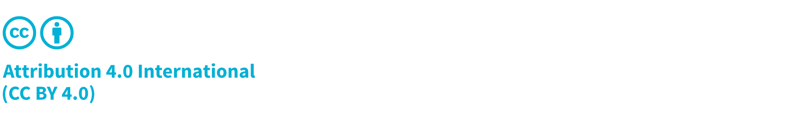

\newpage

# Frontispiece

## About the Guide
CycloneDX is a modern standard for the software supply chain.

The content in this guide results from continuous community feedback and input from leading experts in the software
supply chain security field. This guide would not be possible without valuable feedback from the CycloneDX Industry
Working Group (IWG), the CycloneDX Core Working Group (CWG), the many CycloneDX Feature Working Groups (FWG),
Ecma International Technical Committee 54, and a global network of contributors and supporters.

## Copyright and License

Copyright © 2024 The OWASP Foundation. 

This document is released under the [Creative Commons Attribution 4.0 International](https://creativecommons.org/licenses/by/4.0/).
For any reuse or distribution, you must make clear to others the license terms of this work.

\emptyparagraph

Second Edition, 09 April 2024

\emptyparagraph

| Version        | Changes                    | Updated On | Updated By                   |
|----------------|----------------------------|------------|------------------------------|
| Second Edition | Updated for CycloneDX v1.6 | 2024-04-09 | CycloneDX Core Working Group |
| First Edition  | Initial Release            | 2023-06-25 | CycloneDX Core Working Group |

\newpage

