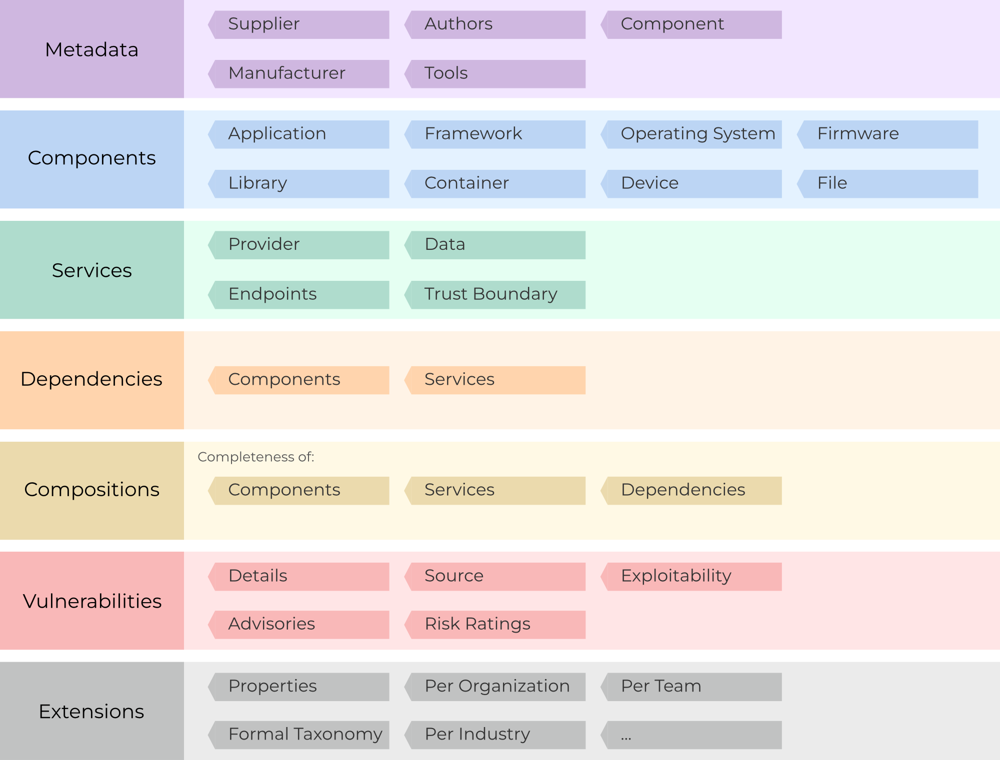

# Introduction

CycloneDX is a modern standard for the software supply chain. At its core, CycloneDX is a general-purpose Bill of 
Materials (BOM) standard capable of representing software, hardware, services, and vulnerabilities. The CycloneDX 
standard began life in 2017 in the Open Web Application Security Project (OWASP) community. Since then, the standard has 
matured into an OWASP Flagship project, has adopted a formal standardization process and governance model, and is 
supported by the global information security community.

## Defining Software Bill of Materials
The U.S. National Telecommunications and Information Administration (NTIA) defines software bill as materials as 
"_a formal, machine-readable inventory of software components and dependencies, information about those components, 
and their hierarchical relationships_". OWASP CycloneDX implements this definition and extends it in many ways, including
the inclusion of services as a foundational component necessary in software bill of materials.

## High-Level SBOM Use Cases
A complete and accurate inventory of all first-party and third-party components is essential for risk identification. 
SBOMs should ideally contain all direct and transitive components and the dependency relationships between them.

CycloneDX far exceeds the [Minimum Elements for Software Bill of Materials](https://www.ntia.gov/files/ntia/publications/sbom_minimum_elements_report.pdf) 
as defined by the [National Telecommunications and Information Administration (NTIA)](https://www.ntia.gov/) in response 
to [U.S. Executive Order 14028](https://www.whitehouse.gov/briefing-room/presidential-actions/2021/05/12/executive-order-on-improving-the-nations-cybersecurity/).

Adopting CycloneDX allows organizations to quickly meet these minimum requirements and mature into using more 
sophisticated use cases over time. CycloneDX is capable of achieving all SBOM requirements defined in the 
[OWASP Software Component Verification Standard (SCVS)](https://owasp.org/scvs).

* Product security, architectural, and license risk
* Procurement and M&A
* Software component transparency
* Supply chain transparency
* Vendor risk management

## CycloneDX Object Model
The CycloneDX object model is defined in JSON Schema, XML Schema, and Protocol Buffers and consists of metadata, 
components, services, dependencies, compositions, and vulnerabilities. CycloneDX is prescriptive, can easily describe 
complex relationships, and is extensible to support specialized and future use cases.

The root elements of a CycloneDX BOM are:

### BOM Metadata
BOM metadata includes the supplier, manufacturer, and the target component for which the BOM describes. It also includes 
the tools used to create the BOM, and license information for the BOM document itself.

### Components
Components describe the complete inventory of first-party and third-party components. The specification can represent 
applications, frameworks, libraries, containers, operating systems, devices, firmware, files, along with the manufacturer 
information, license and copyright details, and complete pedigree and provenance for every component.

### Services
Services describe external APIs that the software may call. Services describe endpoint URI’s, authentication 
requirements, and trust boundary traversals. The flow of data between software and services can also be described 
including the data classifications, and the flow direction of each type.

### Dependencies
CycloneDX provides the ability to describe components and their dependency on other components. The dependency graph is 
capable of representing both direct and transitive relationships. Components that depend on services can be represented 
in the dependency graph and services that depend on other services can be represented as well.

### Compositions
Compositions describe constituent parts (including components, services, and dependency relationships) and their 
completeness. The aggregate of each composition can be described as complete, incomplete, incomplete first-party only, 
incomplete third-party only, or unknown.

### Vulnerabilities
Known vulnerabilities inherited from the use of third-party and open source software and the exploitability of the 
vulnerabilities can be communicated with CycloneDX. Previously unknown vulnerabilities affecting both components and 
services may also be disclosed using CycloneDX, making it ideal for both VEX and security advisory use cases.

### Extensions
Multiple extension points exist throughout the CycloneDX object model allowing fast prototyping of new capabilities and 
support for specialized and future use cases. The CycloneDX project maintains extensions that are beneficial to the 
larger community. The project encourages community participation and development of extensions that target specialized 
or industry-specific use cases.

## Serialization Formats
CycloneDX can be represented in JSON, XML and Protocol Buffers (protobuf) and has corresponding schemas for each.

| **Format** | **Resource**  | **URL**                                          |
|------------|---------------|--------------------------------------------------|
| JSON       | Documentation | https://cyclonedx.org/docs/latest/json/          |
| JSON       | Schema        | https://cyclonedx.org/schema/bom-1.4.schema.json |
| XML        | Documentation | https://cyclonedx.org/docs/latest/xml/           |
| XML        | Schema        | https://cyclonedx.org/schema/bom-1.4.xsd         |
| Protobuf   | Schema        | https://cyclonedx.org/schema/bom-1.4.proto       |

### A note on validation
CycloneDX relies upon JSON Schema, XML Schema, and protobuf for validation. The entirety of the specification can be
validated using officially supported CycloneDX tools or via hundreds of available validators that support JSON Schema, 
XML Schema, or protobuf.

\newpage

