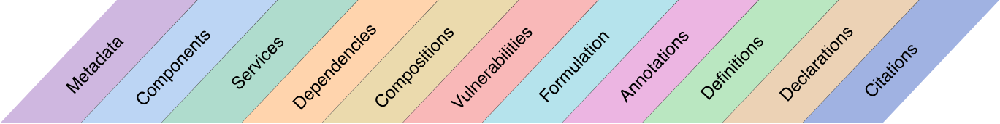
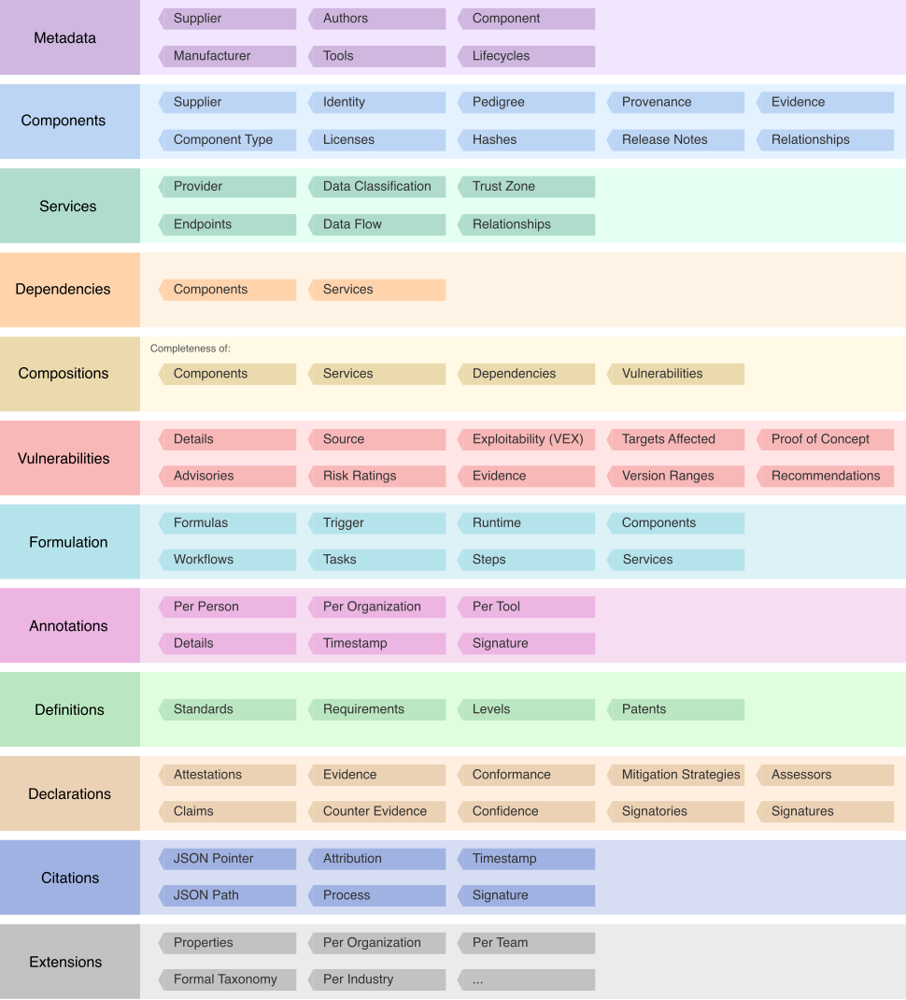
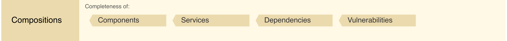

# CycloneDX Object Model
The CycloneDX object model is defined in JSON Schema, XML Schema, and Protocol Buffers and consists of metadata,
components, services, dependencies, compositions, vulnerabilities, formulation, and annotations. CycloneDX is
prescriptive, can easily describe complex relationships, and is extensible to support specialized and future use cases.

Within the root `bom` element, CycloneDX defines the following object types:

The object types are arranged in order and contain (but are not limited to) the following types of data:

## BOM Identity
In addition, the `bom` element has properties for `serialNumber` and `version`. Together these two properties form the
identity of a BOM. A BOMs identity can be expressed using a BOM-Link, a formally registered URN capable of referencing
a BOM or any component, service, or vulnerability in a BOM. Refer to the chapter on Relationships for more information.

### Serial Number
Every BOM generated SHOULD have a unique serial number, even if the contents of the BOM have not changed over time.
If specified, the serial number MUST conform to RFC-4122. Use of serial numbers is RECOMMENDED.

### Version
Whenever an existing BOM is modified, either manually or through automated processes, the version of the BOM SHOULD be
incremented by 1. When a system is presented with multiple BOMs with identical serial numbers, the system SHOULD use
the most recent version of the BOM. The default version is '1'.

## The Anatomy of a CycloneDX BOM
The following are descriptions of the root-level elements of a CycloneDX BOM.

### Metadata
BOM metadata includes the supplier, manufacturer, and target component for which the BOM describes. It also includes
the tools used to create the BOM, and license information for the BOM document itself.

### Components
Components describe the complete inventory of first-party and third-party components. The specification can represent
applications, frameworks, libraries, containers, operating systems, devices, device drivers, firmware, files, runtime 
platforms, machine learning models, datasets, source code, and configurations, along with the manufacturer
information, license and copyright details, and complete pedigree and provenance for every component.

### Services
Services describe external APIs that the software may call. Services describe endpoint URIs, authentication
requirements, and trust boundary traversals. The flow of data between software and services can also be described,
including the data classifications and the flow direction of each type.

### Dependencies
CycloneDX provides the ability to describe components and their dependency on other components. The dependency graph is
capable of representing both direct and transitive relationships. Components that depend on services can be represented
in the dependency graph, and services that depend on other services can be represented as well.

### Compositions
Compositions describe constituent parts (including components, services, and dependency relationships) and their
completeness. The aggregate of each composition can be described as complete, incomplete, incomplete first-party only,
incomplete third-party only, or unknown.

### Vulnerabilities
Known vulnerabilities inherited from the use of third-party and opensource software and the exploitability of the
vulnerabilities can be communicated with CycloneDX. Previously unknown vulnerabilities affecting both components and
services may also be disclosed using CycloneDX, making it ideal for both VEX and security advisory use cases.

### Formulation
Formulation describes how something was manufactured or deployed. CycloneDX achieves this through the support of multiple
formulas, workflows, tasks, and steps, which represent how the declared formula details precise steps to reproduce 
along with the observed formula describing the steps which transpired in the manufacturing process.

### Annotations
Annotations contain comments, notes, explanations, or similar textual content which provide additional context to the
object(s) being annotated. They are often automatically added to a BOM via a tool or as a result of manual review by
individuals or organizations. Annotations can be independently signed and verified using digital signatures.

### Attestations
Attestations contain claims, evidence, and testimony in compliance with regulations, standards, and frameworks. They 
additionally contain reasoning why evidence supports the claims, assessments on compliance with given claims and 
mitigation strategies for non or partial compliance.

### Extensions
Multiple extension points exist throughout the CycloneDX object model, allowing fast prototyping of new capabilities and
support for specialized and future use cases. The CycloneDX project maintains extensions that are beneficial to the
larger community. The project encourages community participation and the development of extensions that target specialized
or industry-specific use cases.

## Serialization Formats
CycloneDX can be represented in JSON, XML, and Protocol Buffers (protobuf) and has corresponding schemas for each.

| **Format** | **Resource**  | **URL**                                          |
|------------|---------------|--------------------------------------------------|
| JSON       | Documentation | https://cyclonedx.org/docs/latest/json/          |
| JSON       | Schema        | https://cyclonedx.org/schema/bom-1.5.schema.json |
| XML        | Documentation | https://cyclonedx.org/docs/latest/xml/           |
| XML        | Schema        | https://cyclonedx.org/schema/bom-1.5.xsd         |
| Protobuf   | Schema        | https://cyclonedx.org/schema/bom-1.5.proto       |

CycloneDX relies exclusively on JSON Schema, XML Schema, and protobuf for validation. The entirety of the specification
can be validated using officially supported CycloneDX tools or via hundreds of available validators that support JSON
Schema, XML Schema, or protobuf.

\newpage

