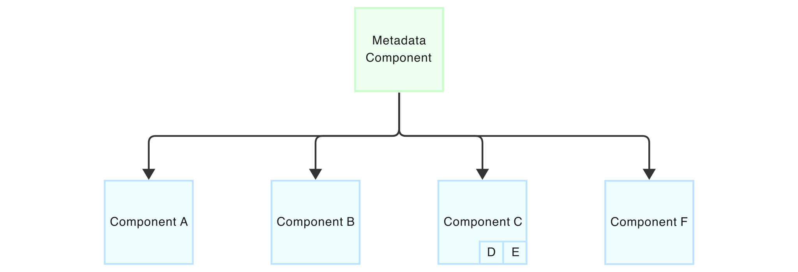

# Establishing Relationships in CycloneDX
CycloneDX has a rich set of relationships that provide additional context and information about the objects in the BOM's
inventory. All relationships in CycloneDX are expressed explicitly. Some relationships are declared through the natural
use of the CycloneDX format. These include assemblies, dependencies, and pedigree. Other relationships are formed via
references to the object's identity in the BOM, referred to as `bom-ref`. The combination of these two approaches 
dramatically simplifies the specification, providing necessary guardrails to prevent deviation of its usage and providing 
an easy path to supporting enveloped signing and other advanced usages.

## Component Assemblies
Components in a BOM can be nested to form an assembly. An assembly is a collection of components that are included in a 
parent component. As an analogy, an automotive dashboard contains an instrument panel component. And the instrument panel 
component contains a speedometer component. This nested relationship is called an assembly in CycloneDX. 

Software assemblies that can be represented in CycloneDX can range from large enterprise solutions comprising multiple 
systems, to cloud-native deployments containing extensive collections of related micro-services. 
Assemblies can also describe simpler inclusions, such as software packages that contain supporting files.

> Assemblies, or leaves within an assembly, can independently be signed. BOMs comprising component assemblies from 
> multiple suppliers can benefit from this capability. Each supplier can sign their respective assembly. The creator of 
> final goods can then sign the BOM as a whole.

The following example illustrates a simple component assembly. In this case, Acme Commerce Suite includes two other
applications as part of its assembly.

```json
"components": [
  {
    "type": "application",
    "name": "Acme Commerce Suite",
    "version": "2.0.0",
    "components": [
      {
        "type": "application",
        "name": "Acme Storefront Server",
        "version": "3.7.0",
      },
      {
        "type": "application",
        "name": "Acme Payment Processor",
        "version": "3.1.1",
      }
    ]
  }
]
```

<div style="page-break-after: always; visibility: hidden">
\newpage
</div>

In the following example, Components A-F are included in the metadata component, in this case, an application.
Component C further includes an assembly of Components D and E which is how they were introduced as components of the
application. An assembly is not an indication that Component C depends on Component D or E, rather Component C bundles
Component D and E. If Component C depends on either D or E, dependency relationships should also be established.



## Service Assemblies
Services also have assemblies and work identically to those of components. While component assemblies describe a component
that _includes_ another component, service assemblies describe a service with other services _behind_ it. A common cloud 
pattern is the use of API gateways which proxy and orchestrate connections to relevant microservices. The microservices 
themselves may not be directly accessible; rather, they are accessed exclusively through the API gateway. For this 
scenario, the API gateway service may contain an assembly of microservices behind it.

## Dependencies
CycloneDX provides the ability to describe components and their dependency on other components. This relies on a 
component's `bom-ref` to associate the component with the dependency element in the graph. The only requirement for `bom-ref` 
is that it is unique within the BOM. Package URL (PURL) is an ideal choice for `bom-ref` as it will be both unique and 
readable. If PURL is not an option or not all components represented in the BOM contain a PURL, then UUID is recommended.
A general dependency graph is unspecified deep and capable of representing both direct and transitive relationships. In CycloneDX representation `dependencies`, a dependency graph SHOULD be codified to be one node deep, meaning no nested child-graphs but all relations on the same level.


<div style="page-break-after: always; visibility: hidden">
\newpage
</div>

The dependency graph above can be codified with the following:

```json
"dependencies": [
  {
    "ref": "acme-app",
    "dependsOn": [
      "pkg:maven/org.acme/web-framework@1.0.0",
      "pkg:maven/org.acme/persistence@3.1.0"
    ]
  },
  {
  "ref": "pkg:maven/org.acme/web-framework@1.0.0",
    "dependsOn": [
      "pkg:maven/org.acme/common-util@3.0.0",
      "pkg:maven/org.acme/rest-api@2.5.0"
    ]
  },
  {
    "ref": "pkg:maven/org.acme/common-util@3.0.0",
    "dependsOn": []
  },
  {
    "ref": "pkg:maven/org.acme/rest-api@2.5.0",
    "dependsOn": []
  }
]
```

> Components that do not have dependencies MUST be declared as empty elements within the graph. Components not 
> represented in the dependency graph MAY have unknown dependencies. It is RECOMMENDED that implementations assume this 
> to be opaque and not an indicator of a component being dependency-free.

As of CycloneDX v1.6, there are two types of dependencies: dependsOn and provides.

| Dependency Type | Description                                                                                                                                                                                                                                                                                                                                       |
|-----------------|---------------------------------------------------------------------------------------------------------------------------------------------------------------------------------------------------------------------------------------------------------------------------------------------------------------------------------------------------|
| dependsOn       | The bom-ref identifiers of the components or services that are dependencies of this dependency object.                                                                                                                                                                                                                                            |
| provides        | The bom-ref identifiers of the components or services that define a given specification or standard, which are provided or implemented by this dependency object. For example, a cryptographic library that implements a cryptographic algorithm. A component that implements another component does not imply that the implementation is in use. |

The dependency type, dependsOn, is leveraged by classic SBOMs to define a complete graph of direct and transitive
dependencies. However, for cryptographic and similar assets, "provides" allows for many additional use cases.


The example shows an application (nginx) that uses the libssl cryptographic library. This library implements the 
TLSv1.2 protocol. The relationship between the application, the library and the protocol can be expressed by using the 
dependencies properties of the SBOM standard.

Refer to the [Authoritative Guide to CBOM](https://cyclonedx.org/guides/) for in-depth information about leveraging
CycloneDX for cryptographic use cases.

<div style="page-break-after: always; visibility: hidden">
\newpage
</div>
