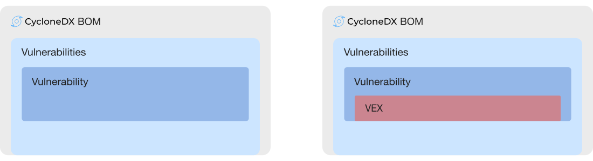

# Introduction to Vulnerability Disclosure Report (VDR)

Vulnerability Disclosure Reports (VDR) communicate known and unknown vulnerabilities affecting components and services.
Known vulnerabilities inherited from the use of third-party and open source software can be communicated with CycloneDX.
Previously unknown vulnerabilities affecting both components and services may also be disclosed using CycloneDX, making 
it ideal for VDR use cases.

## Defining Vulnerability Disclosure Report

[NIST SP 800-161: Cybersecurity Supply Chain Risk Management Practices for Systems and Organizations](https://csrc.nist.gov/publications/detail/sp/800-161/rev-1/final)
defines VDR as a best practice and recommend they include:

* Analysis and findings describing the impact that a reported vulnerability has on a component or product
* Plans to address the vulnerability
* Signing the VDR with a trusted, verifiable, private key that includes a timestamp indicating the date and time of the VDR signature
* Publishing the VDR to a secure portal

For reference, NIST SP 800-161 states:

> Enterprises, where applicable and appropriate, may consider providing customers with a Vulnerability Disclosure Report
(VDR) to demonstrate proper and complete vulnerability assessments for components listed in SBOMs.
The VDR should include the analysis and findings describing the impact (or lack of impact) that the
reported vulnerability has on a component or product. The VDR should also contain information on plans
to address the CVE. Enterprises should consider publishing the VDR within a secure portal available to
customers and signing the VDR with a trusted, verifiable, private key that includes a timestamp indicating
the date and time of the VDR signature and associated VDR. Enterprises should also consider establishing
a separate notification channel for customers in cases where vulnerabilities arise that are not disclosed in
the VDR.

## Expanding the NIST definition of VDR
CycloneDX can be used to describe services including the provider, endpoint URI’s, authentication requirements, and 
trust boundary traversals. The flow of data between software and services can also be described including the data 
classifications, and the directional flow of each type.

BOMs that include services can be used for various forms of deployment and runtime verification, seed dynamic analysis 
security tools, and used to populate data flow diagrams and threat models. They can also aid in identifying potential 
privacy or regulatory concerns.

The inclusion of services may appear in traditional SBOMs alongside software components, or in SaaSBOMs, which describe 
the service inventory that powers cloud-native applications. Regardless of the type of BOM, VDR support in CycloneDX
supports both known vulnerabilities that may appear in the National Vulnerability Database (NVD) for software
and hardware components, and unknown vulnerabilities that may affect services. The support for unknown vulnerabilities 
goes beyond services to include software and hardware as well. This opens up many use cases that would not otherwise be 
possible. These will be covered in subsequent sections.

## How CycloneDX Implements VDR
Lorem ipsum dolor sit amet, consectetur adipiscing elit. Aliquam ipsum sapien, vehicula et turpis varius, ornare consectetur lorem. Nulla finibus tellus in feugiat efficitur. Ut lacinia ultricies diam eget dictum. Maecenas sit amet pretium urna. Curabitur finibus lobortis leo nec facilisis. Nullam et varius nunc, quis vehicula lorem. In blandit pharetra leo tincidunt placerat. Vestibulum gravida molestie velit egestas feugiat. Sed nec ultrices ipsum. Vestibulum sit amet tellus non lectus auctor iaculis.\

## Some other section
CycloneDX exceeds the data field requirements defined in [ISO/IEC 29147:2018](https://www.iso.org/standard/72311.html)
for vulnerability disclosure information and provides a simple path for including Vulnerability Exploitability eXchange
(VEX) information. VEX is covered is subsequent chapters.

NIST SP 800-161 recommends that VDR is integrated into:
* Level 2: Mission and Business Process
* Level 3: Operational

\newpage

